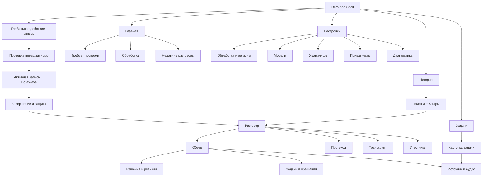
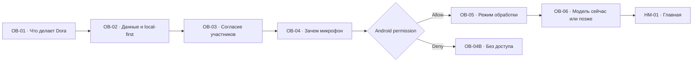
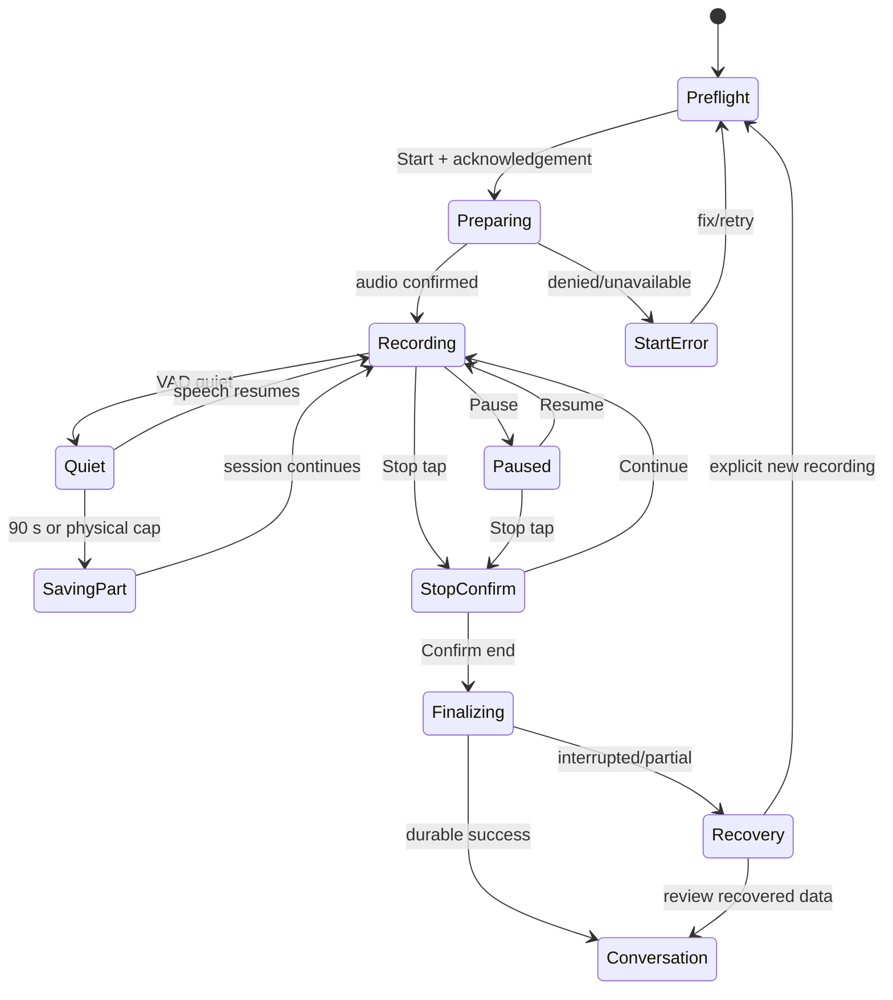
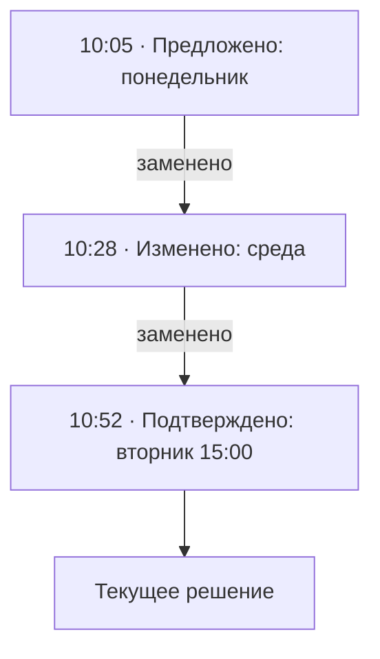

# Dora: дизайн-спецификация Android MVP 1

**Статус:** дизайн-направление и пакет требований для утверждения<br>
**Дата проверки источников:** 4 августа 2026 года<br>
**Область:** UX/UI Android MVP 1; production-код и финальные графические макеты в документ не входят<br>
**Связанный документ:** [DORA_MVP1_TECHNICAL_PLAN.md](DORA_MVP1_TECHNICAL_PLAN.md)<br>
**Handoff-данные:** [design tokens](design/DORA_MVP1_DESIGN_TOKENS.json) · [screen inventory](design/DORA_MVP1_SCREEN_INVENTORY.csv)

## Как читать документ

- **Факт** — требование платформы, технического плана или измерение референса.
- **Решение** — рекомендуемое направление дизайна MVP 1.
- **Допущение** — рабочая гипотеза, которую должен подтвердить владелец продукта.
- **PoC-гейт** — решение принимается только после прототипа или исследования пользователей.
- **Не делать** — намеренно исключённый паттерн.

Все числовые UX-гейты ниже являются начальными целями, а не результатами уже проведённого исследования. Цвета референсов измерены приблизительно без гарантии исходного color profile; финальная палитра проверяется на реальных OLED/LCD-устройствах.

---

## 1. Краткое резюме

**Однозначная рекомендация:** строить визуальный язык Dora как **Deep Ocean / Quiet Intelligence** — спокойный, приватный и точный интерфейс, в котором глубокий синий задаёт узнаваемость, а светлые поверхности сохраняют читаемость длинных протоколов и транскриптов.

Ключевые решения:

| Область | Решение MVP 1 | Зачем |
|---|---|---|
| Основной цвет | `Deep Ocean #061A35`, производный от синего референса | приватность, концентрация, узнаваемость |
| Общая тема | light-first для чтения; иммерсивный deep-blue экран для активной записи; полноценная dark theme | не превращать длинные тексты в утомительный «неоновый» интерфейс |
| Фирменный элемент | **Circular Audio Waveform** `DoraWave` вокруг таймера записи | немедленно показывает, что Dora слышит звук, и формирует визуальную идентичность |
| Навигация compact | четыре destination + центральное действие записи в плавающем pill dock | сохраняет мотив референсов и отделяет навигацию от критического действия |
| Навигация medium/expanded | Navigation Rail; list-detail для истории, задач и разговора | Android-adaptive, без растянутого телефонного UI |
| Формы | крупные радиусы 20–28 dp, pill chips, один контролируемый `Dora Notch` | современный мягкий характер без декоративного хаоса |
| Типографика | Manrope Variable, Roboto/system fallback | геометричный характер, RU/EN, открытая лицензия |
| Контент | источник и confidence доступны рядом с каждым AI-выводом | доверие важнее иллюзии магии |
| Статусы | текст + icon/shape + color; единый словарь | пользователь различает запись, сохранение и AI-обработку |
| Motion | спокойные короткие переходы; waveform максимум 20 fps; reduced-motion mode | выразительность без перегрева и сенсорной перегрузки |
| Privacy | local/cloud status виден до действия; никаких скрытых upload или fake progress | соответствует local-first архитектуре |

В MVP проектируются все состояния основного пути:

`Onboarding → Preflight → Recording → Finalizing → Processing → Review → Conversation → Search/Tasks`.

Главная дизайн-гипотеза: пользователь доверяет Dora, если за несколько секунд понимает четыре вещи:

1. идёт ли запись прямо сейчас;
2. сохранён ли уже записанный звук;
3. где именно обрабатываются данные;
4. на какой реплике основано решение или задача.

---

## 2. Продуктовая задача дизайна

Dora — не диктофон с «AI-кнопкой», а инструмент перехода от разговора к проверяемым действиям. Интерфейс должен связать пять уровней:

1. **Захват:** микрофон действительно активен, маршрут известен, данные сохраняются.
2. **Обработка:** расшифровка, спикеры и анализ имеют понятные стадии и ограничения.
3. **Понимание:** протокол показывает хронологию, а не только итоговый prose.
4. **Действие:** задачи, обещания и решения можно подтвердить или исправить.
5. **Доверие:** любой вывод ведёт к timestamp, реплике и при наличии — аудио.

### 2.1. Основные Jobs to Be Done

| Контекст | Потребность пользователя | Доказательство успеха в UI |
|---|---|---|
| До встречи | быстро подготовить запись и не сомневаться в разрешениях/месте | preflight помещается в один короткий sheet и даёт конкретный Start |
| Во время встречи | видеть, что запись продолжается и не потеряна | waveform, timer, route, последний checkpoint и явный Stop |
| После встречи | понять, что готово сейчас и что ещё обрабатывается | conversation открывается сразу; стадии не блокируют просмотр сохранённого |
| При проверке | быстро исправить спикеров, текст, решения и задачи | edits локальны, reversible и не спрятаны в меню |
| Позже | найти разговор или обязательство по нескольким словам | одна строка поиска + понятные filters + source jump |
| При проблеме | понять, потеряны ли данные и что можно сделать | recovery сообщает восстановленный диапазон и следующий безопасный шаг |

### 2.2. Эмоциональные требования

- **Спокойствие:** интерфейс не выглядит как диспетчерская ML-системы.
- **Контроль:** Start, Pause, Stop, cloud upload и Delete никогда не происходят неявно.
- **Приватность:** глубоко-синий цвет ассоциируется с защищённым рабочим пространством, а не с развлечением.
- **Проверяемость:** AI-кандидаты визуально отличимы от подтверждённых пользователем фактов.
- **Уважение к разговору:** во время записи минимум движения, текста и отвлекающих notifications.

---

## 3. Цели и границы дизайн-работы

### 3.1. Входит в MVP 1

- RU-first интерфейс с полноценной EN-локализацией;
- onboarding, privacy disclosure, consent reminder, Android permissions;
- Home и глобальная навигация;
- preflight, active recording, pause, stop confirmation, finalizing и recovery;
- обязательный `DoraWave`;
- queue, model download и capability states;
- history, search и filters;
- conversation overview, summary, protocol, transcript, participants, decisions, review;
- внутренние tasks;
- local/hybrid/cloud settings, storage, retention, export и delete;
- light/dark, compact/medium/expanded, portrait/landscape;
- TalkBack, Switch Access, 200% text, reduced motion и high-contrast проверки;
- Figma-ready naming, tokens, component variants и handoff criteria.

### 3.2. Подготовить интерфейсно, но не реализовывать

- места для future integrations и external task status;
- account/workspace shell без требования login;
- semantic search entry point без vector UI;
- speaker identity/enrollment только как отсутствующая future capability;
- collaboration/mentions/share-to-team без активных controls;
- adaptive panes, которые пригодятся web/desktop, но проектируются под Android.

### 3.3. Явно исключить

- iOS-подобные Dynamic Island, home indicator и системный chrome в Android-макетах;
- скрытую/пассивную запись и интерфейс, обещающий её;
- fake live transcript или fake waveform;
- social feed, gamification, streaks и «AI magic» без источников;
- тяжёлую текстуру под длинным текстом;
- декоративный glassmorphism с плохим contrast;
- автоматическую voice identity;
- web/iOS/desktop production layouts;
- маркетинговые 3D-мокапы как источник размеров production-компонентов.

---

## 4. Принципы дизайна

### 4.1. Truth before theatre

Каждый визуальный статус соответствует реальному состоянию. Если аудиофреймы не поступают, waveform не анимируется. Если backend не сообщает процент, UI показывает stage, а не выдуманные `73%`.

### 4.2. Recording is sacred

Во время записи UI снижает когнитивную нагрузку и не запускает тяжёлые декоративные эффекты. Критические controls находятся в стабильных местах и не меняют значение без текста.

### 4.3. Local is visible

`На устройстве`, `Ожидает сети`, `Обрабатывается в регионе …` — продуктовые статусы, а не технические детали в Diagnostics.

### 4.4. AI proposes, user owns

AI-результат имеет badge `Предложено Dora`; подтверждённое пользователем — `Подтверждено`. Повторная обработка показывает diff и не перезаписывает ручную правку.

### 4.5. Evidence is one tap away

Timestamp chip открывает transcript/audio в точной позиции. Source link не прячется в overflow и не заменяется абстрактным confidence score.

### 4.6. Calm density

Крупные заголовки и rounded cards из референсов используются для иерархии, но не уменьшают полезную плотность transcript/task screens. На text-heavy экранах приоритет — вертикальный ритм и быстрый scan.

### 4.7. Accessible by construction

Размер текста, TalkBack order, 48-dp targets, contrast, focus и reduced motion входят в component definition, а не добавляются после high-fidelity макетов.

### 4.8. One system, two atmospheres

Light и dark используют одинаковую семантику. Active recording — выразительный deep-blue режим; остальные экраны не обязаны быть тёмными, чтобы бренд оставался узнаваемым.

---

## 5. Анализ предоставленных референсов

### 5.1. Что взять, что адаптировать

| Референс | Полезные признаки | Использовать в Dora | Не переносить буквально |
|---|---|---|---|
| `c375091db80b8c2461d0addca96cb88b.jpg` | глубокий midnight/navy, синие световые слои, тактильная текстура | исходная brand palette, глубина recording background, очень слабый noise/aurora accent | текстура под transcript, постоянный высокий контраст шума, чистый black без tonal separation |
| `original-ac7ccb92f24bbe1305f378ff1f4af233.webp` | светлые поверхности, тёмные hero cards, lime accents, floating pill nav, rounded modular layout | light-first shell, крупная hero card, central action в dock, мягкие 20–28-dp corners | финансовые метрики, тесные tiny labels, iPhone chrome, точное копирование notches |
| `original-6dab1867a53baa5c7e900821c95efec3.webp` | крупная геометричная типографика, баланс whitespace и плотных cards | заголовки Home/Overview, спокойная asymmetry на promo/empty states | oversized type на transcript и settings, декоративный branding вместо контента |
| `38cb98669134d6028073e6fede13b54f.webp` | сильное деление white/dark zones, floating card layers, electric blue ambient graphic | контраст light content + deep panels, restrained blue glow для recording | network particles как постоянный background, 3D perspective, desktop marketing lighting |
| `1d9789c4775311d709e2fb891453667d.webp` | compositional consistency нескольких экранов, analytics cards, AI/result hierarchy | единая card grammar для Summary, Decisions, Review | чёрный финансовый dashboard как основной режим, красные проценты без смысловой причины |
| `original-ac3dbbf377894c99a2f38962bf293856.webp` | pill segmented control, large rows, swipe reveal, clear selected date | segmented controls, generous row targets, optional swipe + visible menu fallback | orange как primary, swipe-only Delete, iOS navigation/title placement |

### 5.2. Измерение синего референса

**Факт измерения:** грубая выборка каждого десятого пикселя JPEG с квантованием каналов шагом 16 дала:

- approximate average: `#091A37`;
- самый частый bucket: `#001030` — около 20%;
- следующие глубокие buckets: `#000010`, `#000020`, `#001020`, `#002040`.

**Решение:** эти значения задают атмосферу, но не используются вслепую как единственный interactive color. Для buttons и focus нужны более светлые синие, прошедшие contrast check.

### 5.3. Правовой статус референсов

Права на изображения и показанные интерфейсы не подтверждены. Они используются только для анализа направления. Не копировать фотографии, icons, logos, card contours или композиции один-в-один; production assets создаются заново и проходят IP review.

---

## 6. Визуальная концепция Deep Ocean / Quiet Intelligence

### 6.1. Семантические слова

`private · calm · precise · deep · attentive · source-grounded · reversible`

Русская формулировка: **«Спокойная глубина, в которой всё услышанное можно проверить».**

### 6.2. Визуальная формула

- **70%** спокойных light/dark neutral surfaces для чтения;
- **20%** deep-blue brand surfaces: recording, hero, active dock, important current decision;
- **10%** semantic accents: cyan waveform, green success, amber warning, violet review, red destructive.

Это ориентир композиции, а не автоматический подсчёт пикселей.

### 6.3. Фирменные приёмы

1. **DoraWave:** круговая аудиоволна как главный motion signature.
2. **Dora Notch:** один мягкий центральный вырез/вкладка в hero card или bottom dock для status/action; не применять к каждой карточке.
3. **Source Chip:** timestamp в компактной pill-форме с play/source icon.
4. **Deep Panel:** глубокий синий блок на light screen для текущего решения, recording status или privacy state.
5. **Tonal depth:** уровни создаются цветом/outline, а не тяжёлыми drop shadows.

### 6.4. Тематические режимы

| Контекст | Background | Surface | Brand intensity |
|---|---|---|---|
| Обычные экраны light | `#F5F8FC` | `#FFFFFF` | deep cards и primary actions |
| Active recording | `#061A35` с очень мягким radial gradient | `#08294E`/transparent tonal panels | максимальная |
| Обычные экраны dark | `#020A15` | `#071426` | cyan/blue highlights |
| Privacy shield/app switcher | neutral brand cover без content | deep | логотип + `Содержимое скрыто` |

**Не делать:** накладывать исходную texture bitmap на каждый экран. Допустима процедурная или заново созданная low-frequency texture с opacity не выше 2–3% только на splash/onboarding hero/recording background после performance и contrast проверки.

---

## 7. Бренд, логотип и иконка

### 7.1. Wordmark

**Предложение:** lowercase `dora.` в Manrope SemiBold. Точка — графический мотив завершённой мысли и source marker, но никогда не является единственным индикатором записи.

- основная версия: Deep Ocean text на light surface;
- reverse: Ice White на deep surface;
- minimum clear space: высота буквы `o`;
- minimum digital width для полного wordmark: 64 dp;
- в compact top app bar предпочтительнее текст `Dora`, а не декоративная анимация.

**PoC-гейт:** проверить trademark/name availability и читаемость кириллической локали рядом с латинским брендом.

### 7.2. App icon

Рекомендуемая конструкция:

- глубокий синий квадрат с Android adaptive-icon safe zone;
- negative-space lowercase `d`;
- часть bowl буквы образована 12–16 radial waveform strokes;
- один cyan source dot;
- без текста, тонких линий, фото и сложной texture.

Варианты проверяются на 24, 36, 48, 72 и 108 dp, monochrome themed icon и store dark/light previews.

### 7.3. Launch screen

Системный Android splash: solid Deep Ocean, centered icon, без длинной animation. После system splash допускается переход opacity 160–220 ms в Home/Onboarding; не задерживать вход ради брендинга.

---

## 8. Цветовая система

### 8.1. Brand ramp

| Token | HEX | Роль |
|---|---|---|
| `ocean.950` | `#031126` | deepest background/scrim |
| `ocean.900` | `#061A35` | основной brand deep / recording |
| `ocean.800` | `#08294E` | elevated deep surface |
| `ocean.700` | `#0B3B6F` | selected/pressed dark surface |
| `ocean.600` | `#0C5193` | primary button в light theme |
| `ocean.500` | `#0E6FBF` | links/focus accents при подтверждённом contrast |
| `ocean.400` | `#24A3E6` | active waveform gradient start |
| `ocean.300` | `#66C6F0` | active waveform/on-dark focus |
| `ocean.200` | `#A8DFF6` | subtle selected container dark |
| `ocean.100` | `#D8F1FC` | primary container light |
| `ocean.50` | `#F1FAFE` | faint tonal background |

### 8.2. Semantic tokens

| Semantic token | Light | Dark | Использование |
|---|---|---|---|
| `background` | `#F5F8FC` | `#020A15` | root canvas |
| `surface` | `#FFFFFF` | `#071426` | cards/sheets |
| `surface.alt` | `#E9EFF6` | `#0E2037` | grouped content |
| `surface.elevated` | `#FFFFFF` | `#122A47` | dialogs/floating dock |
| `text.primary` | `#0B1525` | `#F2F6FB` | основной текст |
| `text.secondary` | `#536176` | `#A8B6C9` | metadata |
| `text.disabled` | `#8895A7` | `#6F8198` | disabled only |
| `outline` | `#C7D1DE` | `#2F425C` | boundaries |
| `primary` | `#0C5193` | `#66C6F0` | main action/link |
| `onPrimary` | `#FFFFFF` | `#031126` | content on primary |
| `primary.container` | `#D8F1FC` | `#0B3B6F` | selected area |
| `success` | `#2E7D5B` | `#7BE0AD` | saved/complete |
| `warning` | `#A55B00` | `#FFC56B` | storage/thermal/pending attention |
| `error` | `#B3261E` | `#FFB4AB` | failure/destructive |
| `review` | `#6E56CF` | `#C9B8FF` | AI candidate/review |
| `scrim` | `#031126B8` | `#000000B8` | modal background |
| `wave.active` | `#66C6F0` | `#66C6F0` | active speech bars |
| `wave.quiet` | `#2C709D` | `#2C709D` | silence/minimum bars |
| `wave.paused` | `#7F91A9` | `#7F91A9` | paused waveform |

### 8.3. Проверенные contrast pairs

Расчёт выполнен по WCAG relative luminance:

| Pair | Ratio | Решение |
|---|---:|---|
| `#0B1525` / `#F5F8FC` | 17.17:1 | основной текст light |
| `#536176` / `#FFFFFF` | 6.29:1 | secondary text light |
| `#FFFFFF` / `#0C5193` | 8.03:1 | primary button light |
| `#F7FBFF` / `#061A35` | 16.74:1 | recording text |
| `#A8B6C9` / `#071426` | 8.97:1 | secondary text dark |
| `#66C6F0` / `#020A15` | 10.31:1 | cyan accent dark |
| `#B3261E` / `#FFFFFF` | 6.54:1 | error text light |
| `#2E7D5B` / `#FFFFFF` | 5.00:1 | success text light |
| `#A55B00` / `#FFFFFF` | 5.13:1 | warning text light |
| `#6E56CF` / `#FFFFFF` | 5.39:1 | review text light |

Каждый final component повторно проверяется в его реальном фоне, opacity и state. WCAG 2.2 задаёт минимум 4.5:1 для обычного текста и 3:1 для крупного текста; meaningful non-text controls также требуют contrast ([WCAG 2.2](https://www.w3.org/TR/WCAG22/)).

### 8.4. Speaker palette

Цвет спикера дополняет avatar/initial и имя, но не заменяет их:

| Speaker slot | Accent | Light container |
|---|---|---|
| 1 | `#1A73E8` | `#E8F0FE` |
| 2 | `#7C4DFF` | `#EEE8FF` |
| 3 | `#00897B` | `#E0F4F0` |
| 4 | `#A45C00` | `#FFF0DB` |
| 5 | `#B83280` | `#FBE4F1` |
| 6 | `#2E7D32` | `#E6F4E7` |
| 7+ | повтор hue с новым glyph/pattern | neutral tint |

Mapping стабилен только внутри conversation. Нельзя создавать cross-conversation impression распознавания личности.

### 8.5. Dynamic color

**Решение:** Material You dynamic color не включать по умолчанию в MVP, потому что пользователь зафиксировал deep-blue identity, а status colors и waveform требуют предсказуемого contrast. Архитектурно оставить theme adapter; опциональный system-color режим можно проверить позже.

---

## 9. Типографика

### 9.1. Семейство

**Решение:** Manrope Variable для UI, bundled как asset с OFL notice; Roboto/system sans fallback. Manrope поддерживает большинство Latin/Cyrillic языков и распространяется по OFL ([официальный репозиторий семейства](https://github.com/davelab6/manrope)).

Не загружать font с сети во время работы приложения. Проверить точный файл, glyph coverage, hinting на low-density экранах и наличие tabular figures. Если `tnum` недоступен или плохо выглядит, timer использует Roboto Mono только для цифр.

### 9.2. Type scale

| Style | Size / line | Weight | Использование |
|---|---|---:|---|
| `display.large` | 40 / 44 sp | 600 | recording timer, не более одного на экран |
| `headline.large` | 32 / 38 sp | 600 | Home/empty hero |
| `headline.medium` | 28 / 34 sp | 600 | screen title |
| `headline.small` | 24 / 30 sp | 600 | section title |
| `title.large` | 20 / 26 sp | 600 | card title/current decision |
| `title.medium` | 18 / 24 sp | 600 | list title |
| `body.large` | 16 / 24 sp | 400 | transcript/summary |
| `body.medium` | 14 / 20 sp | 400 | default supporting text |
| `label.large` | 14 / 20 sp | 600 | buttons/nav |
| `label.medium` | 12 / 16 sp | 600 | chips/status |
| `caption` | 11 / 16 sp | 500 | noncritical metadata; не для essential info |

### 9.3. Правила текста

- sentence case: `Начать запись`, не `НАЧАТЬ ЗАПИСЬ`;
- заголовок максимум две строки на compact;
- body line length 45–75 символов, reading column максимум 680–720 dp;
- transcript не выравнивается по ширине;
- duration/date используют locale-aware format и tabular digits;
- ellipsis не скрывает assignee/deadline/current status; такие строки переносятся;
- при 200% system font screen reflows без horizontal pan и без обрезки actions;
- source excerpt отличается не italic-only, а container/quote mark/label.

Android рекомендует сохранять пользовательское масштабирование и reflow для reading-intensive layouts ([user-scalable content](https://developer.android.com/develop/ui/compose/accessibility/scalable-content)).

---

## 10. Сетка, размеры, формы и глубина

### 10.1. Base spacing

`4, 8, 12, 16, 20, 24, 32, 40, 48, 64 dp`.

- compact horizontal margin: 16 dp;
- medium: 24 dp;
- expanded: 32 dp;
- default card internal padding: 16 dp;
- hero/summary card: 20–24 dp;
- minimum gap между независимыми touch targets: 8 dp;
- content section gap: 24–32 dp.

### 10.2. Shape scale

| Token | Radius | Использование |
|---|---:|---|
| `shape.xs` | 8 dp | tooltip/small source marker |
| `shape.sm` | 12 dp | compact chip container |
| `shape.md` | 16 dp | input/row/internal card |
| `shape.lg` | 20 dp | standard card/sheet section |
| `shape.xl` | 28 dp | hero/dialog/bottom sheet |
| `shape.full` | 999 dp | pills, record/round icon buttons |

`Dora Notch` — custom top/bottom indentation 20–28 dp wide с 12–16-dp easing radius. Только dock, recording hero или один featured card на экран. Если custom shape ухудшает clipping/focus/edge-to-edge, используется обычная rounded shape.

### 10.3. Elevation

| Level | Light | Dark | Пример |
|---|---|---|---|
| 0 | background | background | page |
| 1 | tonal surface + outline | lighter tonal surface | list card |
| 2 | subtle shadow 1–2 dp + tonal | tonal + outline | floating dock |
| 3 | shadow 4–8 dp + scrim | bright outline + scrim | dialog/bottom sheet |

Не имитировать marketing-render shadows из референсов: они не дают надёжной иерархии на реальном Android/OLED.

### 10.4. Density

- Default comfortable density.
- Transcript/task lists могут использовать `Comfortable` и user-selectable `Compact` позже; MVP только comfortable.
- List row minimum 64 dp, transcript utterance variable height.
- Primary button minimum 52 dp; critical recording buttons 64–72 dp.
- Любая clickable area минимум 48×48 dp согласно Compose/Material accessibility guidance ([API defaults](https://developer.android.com/develop/ui/compose/accessibility/api-defaults)).

---

## 11. Иконки, иллюстрации и изображения

### 11.1. Icon system

- Material Symbols Rounded как baseline; единый optical size/stroke.
- Основные icons: mic, stop, pause, resume, bookmark/mark, history, checklist, settings, play, source, cloud-off, device, shield, download, delete.
- Filled variant — active/selected; outlined — inactive.
- Icon-only action разрешён только для общепринятого значения и всегда имеет content description/tooltip где применимо.
- Запись обозначается `mic + текст + state`, а не только красной точкой.

### 11.2. Иллюстрации

Empty/onboarding artwork строится из абстрактных concentric rings, source dots и мягких blue strokes. Людей/лица не использовать по умолчанию: это снижает культурные и privacy-ассоциации и не требует photo licensing.

### 11.3. Texture

Новая texture создаётся специально для Dora. Параметры:

- monochrome blue, no identifiable photo content;
- large-scale detail, чтобы не давать moiré;
- opacity 2–3% поверх gradient;
- отдельный no-texture asset для reduce-transparency/high-contrast/performance mode;
- не больше одного textured surface на экран.

---

## 12. Motion, haptics и sound

### 12.1. Motion hierarchy

| Класс | Duration target | Пример |
|---|---:|---|
| Instant feedback | 80–120 ms | pressed/selected |
| Component state | 160–220 ms | chip, pause, expand card |
| Container transition | 240–320 ms | sheet/dialog/list-detail |
| Meaningful completion | 320–480 ms | segment saved pulse; один раз |
| Continuous | ≤20 fps | DoraWave while visible |

Durations адаптируются к system animator scale. Reduced motion выключает positional/scale loops и оставляет opacity/color + статичный level indicator. Никаких flashes чаще трёх раз в секунду; waveform не должен создавать strobe effect ([WCAG 2.2](https://www.w3.org/TR/WCAG22/)).

### 12.2. Motion rules

- Navigation transition сохраняет spatial continuity, но не задерживает контент.
- Успешное сохранение segment — один мягкий outward pulse, не confetti.
- AI processing использует спокойный indeterminate stroke; не humanoid typing animation.
- Error не трясёт весь экран; один короткий horizontal offset допустим только для invalid field и отключается в reduced motion.
- Background particle/network animation из референсов не входит в product UI.

### 12.3. Haptics

Android рекомендует умеренные, action-oriented predefined haptics и принцип «less is more» ([haptics principles](https://developer.android.com/develop/ui/views/haptics/haptics-principles)).

| Event | Haptic intent |
|---|---|
| Start confirmed | medium crisp confirmation |
| Pause/Resume | light tick |
| Mark moment | light tick |
| Stop confirmed | medium confirmation |
| Segment safely finalized | без haptic по умолчанию, чтобы не отвлекать встречу |
| Destructive delete | warning only после final confirmation |
| Error requiring attention | standard reject/error fallback |

Не вибрировать в ритм waveform и не использовать длинные one-shot vibrations. Уважать system haptics setting и device fallback.

### 12.4. Sound

Default — без app-generated start/stop tone, чтобы не загрязнять запись и не создавать ложную юридическую гарантию уведомления участников. Возможный audible cue — отдельный будущий opt-in после product/legal/user research. Accessibility не зависит от sound.

---

## 13. Circular Audio Waveform `DoraWave`

### 13.1. Роль

`DoraWave` — обязательная центральная визуализация active recording и ключевой фирменный компонент. Она отвечает на вопрос «микрофон получает сигнал», но **не** является доказательством сохранения, качества распознавания или согласия участников. Эти состояния показываются отдельным текстом.

### 13.2. Анатомия

```text
┌──────────────────── DoraWave container ────────────────────┐
│  outer status arc: silence countdown / finalizing          │
│     ╭─ 72 radial bars: recent level history ─╮             │
│     │                                         │             │
│     │      inner disc                         │             │
│     │      [record state dot + label]         │             │
│     │      01:24:36                           │             │
│     │      «Запись продолжается»              │             │
│     ╰─────────────────────────────────────────╯             │
│  bottom source/status caption: «Сохранено 4 с назад»        │
└──────────────────────────────────────────────────────────────┘
```

Waveform — visualization, не primary button. Stop/Pause остаются отдельными 64–72-dp controls ниже, чтобы animated target не менял affordance.

### 13.3. Геометрия

| Parameter | Compact portrait | Compact landscape | Medium/expanded |
|---|---:|---:|---:|
| Container | 264 dp | 208–224 dp | 300–320 dp |
| Inner disc | 136 dp | 112 dp | 160 dp |
| Radial bars | 72 | 60–72 | 72–96 after performance check |
| Bar width | 2.5–3 dp | 2–2.5 dp | 3 dp |
| Minimum bar length | 6 dp | 5 dp | 8 dp |
| Maximum bar length | 38–42 dp | 28–32 dp | 44–48 dp |
| Outer status arc | 2 dp | 2 dp | 2–3 dp |
| Safe gap to text | ≥16 dp | ≥12 dp | ≥20 dp |

Bars имеют rounded caps. Number of bars фиксируется на screen lifetime, чтобы configuration change не выглядел как новый audio state.

### 13.4. Data-to-visual contract

Дизайн получает только агрегированное значение level, не raw PCM:

1. Audio engine считает RMS/peak по 20-ms frames.
2. UI adapter ограничивает updates максимум 20 Hz.
3. Нормализованный `0…1` level использует calibrated floor/ceiling; silence не равна абсолютному нулю из-за микрофонного шума.
4. Attack быстрее release, чтобы речь ощущалась отзывчивой, но bars не дрожали.
5. Последние 72 display samples образуют круг: newest начинается у 12 часов, история идёт clockwise.
6. При app background rendering прекращается; capture не зависит от UI.
7. Visualization samples не сохраняются и не используются как analytics content.

**PoC-гейт:** подобрать mapping, smoothing и frame rate на D1/D2/D3. Нельзя утверждать частотный spectrum, если показывается только amplitude history.

### 13.5. Визуальные состояния

| State | Bars/arc | Center | Текст вне/внутри | Доступное действие |
|---|---|---|---|---|
| `IDLE` | static thin ocean ring | mic icon | `Готово к записи` | Start через preflight |
| `PREPARING` | low-opacity breathing ring | spinner + mic | `Подключаем микрофон…` | Cancel |
| `RECORDING_SPEECH` | cyan bars responsive 15–20 fps | red record dot + timer | `Речь обнаружена` | Mark, Pause, Stop |
| `RECORDING_QUIET` | shorter darker bars | dot + timer | `Тишина · 00:37` | same |
| `SILENCE_COUNTDOWN` | outer arc progresses to 90 s | dot + timer | `Фрагмент закроется после 90 с тишины` | same; speech cancels arc |
| `PAUSED` | frozen/desaturated bars | pause icon + stopped audio timer | `Запись приостановлена` | Resume, Stop |
| `SAVING_SEGMENT` | one restrained inward→outward pulse | timer continues | `Сохраняем фрагмент…` | controls remain |
| `FINALIZING` | bars collapse to stable ring; determinate only if real | lock/check animation | `Защищаем последнюю часть` | no duplicate Stop |
| `RECOVERED_PARTIAL` | incomplete arc + warning glyph | recovered duration | `Восстановлено 12:41` | Review, Resume as new session |
| `MIC_ERROR` | stable broken ring, no fake movement | mic-off | specific error | Fix/Stop |
| `REDUCED_MOTION` | 12-segment static level ring updated ≤4 Hz | normal center | all text unchanged | same |

### 13.6. Silence countdown

После обнаруженной речи и начала непрерывной тишины:

- outer arc идёт от 0 до 90 s;
- label показывает elapsed silence, а не «запись остановится»;
- при возобновлении речи arc быстро, но спокойно исчезает;
- по достижении 90 s появляется `Фрагмент сохранён`; RecordingSession продолжается;
- physical 10-min rotation не показывается как конец встречи; обновляется `Сохранено фрагментов: N`.

### 13.7. Семантика и TalkBack

- 72 bars объединены в один decorative node и не фокусируются.
- Один live region сообщает **только смену state**, не amplitude и не каждую секунду.
- Пример: `Запись продолжается. Длительность 24 минуты. Сигнал микрофона нормальный. Последнее сохранение 4 секунды назад.`
- Timer доступен по focus, но не объявляется каждую секунду.
- Speech level имеет coarse labels `Тихо / Нормально / Громко`, обновляемые не чаще чем раз в 5 s и только при устойчивой смене bucket.
- Все controls имеют visible text или accessibility label и stable traversal order.

### 13.8. Performance budget

- visible update target: 20 fps; D1/reduce-motion: 4–10 fps;
- no allocation per bar per frame в implementation contract;
- no blur larger than pre-rendered/static background;
- no shadow per bar;
- pause/background stops animation immediately;
- design acceptance: waveform не вызывает dropped audio frames и добавляет не более согласованного UI overhead к capture baseline; измеряется совместно с technical PoC 1/6.

### 13.9. Не делать

- не делать круг целиком красным: это выглядит как alarm и нарушает deep-blue identity;
- не вращать весь waveform бесконечно: это воспринимается как progress/loading;
- не показывать случайную decorative animation без audio level;
- не превращать waveform в scrubber во время live capture;
- не скрывать timer/status внутри движущихся bars;
- не обозначать тишину как остановленную запись;
- не использовать цвет waveform как единственное доказательство active recording.

---

## 14. Accessibility

### 14.1. Целевой уровень

**Решение:** WCAG 2.2 AA как проверяемый baseline плюс Android-specific TalkBack, Switch Access, font/display scaling, keyboard и system settings. Формальная web-conformance не заявляется для native app, но критерии используются как измеримый дизайн-стандарт.

### 14.2. Обязательные требования

| Область | Gate |
|---|---|
| Touch | все actions ≥48×48 dp; critical record actions ≥64 dp |
| Text contrast | ≥4.5:1 normal; ≥3:1 large |
| Non-text interactive contrast | ≥3:1 к соседнему цвету |
| Font scale | 200% без потери content/action; primary flows дополнительно на максимальных system settings |
| Color | status всегда дублируется icon/label/shape |
| TalkBack | 100% primary tasks без exploration by sight |
| Traversal | логический порядок: title→status→content→primary→secondary |
| Gestures | swipe, drag, pinch имеют видимую альтернативу |
| Motion | reduced-motion variant; no flashing/strobe |
| Orientation | portrait/landscape, кроме объективно недоступных OEM capture states |
| Focus | focus ring/indicator ≥3:1, не перекрывается dock/sheet/IME |
| Text selection | transcript/summary selectable; controls не ломают selection handles |

Compose использует semantics/state descriptions и требует ручной семантики для custom components ([Compose accessibility](https://developer.android.com/develop/ui/compose/accessibility), [Semantics](https://developer.android.com/develop/ui/compose/accessibility/semantics)).

### 14.3. Critical content rules

- `Ошибка` всегда содержит причину в понятных пределах и следующее действие.
- `Confidence` не передаётся только процентом; `Высокая`, `Нужна проверка`, `Недостаточно данных` имеют explanation.
- Transcript speaker identity: имя/initial + цвет.
- Decision revision: status word + icon + timeline relation.
- Cloud state: provider/region text; cloud icon alone insufficient.
- Destructive confirmation называет объект и scope: local/cloud/export.

### 14.4. Accessibility QA matrix

- TalkBack RU/EN;
- Switch Access и external keyboard;
- font scale 1.0, 1.3, 1.5, 2.0 и максимальный supported;
- display size enlarged;
- grayscale, protan/deutan simulation;
- animator scale 0×, 0.5×, 1×, 2×;
- dark/light/high-contrast system state;
- 3-button и gesture navigation;
- screen magnification и text selection.

---

## 15. Adaptive layout и edge-to-edge

### 15.1. Платформенная основа

**Факт:** для apps target SDK 35+ Android 15 включает edge-to-edge по умолчанию; interactive content должен учитывать system insets ([Android edge-to-edge](https://developer.android.com/develop/ui/compose/system/setup-e2e)). Dora target-ит API 36, поэтому edge-to-edge — исходное условие макетов, а не polish.

### 15.2. Window classes

| Width class | Navigation | Content pattern | Recording |
|---|---|---|---|
| Compact | bottom dock | single pane | centered `DoraWave` 264 dp; landscape 208–224 dp |
| Medium | navigation rail или bottom при compact height/tabletop | list→detail transition; optional supporting pane | centered max 300 dp |
| Expanded+ | rail/permanent drawer по research | list-detail; max reading column | centered 320 dp + side status panel |

Android рекомендует выбирать navigation bar на compact и navigation rail на expanded через adaptive navigation suite ([adaptive navigation](https://developer.android.com/develop/adaptive-apps/guides/build-adaptive-navigation)); breakpoints берутся из актуального `WindowSizeClass`, а не из названия устройства ([window size classes](https://developer.android.com/develop/adaptive-apps/guides/use-window-size-classes)).

### 15.3. Insets и system bars

- Background/texture может уходить под status/navigation bars.
- Touch controls и текст получают safe inset.
- Floating dock учитывает gesture/3-button navigation и IME.
- Active recording не включает immersive system-bar hiding: пользователь должен сохранять системный контроль.
- Light/dark system icon appearance меняется вместе с реальным background.
- Display cutout/hinge не пересекает `DoraWave`, Stop и timer.

### 15.4. Large-screen patterns

- History: list слева 320–400 dp, conversation detail справа.
- Tasks: filters/list слева, task detail справа.
- Conversation: overview navigation/sidebar + reading pane; transcript max width 720 dp.
- Settings: category list + detail pane.
- Recording: waveform по центру, справа status/checkpoint/route; controls остаются рядом с waveform, не у края экрана.

### 15.5. Orientation and posture

- Rotation во время записи не влияет на capture и сохраняет screen state.
- Compact landscape убирает secondary illustration, уменьшает waveform, располагает controls справа или снизу по available height.
- Fold/tabletop: не ставить Stop на hinge; использовать posture data только для layout.
- Multi-window: waveform scale down, но primary controls не ниже 48 dp; при слишком малой высоте переходить к simplified recording layout.

---

## 16. Информационная архитектура

### 16.1. Верхний уровень



### 16.2. Правила глубины

- Основные destination доступны одним tap из shell.
- Start recording доступен одним tap до preflight и двумя подтверждёнными tap до включения микрофона.
- Source audio от Decision/Task доступен максимум за два tap.
- Delete никогда не находится на первом уровне без confirmation.
- Model/cloud technical detail не заслоняет основной путь, но всегда доступен из status card.
- Back возвращает к предыдущему контексту и не останавливает запись.

### 16.3. Screen identifiers

Screen ID используется в Figma, analytics schema, QA и issue names:

- `OB-*` onboarding;
- `HM-*` Home;
- `RC-*` recording;
- `PQ-*` processing queue;
- `MD-*` models;
- `HI-*` history/search;
- `CV-*` conversation;
- `RV-*` review;
- `TK-*` tasks;
- `ST-*` settings;
- `ER-*` recovery/error;
- `DL-*` dialogs/sheets.

Полный inventory вынесен в `docs/design/DORA_MVP1_SCREEN_INVENTORY.csv`.

---

## 17. Глобальная навигация

### 17.1. Compact: Dora Dock

```text
╭──────────────────────────────────────────╮
│  Главная   История   [ ● ]   Задачи  Настройки │
╰──────────────────────────────────────────╯
                         ↑
                  Record action, не tab
```

**Решение:** четыре destination и центральная 64-dp action button в 72–80-dp плавающем pill dock. Центральная кнопка не считается пятой destination:

- idle: mic icon, label для TalkBack `Открыть запись`;
- active capture: small live ring + label `Вернуться к записи`;
- tap в idle открывает preflight, но не включает микрофон;
- tap while active возвращает `RC-02`, не останавливает;
- long press ничего скрытого не делает;
- selected destination имеет filled icon, tonal indicator и label;
- все четыре destination сохраняют state/scroll согласно navigation policy.

Высота dock и bottom inset суммируются, но visible pill не растягивается под gesture bar. Background list может прокручиваться под transparent system navigation area, последний item получает content padding.

### 17.2. Medium/expanded

- Navigation Rail: Home, History, Tasks, Settings.
- Record action — отдельная extended/circular button у верхней части rail.
- Expanded при подтверждённой пользе может использовать permanent drawer с label и storage/cloud status, но MVP baseline — rail.
- Active recording indicator закрепляется рядом с action и не пульсирует бесконечно в reduced motion.

### 17.3. Navigation behavior during capture

Пользователь может открыть Home/History/Tasks/Settings, пока foreground recording продолжается. На каждом screen показывается компактный persistent in-app banner:

`● Запись 24:36 · Сохранено 4 с назад · К записи`.

Banner:

- находится над dock/rail content, не перекрывает snackbar;
- имеет deep surface, icon + text, не только red dot;
- не показывает waveform вне record screen;
- tap возвращает active recording;
- close отсутствует, пока запись активна;
- TalkBack объявляет появление один раз.

### 17.4. Back and predictive back

- Back из active recording возвращает к предыдущему screen, запись продолжается; первый раз показывается nonblocking education.
- Stop доступен только как видимое действие, не как side effect Back.
- Modal preflight/confirmation поддерживает predictive-back preview и безопасно dismiss-ится.
- Unsaved transcript/task edits используют save/cancel contract; recording state от navigation не зависит.

---

## 18. Контентная модель и словарь статусов

### 18.1. Четыре независимые оси

UI не смешивает:

1. **Capture:** микрофон и запись frames.
2. **Durability:** последний подтверждённо сохранённый checkpoint/segment.
3. **Processing:** ASR/diarization/analysis.
4. **Review:** human confirmation.

Например, `Запись продолжается · сохранено 4 с назад · расшифровано 2 из 6 · 3 пункта требуют проверки` — допустимая комбинация. Один общий spinner — нет.

### 18.2. Canonical vocabulary

| Domain state | RU label | EN label | Visual token | Пользовательское действие |
|---|---|---|---|---|
| Capturing | `Запись продолжается` | `Recording` | mic + active DoraWave | Pause/Stop/Mark |
| Quiet | `Тишина` | `Quiet` | calm bars + silence arc | none |
| Paused | `Запись приостановлена` | `Recording paused` | pause icon + frozen ring | Resume/Stop |
| Saved | `Фрагмент сохранён на устройстве` | `Saved on this device` | device-check + success | none |
| Finalizing | `Защищаем последнюю часть` | `Securing the last part` | lock/progress | wait/cancel only if safe |
| Local processing | `Обрабатывается на устройстве` | `Processing on this device` | device + stage | manage queue |
| Waiting model | `Ожидает модель` | `Waiting for model` | model/download | download/select fallback |
| Waiting power | `Продолжим при зарядке` | `Waiting for charging` | battery | process now if allowed |
| Waiting network | `Ожидает сеть` | `Waiting for network` | cloud-off | use local/change network |
| Remote processing | `Обрабатывается в облаке · {region}` | `Cloud processing · {region}` | cloud + region | view consent/log/cancel if possible |
| Review | `Требуется проверка` | `Needs review` | review violet + edit icon | review |
| User confirmed | `Подтверждено вами` | `Confirmed by you` | user-check | edit/undo |
| Superseded | `Заменено более поздним решением` | `Superseded` | history arrow | view chain |
| Conflict | `Есть противоречие` | `Conflict to review` | split arrows + warning | compare/resolve |
| Retryable error | `Не удалось. Повторим автоматически` | `Couldn't complete. Will retry` | warning | retry now/details |
| Final error | `Нужно действие` | `Action required` | error + action | fix |
| Recovered | `Запись частично восстановлена` | `Recording partially recovered` | recovery icon | review/resume |

### 18.3. Confidence vocabulary

Не показывать голый `0.72` большинству пользователей.

| Machine range hypothesis | User label | UI behavior |
|---|---|---|
| high + policy-safe | `Высокая уверенность` | normal candidate, still source-linked |
| medium | `Проверьте` | review badge and highlighted fields |
| low/ambiguous | `Недостаточно данных` | no auto-confirm; explain missing speaker/deadline/relation |
| invalid source/schema | result not shown as claim | diagnostic only; retry/reject |

Thresholds versioned by engine; design labels cannot define ML calibration.

### 18.4. Status writing rules

- present tense for active state: `Записываем`, `Сохраняем`;
- result wording after durable fact: `Сохранено`;
- never `Готово`, если только transcript готов, а summary ещё нет;
- no blame: `Микрофон недоступен`, not `Вы запретили доступ`;
- explicit next step: `Откройте настройки Android`;
- provider/region shown whenever data leaves device;
- unknown stays unknown: `Ответственный не определён`.

---

## 19. Onboarding, permissions и consent

### 19.1. Flow



### 19.2. OB-01 — ценность

**Цель:** объяснить продукт без технических терминов.

Hierarchy:

1. Wordmark и абстрактный static DoraWave.
2. `Разговор превращается в решения и задачи.`
3. Три коротких benefit: `Записывает`, `Показывает источник`, `Работает локально`.
4. Primary `Продолжить`; secondary `Как защищены данные`.

Не просить permission на первом frame и не показывать 6-screen carousel без возможности вернуться.

### 19.3. OB-02 — local-first

Copy proposal:

> Аудио, история и задачи хранятся на этом устройстве. Облачная обработка выключена, пока вы сами её не включите.

Показать diagram `Устройство → опциональное облако`, link на privacy policy и короткий `Подробнее` expandable.

### 19.4. OB-03 — согласие участников

Copy proposal:

> Перед записью предупредите всех участников и получите необходимое согласие. Dora не определяет, разрешена ли запись в вашей ситуации.

- checkbox на onboarding фиксирует только понимание правила, не заменяет per-session reminder;
- link `Почему это важно` открывает plain-language explanation;
- текст адаптируется после legal review рынка;
- не использовать green shield/`100% legal` claims.

### 19.5. OB-04 — microphone permission

Prominent disclosure показывается **до** Android runtime dialog:

> Dora использует микрофон только после вашего нажатия «Начать запись». Во время записи Android показывает системный индикатор и постоянное уведомление.

Actions: `Разрешить микрофон`, `Не сейчас`.

После deny:

- Home и demo/local history остаются доступны;
- record CTA открывает education + retry;
- после don't-ask показывается deep link в Android Settings;
- notification permission объясняется отдельно и не выдаётся за mic permission.

### 19.6. OB-05 — processing mode

Три selectable cards:

| Mode | Label | One-line promise | Required disclosure |
|---|---|---|---|
| Local | `Только на устройстве` | `Максимум приватности; скорость зависит от телефона` | model size/storage |
| Hybrid | `Автоматический выбор` | `Локально по умолчанию; облако только после отдельного согласия` | provider/region/per-artifact control |
| Cloud enhanced | `Лучшее качество в облаке` | `Аудио или текст покинут устройство` | explicit consent, provider/region/retention |

**Default:** Local. Cloud cards не используют визуально более привлекательный primary styling до consent.

### 19.7. OB-06 — model setup

- recommended `Whisper Base · RU + EN · размер {actual}`;
- state: not installed/downloading/paused/verifying/ready/failed/incompatible;
- `Скачать по Wi-Fi`, `Скачать сейчас`, `Позже`;
- checksum verification has real stage label;
- no fake time estimate without measured throughput.

Onboarding completion не требует model download; Home объясняет доступные capabilities.

---

## 20. Главная `HM-01`

### 20.1. Цель

За 3–5 секунд дать ответ: можно ли начать запись, есть ли незавершённая работа и что важно проверить сегодня.

### 20.2. Compact hierarchy

```text
Top app bar: dora.                       [privacy/account]

Headline: Добрый день
Subline: Все основные данные — на устройстве

┌──── Deep recording hero ─────────────────────────┐
│ Готовы записать разговор?                        │
│ Static circular ring   Микрофон · Встроенный     │
│ [Проверить и начать]                              │
└───────────────────────────────────────────────────┘

[Требует проверки · 3]  [Обработка · 2]

Недавние разговоры                              Все
Conversation card
Conversation card

Ближайшие задачи                                 Все
Task row

Floating Dora Dock
```

### 20.3. Hero variants

| State | Headline | Supporting | Action |
|---|---|---|---|
| Ready | `Готовы записать разговор?` | mic route + free-space estimate | `Проверить и начать` |
| Model missing | `Запись доступна` | `Расшифровка начнётся после загрузки модели` | `Начать` + `Выбрать модель` |
| Active | `Запись идёт · 24:36` | `Сохранено 4 с назад` | `Вернуться к записи` |
| Paused | `Запись приостановлена` | current session title | `Продолжить` |
| Low storage | `Нужно освободить место` | exact available/required | `Управление хранилищем` |
| Mic unavailable | `Микрофон недоступен` | reason bucket | `Исправить` |
| Recovery | `Есть восстановленная запись` | recovered/lost estimate | `Проверить` |

### 20.4. Cards

Conversation card:

- title/fallback `Разговор · 4 августа, 14:32`;
- date, duration, participant count;
- readiness status;
- 1–2-line summary only if complete and privacy preview enabled;
- count chips `2 решения`, `4 задачи`, `1 на проверку`;
- storage/cloud icon with text alternative.

Task row:

- checkbox/status icon, title, deadline, assignee;
- source conversation short label;
- overdue uses icon + `Просрочено`, not red text only.

### 20.5. Empty state

`Ваши разговоры появятся здесь.`<br>
`Запустите запись вручную — Dora не слушает в фоне без вашего действия.`

Primary `Проверить и начать`, secondary `Как работает запись`.

---

## 21. Проверка перед записью `RC-01`

### 21.1. Формат

Expanded bottom sheet на compact; dialog/side sheet на expanded. Recording ещё не началась.

### 21.2. Состав

| Блок | Значение | Interaction |
|---|---|---|
| Microphone | `Встроенный микрофон` / headset | route selector/diagnostic |
| Storage | `Свободно 8,4 ГБ · примерно 72 часа` | opens storage details |
| Processing | `Только на устройстве` | choose mode; cloud opens consent |
| Model | `Whisper Base готова` или capability warning | download/select fallback |
| Battery/thermal | only if attention needed | explanation/action |
| Consent reminder | `Я предупредил(а) участников о записи` | required checkbox per session by recommended default |

Primary button: `Начать запись`. Secondary: `Отмена`.

### 21.3. Start state sequence

1. Tap `Начать запись`.
2. Button enters `Подключаем микрофон…`; sheet remains visible.
3. Only after real AudioRecord/FGS success screen switches to `RC-02` and timer starts.
4. Failure retains context and presents action.

Нельзя показать active waveform до подтверждённого audio start.

### 21.4. Friction policy

**PoC-гейт:** per-session checkbox increases legal clarity but can cause habituation. Test full checkbox, one-tap acknowledgement and enterprise-configured text. Until Legal/Product approve another pattern, default is explicit checkbox every session.

---

## 22. Активная запись `RC-02`

### 22.1. Visual hierarchy

```text
Deep Ocean edge-to-edge background

[Back]                    Запись                    [⋮]
                          ● Активна

                    Circular Audio Waveform
                         01:24:36
                    Запись продолжается

              Тишина 00:37 / Сигнал нормальный

        [Встроенный микрофон] [Сохранено 4 с назад]
        [Фрагменты 6]          [Локально]

               [Метка]   [Пауза]   [Стоп]

              Expandable status / warning area
```

### 22.2. Top area

- Back leaves screen, not capture.
- Title `Запись`; small active state below.
- Overflow: rename session, diagnostics, help; no Delete.
- Android system mic indicator remains visible; content respects status inset.

### 22.3. Center

- `DoraWave` occupies optical center, not necessarily mathematical center after insets.
- Timer shows captured audio duration; session wall duration may appear in detail while paused.
- State line always present.
- Silence countdown secondary and never suggests auto-stop.

### 22.4. Status chips

Maximum two rows; critical warning replaces low-priority chips.

- route: `Встроенный микрофон`, `Bluetooth`, `Проводная гарнитура`;
- durability: `Сохранено 4 с назад`;
- parts: `6 фрагментов`;
- processing: `Локально`, `Ожидает сети`, `Расшифровка 2/6`;
- quality coarse: `Сигнал тихий`, `Нормальный`, `Слишком громкий`.

Tap opens details but does not pause capture.

### 22.5. Controls

| Control | Visual | Behavior |
|---|---|---|
| Mark | 56–64 dp tonal circle + `Метка` | adds timestamp marker; short haptic; undo snackbar |
| Pause | 64–72 dp ice/primary circle + `Пауза` | immediate state change after recorder acknowledgement |
| Stop | 64–72 dp white/tonal circle with red square + `Стоп` | opens confirmation while recording continues |

Stop не является сплошной красной FAB: красный зарезервирован для square/icon и final destructive confirmation, а main field остаётся brand-consistent.

### 22.6. Warnings

- low storage: amber banner with remaining estimated minutes and `Завершить безопасно`;
- mic route change: info banner `Переключились на динамик телефона`;
- thermal: `Анализ отложен; запись продолжается`;
- model/cloud issue: never overlays Stop/Pause;
- mic revoked/dead object: waveform stops, critical message and safe finalize state.

### 22.7. Screen-on policy

Default screen may dim/turn off according to system policy; Dora does not require keep-screen-on for capture. Before dim, no special animation. On wake, UI reconstructs from state and shows last durable checkpoint.

---

## 23. Pause, Stop, finalize и recovery

### 23.1. Pause `RC-03`

- Deep background remains.
- DoraWave freezes and becomes slate.
- Center label `Запись приостановлена`.
- Primary control becomes `Продолжить`; Stop remains visible.
- Timer for captured audio stops; secondary `Пауза 00:43` may increment.
- Notification and in-app banner say `Пауза`, not `Запись`.
- No auto-resume on route/system change.

### 23.2. Stop confirmation `DL-01`

Recording **continues** while confirmation is open.

> Завершить запись?<br>
> Уже записанное будет защищено и останется на устройстве.

Actions:

- primary destructive `Завершить`;
- secondary `Продолжить запись`;
- optional `Поставить на паузу` only if usability test finds value.

Sheet states explicitly `Запись продолжается`, чтобы диалог не создавал ambiguity.

### 23.3. Finalizing `RC-04`

После подтверждения Stop:

1. Controls lock against duplicate Stop.
2. DoraWave collapses to stable ring.
3. Stage text follows facts: `Закрываем аудиофайл` → `Проверяем сохранение` → `Разговор сохранён`.
4. Если точного progress нет, stages без percent.
5. После durable success: haptic confirmation и transition в Conversation overview.

Если finalize занимает долго, разрешить leave screen; background work status виден на Home. Не говорить `Готово` до durable commit.

### 23.4. Recovery `ER-01`

Recovery card содержит:

- `Часть записи восстановлена`;
- captured/recovered interval, например `Восстановлено 12:41`;
- honest estimate `Последние до 5 секунд могли не сохраниться`;
- cause bucket, если безопасно: `Приложение остановлено системой`;
- actions `Открыть запись`, `Продолжить новой записью`, `Подробнее`;
- no auto-start microphone.

На timeline ставится visible boundary `Восстановление после прерывания`; partial content не смешивается бесшовно с complete.

### 23.5. Design state machine



---

## 24. Обработка, очередь и модели

### 24.1. Processing summary `PQ-01`

Conversation остаётся доступной сразу после сохранения. Верхний progress card показывает независимые stages:

| Stage | State examples | Display |
|---|---|---|
| Audio | saved/recovered/corrupt | always first and explicit |
| Transcript | queued/running/2 of 6/done | determinate by segments |
| Speakers | waiting/running/done/review | no percent unless real |
| Protocol | candidates/running/done | stage |
| Decisions/tasks | running/needs review/done | stage + count |
| Summary | waiting capability/running/done | stage |

Card can collapse after completion but retains `Версии обработки` in details.

### 24.2. Queue list

Each job row:

- conversation title/date;
- stage + locality (`На устройстве` / `{provider}, {region}`);
- actual progress or indeterminate stage;
- reason when waiting;
- actions `Продолжить сейчас`, `Отменить отправку`, `Подробнее` as capabilities allow;
- retry count only in details, not primary label.

Ordering: active recording safety jobs first internally, but UI list prioritizes action-required items, then current, then waiting.

### 24.3. Capability is not error

Examples:

- `Для расшифровки нужна модель` + `Скачать`;
- `Анализ продолжится при зарядке` + `Запустить сейчас`;
- `Нет сети — запись сохранена` + `Обработать локально`;
- `На этом устройстве расширенное резюме недоступно` + `Использовать облако` only after consent.

### 24.4. Model manager `MD-01`

Model card:

- user-facing name and languages;
- purpose: transcript/diarization/summary;
- installed/download size and required free space;
- device tier `Рекомендуется / Может работать медленно / Несовместимо`;
- privacy `Работает локально`;
- license link/notices;
- version/digest inside details;
- actions download/pause/resume/delete/update.

Delete model confirmation explains which pending jobs will wait; it does not delete conversations.

### 24.5. Download states

- use bytes downloaded/total when known;
- verification is separate stage `Проверяем файл`;
- interrupted download resumes;
- incompatible or signature failure is a final actionable error;
- metered/VPN does not produce a moralizing warning—only cost/route facts.

---

## 25. История, поиск и фильтры

### 25.1. History `HI-01`

Top hierarchy:

1. title `История`;
2. persistent search field `Разговоры, задачи, участники…`;
3. horizontal filter chips with overflow `Фильтры`;
4. grouped list by `Сегодня`, `Вчера`, month/year;
5. floating dock/rail.

Default filter chips: `Все`, `Нужна проверка`, `С задачами`, `Локально`, date range. Horizontal chips always have `Фильтры` dialog alternative at large text.

### 25.2. Search behavior

- Search begins after brief debounce locally; no network spinner.
- Query is preserved when opening a result/back.
- Matched phrase is highlighted with accessible background/weight, not color only.
- Results grouped by entity: Conversations, Tasks, Decisions, Transcript matches.
- Each result names its entity type and source context.
- Empty result offers clear filters and spelling suggestion only if deterministic.

### 25.3. Conversation row

| Line | Content |
|---|---|
| 1 | title + action-required indicator |
| 2 | date/time · duration · participants |
| 3 | matched snippet or summary preview |
| 4 | chips: decisions/tasks/review/locality |

Tap opens Conversation in relevant tab/source. Overflow: rename, export, delete. Swipe may reveal Archive/Delete only as enhancement; same actions exist in overflow, following Android accessibility guidance against gesture-only actions ([Android accessibility design](https://developer.android.com/design/ui/mobile/guides/foundations/accessibility)).

### 25.4. Privacy preview

Setting `Скрывать содержание в списках` replaces snippets with metadata. App switcher privacy can hide entire surface. Search still works after biometric/app unlock according to security setting.

### 25.5. Empty/loading/error

- First empty: product education + record action.
- Filter empty: `По этим условиям ничего нет` + `Сбросить фильтры`.
- Search empty: echo escaped query and clear.
- Index rebuilding: existing records visible; status `Обновляем поиск`.
- FTS error: actionable retry/diagnostics, never imply data deleted.

---

## 26. Разговор: обзор `CV-01`

### 26.1. Header

- editable title;
- date/time, duration, participant count;
- locality/processing state;
- overflow: rename, export, delete, processing versions;
- sticky mini-player appears after first source playback.

### 26.2. Local navigation

Compact segmented tabs:

`Обзор · Протокол · Транскрипт · Участники`

Decisions/tasks/review live as sections and deep screens from Overview. На medium/expanded tabs become side/local navigation. Horizontal overflow at 200% text becomes dropdown/list, not clipped tabs.

### 26.3. Overview hierarchy

1. Processing/recovery card, only if incomplete/actionable.
2. Structured summary.
3. `Требуется проверка` queue.
4. `Текущее решение` cards.
5. Tasks/promises.
6. Open questions/risks.
7. Audio/source metadata and processing versions.

### 26.4. Structured summary

Summary is not one uneditable blob. Blocks:

- `Коротко`;
- `Принятые решения`;
- `Задачи и обещания`;
- `Открытые вопросы`;
- `Риски и блокеры`;
- optional `Хронология изменений`.

Each block:

- select/copy;
- source count and representative timestamp chips;
- `Предложено Dora` or `Подтверждено вами`;
- edit/undo;
- regenerate only affected block where available.

### 26.5. Current decision card

Featured Deep Panel:

`Текущее решение`<br>
`Иван отправит отчёт во вторник до 15:00`<br>
`Подтверждено · 10:52`<br>
Actions `К источнику`, `История изменений`, `Изменить`.

Earlier Monday/Wednesday variants are not hidden; revision count appears `3 версии`.

---

## 27. Транскрипт, player и участники

### 27.1. Transcript `CV-03`

Default utterance layout:

```text
[И] Иван                                      10:52
    Фиксируем вторник, 15:00. Я отправлю отчёт.
    [Источник] [Исправить] [⋮]
```

- avatar initial + speaker accent;
- speaker name and timestamp are separate focusable actions only when interactive;
- body is selectable;
- low-confidence words use subtle dotted underline + review icon, not red spelling-error style;
- machine/user revision visible in edit history;
- currently playing utterance uses tonal container and left play indicator;
- long transcript virtualizes but maintains search/source anchors.

### 27.2. Player

Sticky mini-player:

- play/pause 48–56 dp;
- elapsed/total;
- seek bar with accessible increments and timestamp input alternative;
- ±10 s actions;
- speed `0.75× / 1× / 1.25× / 1.5× / 2×`;
- current speaker/utterance preview;
- close collapses player, does not lose position.

Audio waveform for playback may be linear and precomputed later; it does not replace required circular live waveform. MVP can use accessible seek bar first.

### 27.3. Transcript edit

- tap `Исправить` opens focused editor with original machine revision visible via history;
- Save labels ownership as user edit;
- explain affected outputs: `Обновятся связанные решения и задачи`;
- show diff before accepting model reprocess over user-owned field;
- cancel/back protects unsaved edit.

### 27.4. Participants `CV-04`

Participant row:

- Speaker color/initial;
- display name (`Спикер 1`);
- speaking duration/utterance count as secondary;
- confidence/review issues;
- actions Rename, Merge, Split/Reassign, Listen to examples.

Rename sheet:

- name field;
- scope `Весь разговор` default;
- clear statement `Dora не сохраняет голосовой профиль`;
- preview affected utterance count.

Merge requires selecting target and previews result. Split operates on selected utterances/time range; no promise of automatic voice identity.

### 27.5. Overlap/unknown

- `Несколько участников` label for overlapping speech when assignment ambiguous;
- `Неизвестный спикер` rather than forced nearest identity;
- overlapping intervals may stack two speaker badges;
- review filter `Проблемы со спикерами` gathers ambiguous items.

---

## 28. Протокол `CV-02`

### 28.1. Timeline grammar

```text
10:05  ○  Предложение
          Иван: отправить отчёт в понедельник
          [Источник 10:05]
          │
10:28  ◇  Изменение обсуждается
          Анна: перенести на среду
          [Связано с 10:05] [Проверить]
          │
10:52  ●  Финальное решение
          Иван отправит во вторник до 15:00
          [Источник 10:52] [3 версии]
```

Timeline line — visual aid; reading order remains chronological list. Event type has icon + label + tonal card.

### 28.2. Event types

| Type | Icon/shape | Default treatment |
|---|---|---|
| Utterance/context | small dot | compact/no card unless selected |
| Proposal/idea | open circle/lightbulb | neutral |
| Question | question mark | neutral |
| Tentative agreement | half-filled diamond | review |
| Final decision | filled check circle | deep/current if active |
| Change | branching arrow | link to prior revision |
| Cancel | crossed circle | muted + explicit cancelled |
| Conflict | split arrows | warning/review |
| Task | checkbox | task card/source |
| Promise | hand/check | distinct from task |
| Deadline | calendar/clock | attached metadata |
| Risk/blocker | triangle | warning, not automatically error |

### 28.3. Filters and density

Default shows meaningful events, not every utterance. Filters: `Все события`, `Решения`, `Задачи`, `Вопросы`, `Риски`. `Показать контекст` expands nearby transcript. User can always jump to full transcript.

### 28.4. Copy/export

- Copy event;
- Copy selected range;
- Copy entire protocol;
- Markdown export preserves timestamps and revision relationships;
- export preview states whether audio is included and warns before plain share.

---

## 29. Решения, ревизии и review queue

### 29.1. Decision detail `CV-05`

Header:

- subject/title;
- current projection;
- status `Финальное / Требует проверки / Отменено / Конфликт`;
- source timestamp;
- user ownership badge.

Sections:

1. Current value.
2. Revision chain.
3. Linked tasks/promises.
4. Evidence/source excerpts.
5. Processing/version details behind disclosure.

### 29.2. Revision chain



Каждая link label отображается текстом. Superseded card остаётся читаемой, но muted; strikethrough применяется только к изменённому value, не ко всему абзацу.

### 29.3. Conflict compare

Two-up на expanded, stacked на compact:

- claim A + time/source/speaker;
- claim B + time/source/speaker;
- relation proposed by Dora;
- actions `Выбрать A`, `Выбрать B`, `Оставить нерешённым`, `Создать новое решение`;
- подтверждение объясняет влияние на linked tasks;
- Undo available.

### 29.4. Review queue `RV-01`

Queue groups by risk:

1. `Влияет на задачу или срок`;
2. `Противоречивое решение`;
3. `Неизвестный участник`;
4. `Низкая уверенность текста`.

Review card показывает минимальный контекст + source. Actions `Подтвердить`, `Исправить`, `Отклонить`; bulk confirm разрешён только для low-risk items после PoC, не для final decisions/deadlines.

### 29.5. AI/user visual contract

| Origin | Badge | Edit policy |
|---|---|---|
| Machine candidate | `Предложено Dora` | confirm/edit/reject |
| User confirmed | `Подтверждено вами` | protected from silent model overwrite |
| User edited | `Исправлено вами` | new model offers diff |
| Imported/future connector | provider label | source and sync state |

Не использовать sparkle icon как единственный признак AI.

---

## 30. Задачи и обещания

### 30.1. Task list `TK-01`

Top filters: `Открытые`, `Нужно подтвердить`, `Просроченные`, `Выполненные`, assignee/date. Default сортировка: action required → overdue → ближайший deadline → без срока → completed.

### 30.2. Task card

```text
[status] Отправить отчёт
         Иван · Вт, 15:00
         Финальное решение · Разговор «План запуска»
         [Источник 10:52]   [Подтвердить]
```

Required UI fields:

- task title/action;
- state;
- assignee or `Не назначен`;
- deadline with timezone/precision where relevant;
- origin: Task/Promise;
- linked Decision revision;
- Conversation + timestamp;
- review/user ownership;
- optional notes.

### 30.3. Status model

| Domain | RU UI | Treatment |
|---|---|---|
| DRAFT | `Черновик` | neutral |
| NEEDS_CONFIRMATION | `Нужно подтвердить` | review |
| PLANNED | `Запланировано` | primary |
| IN_PROGRESS | `В работе` | primary progress |
| DONE | `Выполнено` | success |
| CANCELLED | `Отменено` | muted |
| OVERDUE projection | `Просрочено` | error text/icon, no state mutation |
| SUPERSEDED | `Заменено решением` | history link |

### 30.4. Task detail/edit `TK-02`

- editable action, assignee, deadline, status, notes;
- source section always visible unless task manually created without conversation;
- date picker supports date-only and exact time; timezone shown when ambiguity exists;
- relative source phrase retained: `«во вторник»`;
- changes from decision reconciliation show field-level diff;
- save creates undoable local revision.

### 30.5. Actions and gestures

- Checkbox marks Done only after task is confirmed; draft checkbox opens confirmation.
- Swipe complete/delete may be enhancement, but overflow/button alternative always exists.
- Delete task distinguishes `Удалить задачу` from `Отклонить предложение Dora`.
- Completing a task does not change source Decision.

### 30.6. Empty state

`Задачи появятся после разговора или когда вы создадите их вручную.`<br>
Primary `Записать разговор`; secondary `Создать задачу` if manual creation is accepted for MVP scope.

---

## 31. Настройки, privacy, cloud, storage, export и delete

### 31.1. Settings information architecture `ST-01`

| Category | Contents | Highest-risk action |
|---|---|---|
| Обработка | Local/Hybrid/Cloud, provider, region, charging/network policy | enable cloud |
| Модели | installed models, download/update/delete, device capability | delete active model |
| Хранилище | used/free, audio/model/DB breakdown, retention | delete recordings |
| Приватность и безопасность | app lock, previews, diagnostics consent, cloud log | reset keys/account deletion |
| Язык и формат | RU/EN UI, recognition hints, date/timezone | none |
| Уведомления | recording notification explanation, processing results | open Android settings |
| Accessibility | reduced motion, optional waveform intensity, text preferences | none |
| Экспорт | format availability/policy restrictions, recent exports, cleanup | plain sensitive share |
| Диагностика | permissions, OEM state, exit reason, versions, logs without content | share diagnostic package |
| О приложении | privacy policy, licenses, version, support | none |

Settings row uses title, current value and optional supporting text. Toggle appears only for truly binary immediate settings; navigation rows do not masquerade as switches.

`DEC-017` / `des-export-interaction-v0.1` replaces the earlier `default formats` wording for MVP 1:
Export settings may expose only visible format availability and managed-policy restrictions. They
do not persist, remember or preselect content, format or destination. This is a design-source
reconciliation recorded in `docs/evidence/des-export-001/decision-record-v0.1.json`; it does not
implement settings, export, schema or provider behavior.

### 31.2. Processing mode `ST-02`

- Selected mode card includes plain-language behavior.
- `Local` remains fully functional after cloud revocation.
- `Hybrid` does not mean silent upload: each artifact type has consent scope.
- Cloud card names provider, region, audio/transcript retention and last consent date.
- Changing region requires explicit explanation and cannot happen due to VPN automatically.
- `Проверить соединение` reports endpoint category without revealing transcript/audio.

### 31.3. Cloud consent `ST-03`

Consent sheet answers:

1. **Что отправляется:** audio, transcript window or structured candidates.
2. **Зачем:** selected processing capability.
3. **Куда:** provider + region.
4. **Как долго:** retention rule.
5. **Как отозвать:** stop future sends, pending deletion behavior.

Checkboxes are separated by artifact category where architecture supports it. Primary button says `Разрешить облачную обработку`, not `Продолжить`. Decline leaves Local selected and does not nag on every launch.

### 31.4. Storage and retention `ST-05`

Storage breakdown:

- audio;
- models;
- transcripts/database;
- exports/cache;
- reserved safety space.

Use horizontal stacked bar + textual sizes. Suggestions are reversible and explicit:

- `Удалить временные экспорты`;
- `Удалить неиспользуемую модель`;
- `Настроить автоудаление аудио` — opt-in only;
- `Сохранить транскрипт, удалить аудио` requires loss-of-source warning.

### 31.5. Export `ST-07` / conversation action

Export sheet:

- select contents: Summary, Protocol, Transcript, Tasks, Audio;
- format: Markdown, JSON, CSV tasks; plain text copy;
- destination through Android Sharesheet/Storage Access Framework;
- privacy note before unencrypted share;
- temporary file expiry and `Удалить сейчас`;
- progress only for real bytes/items;
- cancel and partial-file cleanup state.

### 31.6. Delete `DL-02`

Delete conversation confirmation lists scope:

```text
Будет удалено с этого устройства:
✓ аудио и ключи
✓ транскрипт, протокол и задачи-кандидаты
✓ поисковый индекс

В облаке:
• запрос на удаление будет отправлен в EU / Provider
• резервные копии могут храниться до {policy value}
```

Actions: `Удалить разговор` and `Отмена`. Confirmation may require typing title only for bulk/account deletion, not ordinary single item. After action, show local completion + remote pending receipt separately.

### 31.7. Diagnostics `ST-09`

Design shows human-readable status first:

- mic permission;
- notifications;
- battery restriction category;
- active/last FGS exit reason;
- free space and checkpoint;
- installed models/ABI compatibility;
- queue/network/provider health;
- app/OS/OEM/firmware versions.

`Скопировать диагностику` previews exactly what is included; no audio/transcript/names/file paths/tokens.

---

## 32. Empty, loading, offline, warning и error system

### 32.1. State anatomy

Любой non-happy state содержит:

1. specific icon/illustration;
2. short title describing fact;
3. one- or two-line consequence;
4. primary next action;
5. optional secondary/diagnostics;
6. statement of what remains safe, if relevant.

Pattern example:

> **Нет сети — запись сохранена**<br>
> Облачная расшифровка продолжится автоматически. Можно обработать разговор на устройстве.<br>
> `Обработать локально` · `Подробнее`

### 32.2. Global state matrix

| Situation | Severity | Required copy | Primary action | Never imply |
|---|---|---|---|---|
| Empty history | neutral | no recordings yet | Start | app was listening |
| Empty tasks | neutral | no tasks extracted/created | Record/Create | analysis failed |
| Mic denied | action required | recording unavailable until permission | Allow/Open Settings | all app unusable |
| Notification denied | warning | recording visible in Android active apps, notification may be absent | Open Settings | mic permission denied |
| Model missing | capability | transcript waits | Download | data lost |
| Offline local mode | neutral/info | core works normally | none | degraded capture |
| Offline cloud mode | waiting | saved, upload queued | Local option | upload happened |
| VPN route change | waiting/info | connection stabilizing | Retry/local | user must disable VPN |
| Low storage soft | warning | estimated remaining time | Manage storage | immediate loss |
| Low storage hard | critical | safe stop required | Finish safely | continuing is safe |
| Thermal high | warning | analysis paused, capture continues | none/Stop if capture affected | audio necessarily lost |
| Partial recovery | warning | recovered amount + possible tail loss | Review | full recording intact |
| Corrupt segment | critical scoped | affected interval and preserved items | Retry/export diagnostics | whole meeting gone |
| Cloud final failure | action required | local content remains | Retry/change mode | local content unavailable |
| Delete pending remote | warning/info | local deleted, remote request pending | Retry/view receipt | remote deletion complete |
| No AI result | capability/review | transcript remains usable | Review manually/reprocess | conversation empty |

### 32.3. Loading and skeletons

- Use skeleton only when content shape is known and wait is short.
- Existing local content stays visible during refresh/reprocess.
- Never skeletonize active recording timer/waveform.
- Indeterminate spinner has accompanying stage label.
- Pull-to-refresh is optional for cloud status, not needed for local history truth.

### 32.4. Snackbar/banner/dialog choice

| Pattern | Use |
|---|---|
| Snackbar | reversible low-risk result: marker added, task completed, rename saved |
| Inline message | local field validation or scoped transcript uncertainty |
| Banner | persistent condition affecting screen: recording active, low storage, offline queue |
| Bottom sheet | contextual choice/preflight/confirmation |
| Dialog | high-risk irreversible action or security/authentication |
| Full screen | blocking first-run/recovery when no safe main content exists |

### 32.5. Retry principles

- Idempotent retry button has stable label `Повторить`.
- Auto-retry state shows approximate next attempt only if reliable.
- Retry never duplicates cloud cost/job; UI does not expose low-level idempotency jargon.
- `Отмена` describes whether it stops upload, processing or only hides status.

---

## 33. Компонентная система

### 33.1. Foundations vs components vs patterns

- **Foundations:** colors, type, spacing, shape, elevation, motion.
- **Components:** buttons, cards, chips, rows, player, DoraWave.
- **Patterns:** recording, source grounding, review, recovery, consent, deletion.

### 33.2. Component inventory

| Component | Essential variants | States | Accessibility contract |
|---|---|---|---|
| `DoraButton` | Primary, Secondary, Tonal, Destructive, Text | default/pressed/focus/disabled/loading | role Button, stable label, ≥48 dp |
| `DoraIconButton` | standard, recording control | same | content description, tooltip where useful |
| `DoraDock` | compact idle/recording | selected/focus | destinations + separate action semantics |
| `DoraRail` | medium/expanded | selected/recording | labels available |
| `DoraWave` | compact/landscape/expanded/reduced motion | §13 states | merged semantics, stateDescription |
| `StatusChip` | device/cloud/saved/review/warning | static/actionable | icon + label; actionable role |
| `SourceChip` | transcript/audio/decision | default/playing/unavailable | announces timestamp and target |
| `ConversationCard` | standard/action required/processing/recovered | swipe optional | whole-card title; actions separate |
| `TaskCard` | draft/review/active/done/cancelled | selectable/editing | checkbox semantics only when valid |
| `DecisionCard` | current/superseded/conflict/cancelled | expanded/collapsed | status/relation read aloud |
| `TimelineEvent` | all event types | selected/playing/review | chronological heading + source |
| `TranscriptUtterance` | normal/low confidence/user edited/playing | selection/edit | speaker+time+text grouping |
| `SpeakerAvatar` | named/unknown/overlap | editable | name/slot, not color-only |
| `ProcessingStage` | queued/running/waiting/done/error | determinate/indeterminate | actual progress/stage |
| `DoraBanner` | active record/info/warning/error | dismissible where safe | live region only on meaningful change |
| `EmptyState` | first use/filter/search/capability | — | heading + action |
| `ConfirmSheet` | stop/cloud/delete/export | busy/error | initial focus title; destructive explicit |
| `MiniPlayer` | collapsed/expanded | playing/paused/unavailable | media semantics + seek actions |
| `FilterChip` | single/multi select | selected/disabled | selected state announced |
| `EditableFieldCard` | machine/user/conflict | read/edit/diff | field ownership and errors |

### 33.3. Naming

Figma component naming:

`Component / Subtype / Variant / State`

Examples:

- `Recording / DoraWave / Compact / RecordingSpeech`;
- `Card / Decision / Current / Confirmed`;
- `Chip / Source / Audio / Playing`;
- `Navigation / Dock / Compact / RecordingActive`.

Code-facing handoff names may differ, but component semantics/state names map one-to-one in the handoff table.

### 33.4. Component quality gate

Before component is marked `Ready for Dev`:

- all variants/states exist in light/dark;
- compact and large-text behavior documented;
- min/max content examples tested RU/EN;
- focus/TalkBack name/role/state defined;
- touch target and contrast measured;
- loading/error/disabled behavior present;
- related analytics event and domain state documented if applicable;
- no detached instance used to hide missing variant.

---

## 34. UX writing, RU/EN и локализация

### 34.1. Voice and tone

Dora speaks as a calm professional assistant:

- direct, not robotic;
- honest about uncertainty;
- concise during capture;
- explanatory at privacy/destructive moments;
- never congratulatory about sensitive content;
- avoids blame and anthropomorphic overclaim.

Use `Dora предлагает`, not `Dora поняла точно`; `Проверьте`, not `AI уверен на 73%` unless expert detail is requested.

### 34.2. Preferred vocabulary

| Use | Avoid | Why |
|---|---|---|
| `Разговор` | `Сессия` in normal UI | human language |
| `Расшифровка` / `Транскрипт` | `ASR output` | product term |
| `Участник` | `Кластер спикера` | human language |
| `Решение` / `Версия решения` | `DecisionRevision` | domain accessible |
| `Требуется проверка` | `Low confidence` | actionable |
| `На устройстве` | `local inference` | understandable |
| `Облачная обработка` | `remote pipeline` | understandable |
| `Источник 10:52` | `provenance range` | concrete |
| `Часть записи восстановлена` | `salvage succeeded` | understandable |
| `Запись продолжается` | `FGS active` | user state |

Technical terms may appear in Diagnostics and legal notices.

### 34.3. Critical copy catalogue

| Moment | RU copy | EN intent |
|---|---|---|
| Ready | `Готовы записать разговор?` | Ready to record a conversation? |
| Consent | `Я предупредил(а) участников о записи` | I informed participants about the recording |
| Active | `Запись продолжается` | Recording |
| Quiet | `Тишина · 00:37` | Quiet · 00:37 |
| Saved | `Фрагмент сохранён на устройстве` | Segment saved on this device |
| Pause | `Запись приостановлена` | Recording paused |
| Stop confirm | `Завершить запись?` | Finish recording? |
| Finalize | `Защищаем последнюю часть` | Securing the last part |
| Offline | `Нет сети — запись сохранена` | You're offline—the recording is saved |
| Review | `Проверьте решение перед созданием задачи` | Review the decision before creating a task |
| Unknown assignee | `Ответственный не определён` | Assignee not identified |
| Superseded | `Заменено решением от 10:52` | Superseded by the decision at 10:52 |
| Recovery | `Восстановлено 12:41 записи` | Recovered 12:41 of audio |
| Cloud consent | `Разрешить облачную обработку` | Allow cloud processing |
| Delete | `Удалить разговор с устройства и запросить удаление в облаке` | Delete locally and request cloud deletion |

Final localized strings проходят legal/content review; таблица задаёт смысл, не final legal wording.

### 34.4. Russian-specific rules

- не собирать строки конкатенацией: склонения `1 задача / 2 задачи / 5 задач`;
- учитывать длинные labels и переносы;
- дата `4 августа 2026`, short `4 авг.` согласно locale;
- 24-hour/12-hour system preference;
- `ё` используется последовательно в authored copy, user content не нормализуется;
- нейтральные формулировки при неизвестном gender; `пользователь` не требуется в direct UI;
- time zones и relative dates всегда имеют anchor/clarification.

### 34.5. English expansion/testing

RU часто длиннее EN в controls, но EN legal/privacy paragraphs могут быть длиннее. Test pseudo-locales, 30–40% expansion, RTL resilience of generic components even if RTL language not launch scope, and Unicode mixed RU/EN names.

---

## 35. Privacy и trust patterns

### 35.1. Trust hierarchy

| Question | UI answer location |
|---|---|
| Меня записывают? | active screen, in-app banner, Android notification/system indicator |
| Данные уже сохранены? | checkpoint chip and finalize result |
| Данные покидают устройство? | preflight mode, processing card, cloud log |
| Где идёт обработка? | every active processing job |
| Почему появилась задача? | Source Chip → transcript/audio |
| Можно ли исправить? | visible edit/review actions |
| Что удалится? | scoped delete confirmation and receipt |
| Что неизвестно? | explicit unknown/review state |

### 35.2. Recording visibility

- active state persists in app and Android notification;
- no camouflage/neutral notification text;
- returning to app opens active state quickly;
- pause and stopped states visually/verbally distinct;
- system stop is reported on next launch with recovery, not hidden.

### 35.3. Local/cloud boundary

Cloud icon never appears without label on consent-critical surfaces. Use:

- `На этом устройстве` + device icon;
- `Отправляется в {provider}, {region}` + cloud arrow;
- `Удаление в облаке ожидается` + receipt status.

VPN/network changes never silently change region/provider. A user cannot accidentally enable cloud by selecting a premium-looking card; explicit consent is separate.

### 35.4. AI transparency

- distinguish candidate/current/user-confirmed;
- show source and processing version in layers;
- do not expose model jargon by default;
- no human avatar for AI;
- no chat-first interface for core analysis: structured review is safer and easier to audit;
- regenerate action explains what may change and preserves manual edits.

### 35.5. Sensitive previews

- app switcher privacy setting hides content with brand cover;
- notifications show generic text by default: `Разговор обработан`, not summary/people names;
- lock-screen content follows system privacy and app setting;
- clipboard/share warning before plain sensitive export;
- screenshots may be blocked on selected screens only after user/product decision because blanket blocking harms legitimate workflows.

### 35.6. Dark patterns prohibited

- cloud option cannot be preselected after user chose Local;
- decline is equally visible and does not require extra pages;
- delete is not hidden while retention is promoted;
- model download sizes appear before start;
- no countdown urgency for subscriptions/storage;
- no `Improve Dora` consent bundled with required processing;
- no legal checkbox suggesting Dora guarantees lawful recording.

---

## 36. Обязательные дизайн-прототипы

Каждый prototype создаётся как interactive Figma flow или lightweight visual harness без production-кода. Test results записываются по device, language, accessibility mode и participant profile.

### Прототип D1 — Circular Audio Waveform

- **Гипотеза:** пользователь за ≤3 s понимает active/quiet/paused/error states, а animation ощущается живой, но не тревожной.
- **Реализация:** high-fidelity DoraWave с recorded amplitude fixtures: speech, silence, background noise, clipping, route loss; compact/landscape/reduced motion.
- **Участники/устройства:** 8–12 RU/EN users; weak 60-Hz Android, mainstream OLED, flagship, TalkBack.
- **Метрики:** state identification, false `recording stopped` interpretation, perceived calm 5-point, frame stability, UI energy/CPU with engineering harness.
- **Успех:** ≥90% correctly identify recording/paused/error without explanation; ≥85% understand silence does not stop session; no TalkBack spam; performance budget met.
- **Провал:** decorative animation interpreted as processing/progress; silence mistaken for Stop; jank or audio drops.
- **Резерв:** 36-bar/static ring, lower fps, linear level chip plus circular brand outline.

### Прототип D2 — Start и consent friction

- **Гипотеза:** per-session preflight creates informed action without causing habitual blind confirmation or excessive delay.
- **Реализация:** compare required checkbox, one-tap acknowledgement and two-step legal sheet; permission allow/deny paths.
- **Участники:** 10–15 returning/first-time users across RU/global legal copy variants.
- **Метрики:** comprehension of manual start/cloud/participant notice, time to Start, missed checkbox, abandonment.
- **Успех:** ≥90% answer three comprehension questions; returning median Start path ≤12 s excluding system dialogs; no participant thinks onboarding checkbox grants legal permission.
- **Провал:** users believe recording starts before final action or cloud is default; repeated checkbox ignored without comprehension.
- **Резерв:** shorter persistent reminder + explicit Start wording; legal variant by market/enterprise policy.

### Прототип D3 — Pause/Stop safety

- **Гипотеза:** users never confuse Pause, leaving screen and ending capture; confirmation prevents accidental Stop.
- **Реализация:** interactive recording flow with Back, notification return, Stop sheet, rotation and interruption scenarios.
- **Участники:** 8–12 users, one-handed/large-text/Switch Access subsets.
- **Метрики:** accidental stop, time to intentional stop, recovery after Back, state recall.
- **Успех:** 0 accidental Stop in scripted tests; ≥95% know recording continues behind confirmation/other screen; intentional finish median ≤5 s.
- **Провал:** Back perceived as Stop, sheet perceived as Pause, destructive button missed.
- **Резерв:** stronger persistent banner, copy/order change, two-stage hold only if simple confirmation fails.

### Прототип D4 — Processing-status comprehension

- **Гипотеза:** separating capture/durability/processing/review prevents users from treating waiting capability as data loss.
- **Реализация:** conversation/queue variants: local running, model missing, offline cloud, charging wait, partial completion, final error.
- **Участники:** 10–12 users with mixed technical literacy.
- **Метрики:** correct answer to `saved?`, `where processed?`, `what next?`; support-intent rating.
- **Успех:** ≥90% correct across critical scenarios; ≥85% choose safe next action.
- **Провал:** `Ожидает сеть` interpreted as unsaved; `Готово` interpreted as all stages complete.
- **Резерв:** explicit four-axis status card; remove compact combined statuses.

### Прототип D5 — Эволюция решений

- **Гипотеза:** current-decision card + revision chain correctly communicates Monday→Wednesday→Tuesday without erasing history.
- **Реализация:** scenario from technical plan plus cancel/conflict/unconfirmed variants.
- **Участники:** 10–15 managers/project contributors.
- **Метрики:** identify current decision, earlier variants, confirmation source, unresolved conflict; time and error rate.
- **Успех:** ≥90% select Tuesday 15:00 and explain why; ≥85% find earlier versions/source within 20 s; 0 users think superseded item is active.
- **Провал:** chronological last phrase wins in perception or history appears deleted.
- **Резерв:** stronger `Текущее решение` hero + explicit compare screen; reduce timeline decoration.

### Прототип D6 — Коррекция участников

- **Гипотеза:** Rename/Merge/Reassign can repair common diarization errors without teaching clustering terminology.
- **Реализация:** transcript with split one speaker, merged two speakers, overlap, unknown and returning participant.
- **Участники:** 8–12 users; 2–6-speaker fixtures.
- **Метрики:** task completion, wrong-scope edits, undo use, confidence.
- **Успех:** ≥90% rename; ≥80% correctly merge/reassign without facilitator; 100% can undo.
- **Провал:** users assume voice identity is stored globally; merge destroys unrelated utterances.
- **Резерв:** guided correction mode, scope preview and single-utterance assignment first; defer split automation.

### Прототип D7 — Source-grounded trust

- **Гипотеза:** Source Chip and mini-player let users verify a decision/task faster than searching transcript manually.
- **Реализация:** seeded correct/incorrect candidates, timestamp jump, nearby context and unavailable-audio variant.
- **Участники:** 10–12 target users.
- **Метрики:** verification success/time, correction rate, trust calibration, unavailable source comprehension.
- **Успех:** ≥90% reach exact evidence within 15 s; incorrect claim rejected ≥90%; trust does not remain high after shown contradiction.
- **Провал:** source chip overlooked, timestamp opens wrong context, AI badge overpowers evidence.
- **Резерв:** inline excerpt with play, larger source action, dedicated review player.

### Прототип D8 — Offline/cloud mental model

- **Гипотеза:** users understand core remains local, what is uploaded and how VPN/network changes affect only queued processing.
- **Реализация:** onboarding, preflight mode, airplane mode, VPN change, cloud consent/revoke/delete receipt.
- **Участники:** 12–16 users split RU/global, privacy-sensitive and ordinary users.
- **Метрики:** mental-model questions, consent accuracy, accidental cloud enablement, successful local fallback.
- **Успех:** 0 accidental cloud consent; ≥90% identify location/retention; ≥85% find local fallback.
- **Провал:** Hybrid interpreted as always cloud or VPN as region selector.
- **Резерв:** Local default only in MVP UI; cloud activated per conversation behind explicit sheet.

### Прототип D9 — Accessibility

- **Гипотеза:** all primary tasks work with TalkBack, Switch Access, 200% text and reduced motion without separate simplified app.
- **Реализация:** end-to-end prototype with semantic annotations, alternate non-gesture actions and large-text frames.
- **Участники:** specialist audit + at least 5 users of assistive technologies where recruitment is possible.
- **Метрики:** task completion, focus order errors, unlabeled nodes, clipped content, motion discomfort.
- **Успех:** 100% critical tasks complete; 0 unlabeled/overlapping critical controls; 0 waveform live-region spam; contrast gates pass.
- **Провал:** Start/Stop/source/delete inaccessible or content lost at scale.
- **Резерв:** simplify custom dock/wave semantics, standard Material components, single-column reflow.

### Прототип D10 — Adaptive/list-detail

- **Гипотеза:** one information architecture remains coherent from 320-dp multi-window to expanded tablet without duplicate state or stretched cards.
- **Реализация:** compact portrait/landscape, medium foldable/tabletop, expanded list-detail and IME/inset variants.
- **Участники/устройства:** emulator + physical phone/tablet/foldable where available; 6–8 usability participants.
- **Метрики:** navigation errors, context preservation, reachable controls, pane comprehension, rotation continuity during capture.
- **Успех:** 100% critical actions visible/reachable; selection/detail state survives resize; no hinge/system-bar overlap; transcript column ≤720 dp.
- **Провал:** active recording control moves unpredictably, panes duplicate or lose selection, dock obscures content.
- **Резерв:** single-pane on medium, rail + one detail pane; postpone advanced fold posture.

---

## 37. Критерии приёмки и дизайн-метрики

### 37.1. Critical UX gates

| Area | Proposed gate |
|---|---|
| Recording state | ≥95% identify active/paused/stopped in unmoderated 3-second exposure; 100% with text read |
| Start | returning-user median ≤12 s from record action to confirmed start, excluding OS/system wait |
| Stop safety | 0 accidental Stop in scripted usability suite; intentional Stop median ≤5 s |
| Durability comprehension | ≥90% correctly state whether audio is saved in all tested states |
| Cloud comprehension | 0 accidental opt-in; ≥90% identify artifact/provider/region in consent test |
| Processing comprehension | ≥90% distinguish saved vs transcript-ready vs review-ready |
| Current decision | ≥90% choose correct final revision in canonical scenario |
| Source verification | ≥90% open correct source within 15 s |
| Speaker correction | ≥80% complete rename/merge/reassign core cases without facilitator |
| Task review | ≥90% correctly confirm/edit/reject high-risk candidate |
| Recovery | ≥90% understand recovered amount and possible loss |
| Delete scope | ≥95% correctly identify local/cloud consequences before confirmation |

### 37.2. Accessibility gates

| Area | Gate |
|---|---|
| Text contrast | WCAG AA pairs in every final state |
| Non-text controls | ≥3:1 boundaries/focus where required |
| Touch target | 100% interactive targets ≥48 dp |
| Font scale | 200% primary flows without clipping/hidden action/horizontal content pan |
| TalkBack | 100% Start→Stop→Open conversation→Verify source→Delete test completion |
| Switch/keyboard | all actions reachable; visible focus never obscured |
| Motion | animator 0×/reduced motion retains state meaning |
| Color vision | no status relies on hue alone |

### 37.3. Visual/performance gates

- no DoraWave animation without real audio state;
- waveform performance passes technical audio/no-drop benchmark on supported matrix;
- no high-cost blur/particle loop in recording;
- screenshot diff baselines for light/dark/compact/expanded/200% text;
- all icons/assets remain legible at mdpi and high density;
- edge-to-edge system bars and both navigation modes pass;
- no content under dock/IME/cutout/hinge;
- high contrast remains stable on OLED black crush and budget LCD.

### 37.4. Product analytics with privacy

Allowed categorical events:

- onboarding step completion/permission outcome;
- preflight issue category and Start success;
- recording UI actions without content/timestamp excerpts;
- recovery/banner/action outcome;
- processing status comprehension proxies such as `open_details`, not raw job data;
- review confirm/edit/reject counts by generic entity type;
- source jump success;
- search latency/result count bucket, never query;
- accessibility setting usage if opt-in analytics policy permits.

Never send audio level history, transcript/query/task text, names, source timestamps tied to content, provider credentials or file paths.

### 37.5. Research scorecard

Each test report records:

- participant profile/language/accessibility needs;
- prototype/version/device/window/font/motion mode;
- task success/time/errors;
- comprehension answers;
- severity and evidence clips/notes under research consent;
- recommendation `pass / iterate / scope fallback`;
- owner and linked design decision.

---

## 38. Figma и handoff structure

### 38.1. File pages

```text
00 · Cover & changelog
01 · Product principles
02 · References (links/analysis, no copied assets)
03 · Foundations
04 · Tokens & variables
05 · Components
06 · Patterns
10 · IA & flows
20 · Compact screens
21 · Compact landscape
22 · Medium / foldable
23 · Expanded / tablet
30 · Accessibility
31 · Localization stress
40 · Prototypes & research
50 · Handoff / redlines / state mapping
90 · Archive
```

### 38.2. Variables

Collections:

- `Color / Semantic` with Light/Dark modes;
- `Color / Brand` fixed ramp;
- `Spacing`;
- `Radius`;
- `Typography`;
- `Motion`;
- `Breakpoint examples` as documentation, not hardcoded device detection;
- `Component / Density` reserved for future.

Raw reference colors and semantic app colors are separate collections. Designers do not bind components directly to `ocean.600`; they bind to `primary`, `surface`, `text.primary`, etc.

### 38.3. Component properties

Use boolean/text/instance-swap properties instead of detached variants. Required axes:

- theme;
- size/window context;
- state;
- status/origin;
- selected/actionable;
- content length examples;
- reduced motion annotation for motion components.

### 38.4. Frame matrix

Minimum design frames:

| Frame | Purpose |
|---|---|
| 320×568 | minimum compact/multi-window stress |
| 360×800 | compact baseline |
| 412×915 | large phone |
| 800×360 | compact landscape stress |
| 600×960 | medium/tablet portrait |
| 840×900 | expanded baseline |
| 1280×800 | large/desktop window behavior, not desktop product |

Every critical screen also has light/dark and 200% font stress variant. Device chrome is omitted; status/navigation insets are annotated as Android, not iPhone mockup.

### 38.5. Screen annotation contract

Each final frame includes:

- Screen ID and domain state;
- entry/exit/navigation behavior;
- data dependencies and empty/error variants;
- scroll/sticky behavior;
- system inset/IME behavior;
- interaction/haptic/motion notes;
- TalkBack reading order and labels;
- analytics event names/categories where approved;
- component/tokens only, no one-off hex/dp;
- links to related acceptance criterion and technical state.

### 38.6. Handoff package

- approved Figma file/version;
- this design spec;
- machine-readable token JSON;
- screen inventory CSV;
- prototype test reports;
- content string catalogue RU/EN;
- accessibility audit;
- icon/app-icon exports and licenses;
- waveform fixture set and state videos;
- design decision log;
- known deviations and fallback behaviors.

### 38.7. Definition of Ready for development

A flow is ready when:

1. happy, empty, loading, offline, error and recovery states are mapped;
2. light/dark and adaptive behavior exist;
3. copy is content/legal-reviewed where needed;
4. components/tokens are approved;
5. accessibility annotations and tests pass;
6. technical feasibility is confirmed for custom motion/shape;
7. analytics/privacy schema is approved;
8. no unresolved decision changes domain behavior.

---

## 39. Поэтапный план дизайн-разработки

Нет календарных оценок; relative complexity отражает риск и количество зависимостей.

### Этап D0 — Product/design alignment · L

- **Цель/ценность:** согласовать, что Dora продаёт доверие и проверяемые действия, а не эффектный диктофон.
- **Scope:** personas/Jobs to Be Done, MVP screens, legal markets, technical constraints, references/IP.
- **Зависимости:** ответы владельца продукта §40; technical plan decisions P1–P20.
- **Работы:** product workshop, assumptions map, risk map, success metrics, content ownership.
- **Research/PoC:** baseline interviews; audit comparable recording/transcription apps without copying.
- **Проверки/риски:** scope drift, cloud-first bias, misunderstood always-on.
- **Готово/артефакты:** signed design brief, decision log, research plan, screen inventory v1.
- **Параллельно:** legal copy and participant recruitment; complexity L.

### Этап D1 — Visual foundations · M

- **Цель/ценность:** утвердить Deep Ocean identity before screen production.
- **Scope:** palette, type, shape, grid, iconography, light/dark, logo direction.
- **Зависимости:** D0, reference/IP constraints.
- **Работы:** color/contrast device checks, Manrope Cyrillic/EN test, app icon explorations, texture/no-texture variants.
- **Research/PoC:** OLED/LCD/low-brightness study, brand preference without leading question.
- **Проверки/риски:** deep blue too dark, finance-app resemblance, font hinting.
- **Готово/артефакты:** foundations page, tokens v1, app-icon direction, accessibility contrast report.
- **Параллельно:** IA wireframes may begin with neutral tokens; complexity M.

### Этап D2 — IA and low-fidelity flows · L

- **Цель/ценность:** prove navigation and end-to-end logic before visual polish.
- **Scope:** onboarding, recording, processing, conversation, tasks, settings.
- **Зависимости:** D0; stable MVP/domain state vocabulary.
- **Работы:** information architecture, compact/expanded wireframes, back/deep-link/resume, state inventory.
- **Research/PoC:** tree test and first-click test.
- **Проверки/риски:** too many local tabs, hidden source, confusing record action.
- **Готово/артефакты:** clickable grayscale prototype, IA diagram, navigation ADR, inventory v2.
- **Параллельно:** components foundations; complexity L.

### Этап D3 — Recording experience and DoraWave · XL

- **Цель/ценность:** make active recording unmistakable, calm and safe.
- **Scope:** preflight, DoraWave, controls, banner, notification continuity, screen-off/Back/rotation.
- **Зависимости:** technical capture state contract and amplitude fixture; D1/D2.
- **Работы:** high-fidelity states, motion spec, silence 90-s arc, pause/stop/finalize/recovery.
- **Research/PoC:** D1–D3; engineering render/performance harness.
- **Проверки/риски:** false waveform, accidental Stop, battery/jank, TalkBack spam.
- **Готово/артефакты:** approved recording prototype, state videos, accessibility/motion annotations, fallback ring.
- **Параллельно:** processing content design; complexity XL.

### Этап D4 — Processing, offline and model UX · L

- **Цель/ценность:** users know what is safe, waiting and actionable.
- **Scope:** queue, model manager, local/cloud/capability states, VPN/offline.
- **Зависимости:** technical job/capability states; consent model.
- **Работы:** four-axis status system, progress patterns, settings/consent, error recovery.
- **Research/PoC:** D4/D8.
- **Проверки/риски:** waiting interpreted as loss, cloud accidental opt-in, fake percent.
- **Готово/артефакты:** status catalogue, queue/model screens, consent flow, content review.
- **Параллельно:** history/search wireframes; complexity L.

### Этап D5 — Conversation, transcript and protocol · XL

- **Цель/ценность:** make long AI-generated content readable, editable and source-grounded.
- **Scope:** overview, summary blocks, timeline, transcript, player, participants.
- **Зависимости:** domain entities/source ranges, content fixtures, D1/D2.
- **Работы:** long-content layouts, sticky player, selection/copy, speaker correction, source pattern.
- **Research/PoC:** D6/D7 plus long-text/font-scale testing.
- **Проверки/риски:** card overload, lost scroll context, edit ownership ambiguity.
- **Готово/артефакты:** compact/expanded flows and content fixtures, component variants, source-jump prototype.
- **Параллельно:** decision/task detail; complexity XL.

### Этап D6 — Decisions, review and tasks · XL

- **Цель/ценность:** present evolving decisions without turning every proposal into an active task.
- **Scope:** current decision, revision chain, conflict compare, review queue, task list/detail.
- **Зависимости:** technical event/revision/status model; annotated canonical scenarios.
- **Работы:** risk hierarchy, origin/ownership badges, diff/undo, deadline/assignee ambiguity.
- **Research/PoC:** D5/D7 and high-cost-error review tests.
- **Проверки/риски:** superseded looks active, bulk confirmation causes wrong task, AI authority bias.
- **Готово/артефакты:** approved canonical scenario + cancel/conflict variants, copy and acceptance report.
- **Параллельно:** History/Settings high fidelity; complexity XL.

### Этап D7 — History, search and settings · L

- **Цель/ценность:** make stored knowledge findable and controllable.
- **Scope:** Home cards, history, filters, search results, storage, export/delete, diagnostics.
- **Зависимости:** FTS/entity scopes and privacy controls.
- **Работы:** empty/large datasets, result highlighting, destructive scope, privacy preview.
- **Research/PoC:** first-click/search tasks, delete comprehension.
- **Проверки/риски:** sensitive preview, swipe-only actions, unclear delete receipt.
- **Готово/артефакты:** all MVP screens/states in light/dark compact.
- **Параллельно:** localization and adaptive expansion; complexity L.

### Этап D8 — Adaptive and accessibility hardening · XL

- **Цель/ценность:** supported Android matrix receives an equivalent, not merely scaled, experience.
- **Scope:** 320→expanded, landscape, fold posture, 200% text, TalkBack/Switch/keyboard/reduced motion.
- **Зависимости:** feature-complete component library and flows.
- **Работы:** list-detail/rail, inset/IME, semantics, focus order, color-vision and contrast QA.
- **Research/PoC:** D9/D10, specialist audit, physical devices.
- **Проверки/риски:** custom dock/wave inaccessible, content clipping, hinge overlap.
- **Готово/артефакты:** accessibility report, adaptive matrix, resolved critical/high findings.
- **Параллельно:** content/legal review; complexity XL.

### Этап D9 — Design QA and handoff · L

- **Цель/ценность:** another Codex/designer/Android team can implement without guessing states.
- **Scope:** component audit, tokens, screen inventory, redlines, fixtures, acceptance traceability.
- **Зависимости:** D3–D8 passed or explicit fallbacks approved.
- **Работы:** detached-style audit, naming/version cleanup, screenshot matrix, spec↔Figma↔domain mapping, design QA process.
- **Research/PoC:** final unmoderated critical-flow validation.
- **Проверки/риски:** stale variants, undocumented empty/error state, token drift.
- **Готово/артефакты:** versioned handoff bundle §38.6, zero unresolved critical accessibility/recording/destructive issues.
- **Параллельно:** engineering story refinement; complexity L.

---

## 40. Первые задачи и решения владельца продукта

### 40.1. Первые 20 задач в правильном порядке

1. Утвердить §40.2 decisions, особенно brand, navigation, consent и cloud scope.
2. Создать design decision log и связать его с technical ADR/requirements.
3. Зафиксировать target personas/markets и подготовить research consent/participant plan.
4. Создать Figma file/pages/variables по §38 без high-fidelity screens.
5. Импортировать semantic tokens из `DORA_MVP1_DESIGN_TOKENS.json` и проверить contrast.
6. Провести Cyrillic/EN/font-scale test Manrope; утвердить font/fallback/license notice.
7. Сделать 3 distinct app-icon/wordmark directions на основе Deep Ocean, без копирования references.
8. Собрать low-fidelity IA prototype `Onboarding→Start→Stop→Conversation→Source`.
9. Провести tree/first-click test и зафиксировать compact/expanded navigation ADR.
10. Собрать engineering amplitude fixtures и domain-state fixture catalogue для DoraWave.
11. Сделать DoraWave variants §13 и выполнить prototype D1 на реальных Android-устройствах.
12. Сделать preflight/permission/consent variants и выполнить D2.
13. Сделать Pause/Stop/Back/banner/finalize/recovery flow и выполнить D3.
14. Зафиксировать canonical status/copy catalogue RU/EN с Legal/Product/Engineering.
15. Спроектировать processing queue/model manager/offline/cloud и выполнить D4/D8.
16. Спроектировать conversation overview/transcript/player/participant correction и выполнить D6/D7.
17. Спроектировать canonical decision revision/task scenario и выполнить D5.
18. Закрыть history/search/settings/storage/export/delete states.
19. Выполнить adaptive/accessibility prototypes D9/D10 и устранить critical/high findings.
20. Провести component/token/state audit и выпустить versioned design handoff bundle.

### 40.2. Решения для утверждения

| ID | Решение | Рекомендуемый default | Что меняется |
|---|---|---|---|
| D-P1 | Название визуального направления | Deep Ocean / Quiet Intelligence | palette/motion/brand review |
| D-P2 | Основной brand color | `#061A35`; primary action `#0C5193` | tokens/contrast/assets |
| D-P3 | Light-first или dark-first | light-first content + deep recording + full dark | readability and screenshot scope |
| D-P4 | Custom font | bundled Manrope Variable + system fallback | brand/size/license/typography |
| D-P5 | Wordmark `dora.` и dot motif | prototype, subject to trademark | icon/launch/marketing |
| D-P6 | Compact navigation | 4 destinations + central record action | IA/component/accessibility |
| D-P7 | Per-session consent acknowledgement | required compact checkbox pending legal research | Start friction/legal copy |
| D-P8 | Stop interaction | tap → confirmation while capture continues | safety/time-to-stop |
| D-P9 | Pause timer meaning | primary timer = captured audio; pause duration secondary | copy/analytics/player duration |
| D-P10 | DoraWave behavior | 72-bar amplitude history, ≤20 fps, reduced variant | technical adapter/performance |
| D-P11 | Silence countdown visibility | show subtle 90-s arc after speech, never auto-stop wording | recording comprehension |
| D-P12 | Global active recording banner | visible across all app destinations | shell/state design |
| D-P13 | Dynamic Material color | off by default | brand/accessibility/theming |
| D-P14 | Sound cues | off by default; haptics only | recording cleanliness/accessibility |
| D-P15 | Home personalization | neutral greeting; no account required | copy/profile scope |
| D-P16 | Summary top structure | short summary + decisions + tasks + open questions/risks | Conversation hierarchy |
| D-P17 | Manual task creation in MVP | include only if Product wants Dora as task system, recommended yes | empty state/editor scope |
| D-P18 | App-switcher privacy | user setting, recommended on for sensitive screens | screenshots/support UX |
| D-P19 | Cloud consent granularity | per artifact class and provider/region | settings/backend contract |
| D-P20 | Accessibility release bar | WCAG 2.2 AA-inspired + Android critical-flow audit | QA scope/release blocker |
| D-P21 | Tablet/foldable release commitment | adaptive baseline required; advanced postures after D10 | frame/device scope |
| D-P22 | Reference texture use | only new low-opacity asset on splash/onboarding/recording | asset/performance/IP |

### 40.3. Decision gate

High-fidelity mass production начинается только после утверждения D-P1–D-P12, потому что они меняют foundations, navigation и главный recording flow. D-P13–D-P22 можно уточнять параллельно, но unresolved accessibility/cloud/legal decisions блокируют `Ready for Dev` соответствующих flows.

---

# Приложение A. Реестр источников

Все web-источники ниже проверены **04.08.2026**. Предпочтение отдано первичным Android/W3C/официальным репозиториям. Visual references являются user-provided inspiration и не считаются лицензированными production assets.

| Источник | Краткий вывод | Влияние на дизайн |
|---|---|---|
| [Android — Compose accessibility](https://developer.android.com/develop/ui/compose/accessibility) | semantics, traversal, scalable content and testing are first-class Compose concerns | accessibility contract for every custom component |
| [Android — semantics](https://developer.android.com/develop/ui/compose/accessibility/semantics) | custom components require meaning/role/state descriptions | DoraWave merged node and stable stateDescription |
| [Android — API defaults/minimum touch target](https://developer.android.com/develop/ui/compose/accessibility/api-defaults) | interactive elements should be at least 48 dp | component size gate |
| [Android — accessibility design](https://developer.android.com/design/ui/mobile/guides/foundations/accessibility) | do not rely on gestures; combine visible alternatives and 48-dp targets | overflow alternatives to swipe, Switch Access |
| [Android — user-scalable content](https://developer.android.com/develop/ui/compose/accessibility/scalable-content) | reading-intensive content must reflow and support scaling | transcript/summary font-scale plan |
| [Android — edge-to-edge setup](https://developer.android.com/develop/ui/compose/system/setup-e2e) | target API 35+ is edge-to-edge by default | all frames include system insets |
| [Android — window insets](https://developer.android.com/develop/ui/compose/system/insets) | content/actions must not be obscured by system UI | dock, sheets, IME and recording controls |
| [Android — adaptive navigation](https://developer.android.com/develop/adaptive-apps/guides/build-adaptive-navigation) | compact uses bar, expanded usually rail; NavigationSuite adapts by window | dock/rail architecture |
| [Android — window size classes](https://developer.android.com/develop/adaptive-apps/guides/use-window-size-classes) | layout responds to current window, not device label | compact/medium/expanded matrix |
| [Android — haptics principles](https://developer.android.com/develop/ui/views/haptics/haptics-principles) | less is more; prefer consistent predefined/action-oriented feedback | discrete Start/Pause/Stop haptics, no waveform vibration |
| [WCAG 2.2](https://www.w3.org/TR/WCAG22/) | text/non-text contrast, color independence, reflow and motion criteria | AA-inspired design acceptance |
| [Material 3 — color](https://m3.material.io/styles/color/overview) | semantic color roles and light/dark theming | raw brand ramp separated from semantic tokens |
| [Material 3 — navigation bar](https://m3.material.io/components/navigation-bar/overview) | primary compact destinations belong in bottom navigation | custom dock stays recognizable and accessible |
| [Material 3 — motion](https://m3.material.io/styles/motion/overview) | motion should communicate state/continuity | restrained transition hierarchy |
| [Manrope repository](https://github.com/davelab6/manrope) | geometric variable font, Latin/Cyrillic, OFL | primary typography candidate + license notice |
| [Android — FGS background-start restrictions](https://developer.android.com/develop/background-work/services/fgs/restrictions-bg-start) | mic capture must be user-initiated/visible under current rules | explicit preflight/Start, persistent active UI |
| [Android — FGS user stopping](https://developer.android.com/develop/background-work/services/fgs/handle-user-stopping) | system/user can terminate app without normal callback | honest recovery flow |
| [Google Play — prominent disclosure](https://support.google.com/googleplay/android-developer/answer/11150561?hl=en) | disclosure precedes sensitive permission and states data use | onboarding permission copy and cloud consent |
| [Google Play — User Data policy](https://support.google.com/googleplay/android-developer/answer/10144311?hl=en-GB) | microphone is sensitive user data with disclosure/security/deletion duties | privacy, export/delete and store-ready UX |

---

# Приложение B. Локальные визуальные референсы

| ID | Файл | Роль | Production use |
|---|---|---|---|
| REF-01 | `c375091db80b8c2461d0addca96cb88b.jpg` | primary deep-blue mood/palette | inspiration only; do not ship bitmap |
| REF-02 | `original-ac7ccb92f24bbe1305f378ff1f4af233.webp` | light cards, dark panels, floating dock | layout inspiration only |
| REF-03 | `original-6dab1867a53baa5c7e900821c95efec3.webp` | typography/whitespace/composition | inspiration only |
| REF-04 | `38cb98669134d6028073e6fede13b54f.webp` | white/deep contrast and blue ambience | inspiration only |
| REF-05 | `1d9789c4775311d709e2fb891453667d.webp` | coherent multi-screen component grammar | inspiration only |
| REF-06 | `original-ac3dbbf377894c99a2f38962bf293856.webp` | pill tabs, list rows and explicit swipe affordance | interaction inspiration; never swipe-only |

Файлы перечислены только по именам. Перед командной работой следует поместить **лицензированные или разрешённые** copies в controlled design-reference storage; не коммитить user-provided files без проверки прав.

---

# Приложение C. Зафиксированные неопределённости

- Exact legal consent copy зависит от рынка/юрлица и не утверждается дизайном.
- Manrope — recommendation, пока не завершены glyph/hinting/size tests и license packaging.
- `DoraWave` geometry/mapping/fps требуют visual+engineering PoC; документ не обещает implementation performance.
- Нельзя выводить точный progress там, где pipeline не имеет измеримого denominator.
- Не подтверждено, что central record action outperform стандартный FAB/nav; D2/D3 и accessibility audit решают.
- User references определяют direction, но не дают право копировать assets или layouts.
- Speaker colors не означают voice identity и не должны быть стабильными между разговорами.
- Cloud provider/region, retention и available models остаются runtime/product decisions из technical plan.
- App-switcher screenshot blocking и biometric lock требуют product/support trade-off.
- Advanced foldable postures и dynamic color не являются launch blockers, если adaptive baseline проходит.
- Все quantitative usability gates являются proposed targets до baseline testing.

---

# Итог для утверждения

1. Visual direction — **Deep Ocean / Quiet Intelligence**.
2. Main deep color — `#061A35`, основанный на REF-01; interactive primary — `#0C5193`.
3. Long-form content — light-first; active recording — immersive deep blue; full dark theme обязательна.
4. Signature — accessible **Circular Audio Waveform `DoraWave`** с 72 radial bars, timer и отдельным status text.
5. Compact navigation — four destinations + central recording action; rail/list-detail on larger windows.
6. AI never silently becomes truth: candidates, user confirmation, source and revisions are visually distinct.
7. Recording, durability, processing and review are four independent UI statuses.
8. Local/cloud location and retention are visible before consent and during processing/deletion.
9. Accessibility, edge-to-edge and adaptive layout are release criteria, not later polish.
10. Development starts with low-fidelity IA and DoraWave/Start/Stop prototypes, then moves to high-fidelity system screens.
