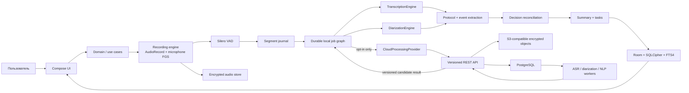
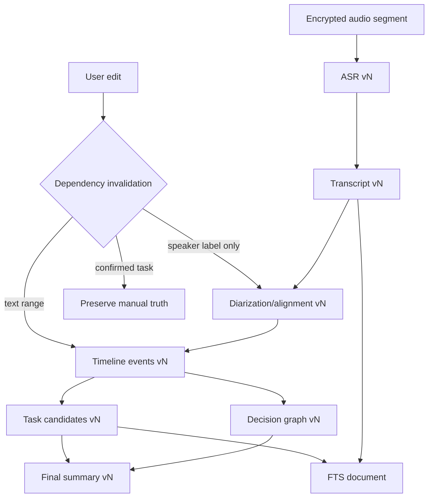
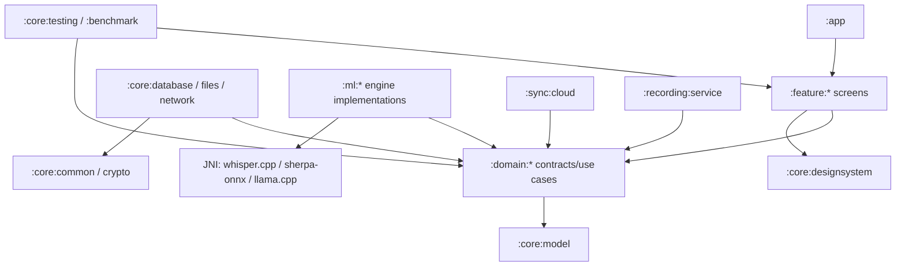
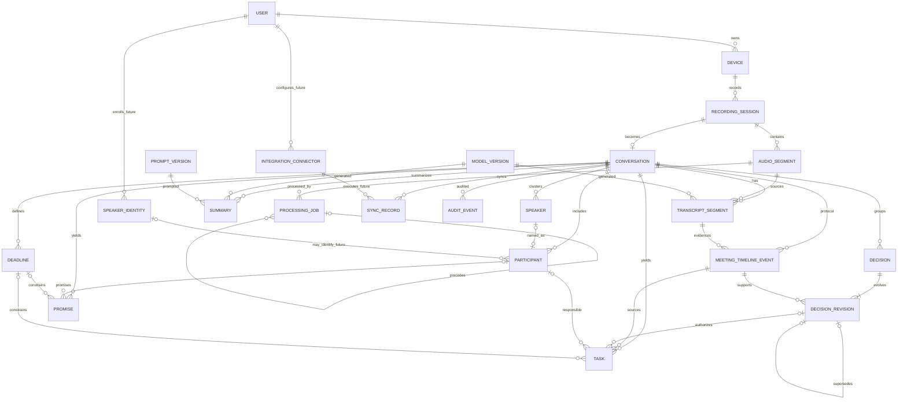
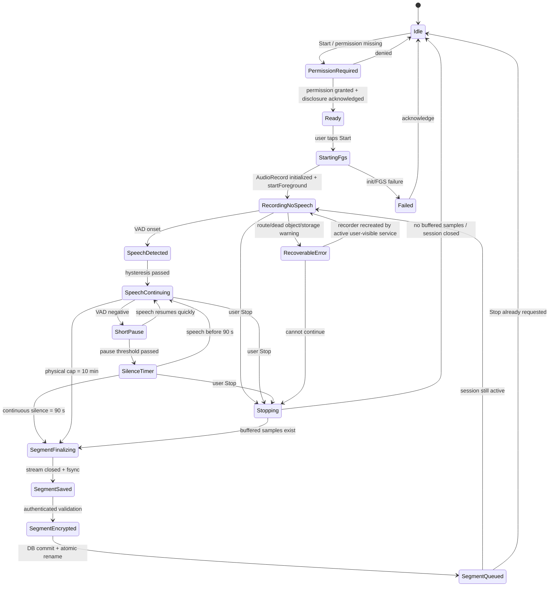
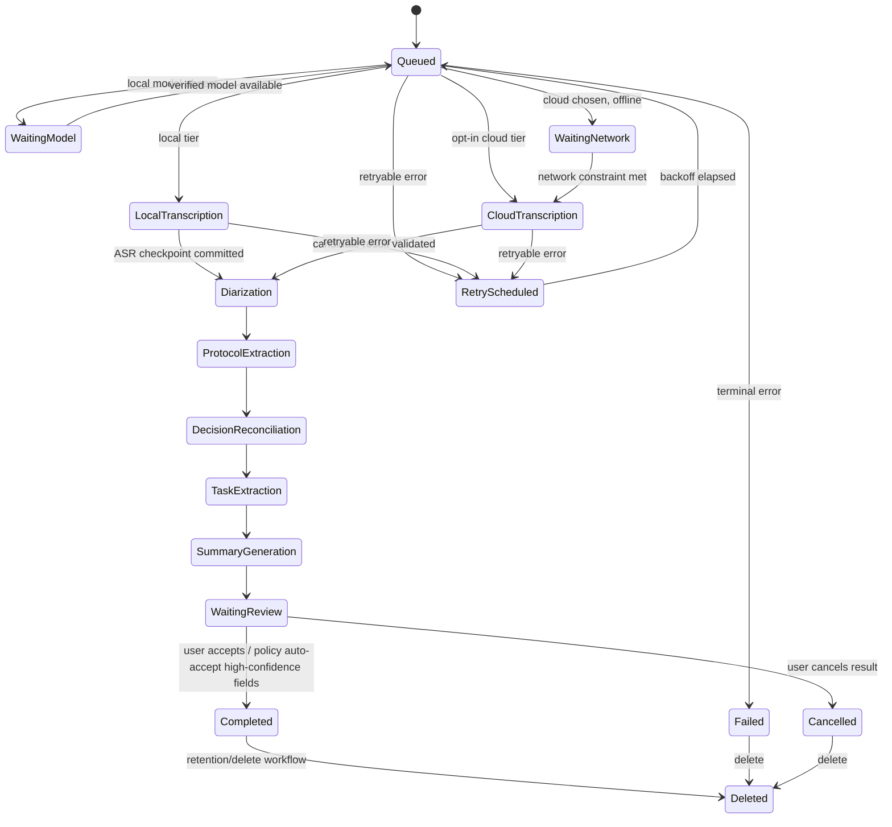

# Dora: исследование архитектуры и план разработки Android MVP 1

**Статус:** архитектурное решение для утверждения<br>
**Дата проверки источников:** 4 августа 2026 года<br>
**Recovery governance amendment:** 12 августа 2026 года — `DEC-044`/`OD-14`; Gate Set exact, implementation/execution withheld<br>
**Область:** Android MVP 1; production-код в документ не входит<br>
**Правовая оговорка:** раздел 25 — инженерный чек-лист, а не юридическая консультация.

## Как читать документ

- **Факт** — подтверждён первичным источником на дату проверки.
- **Решение** — рекомендуемый выбор для Dora MVP 1.
- **Допущение** — рабочая продуктовая предпосылка, которую должен утвердить владелец продукта.
- **Неопределённость** — данных недостаточно или результат зависит от устройства, акустики, региона либо модели.
- **PoC-гейт** — production-выбор запрещено фиксировать до измеримого прототипа.

Версии зависимостей ниже — проверенный ориентир, а не разрешение автоматически брать `latest`. Перед созданием lock-файлов нужно повторно проверить release notes, CVE, ABI и лицензии, затем зафиксировать версии и SHA-256 артефактов.

---

## 1. Краткое резюме

**Однозначная рекомендация:** строить Dora как **local-first Android-приложение с необязательным заменяемым backend** (вариант B). Запись, защищённое хранение, история, поиск, задачи, ручная правка и очередь работают без сети. ASR и базовая диаризация доступны локально после отдельной загрузки моделей. Backend повышает качество и обслуживает слабые устройства, но включается только отдельным согласием и никогда не является условием доступа к локальным данным.

Выбранный технический контур:

| Область | Выбор MVP 1 | Почему |
|---|---|---|
| Android | Kotlin, Jetpack Compose, Coroutines/Flow, ViewModel + reducer/UDF, Hilt | официальный современный стек; проверяемые состояния; compile-time DI |
| Платформа | `minSdk 28`; `targetSdk 36` как подтверждённый release floor; миграционный гейт на API 37 | разумная матрица устройств; Play требует API 36 для новых релизов с 31.08.2026; API 37 включать после проверки финального SDK/поведенческих изменений |
| Запись | `AudioRecord` в foreground service типа `microphone`; только явный запуск пользователем | PCM нужен для VAD, контрольных точек и точного восстановления; Android не разрешает обещать скрытую постоянную запись |
| Сегментация | Silero VAD через sherpa-onnx; логическая граница после 90 с непрерывной тишины; физический cap 10 мин и overlap 1,5–2 с | сохраняет требование 90 с, но не создаёт один хрупкий многочасовой файл |
| Локальный ASR | whisper.cpp + multilingual Whisper `base`, квантованный артефакт после device PoC | зрелый Android/C++ runtime, RU/EN и смешанная речь, полностью offline |
| Резерв слабым устройствам | Vosk small RU/EN либо гибридная обработка | меньше модель/нагрузка, но хуже смешанная речь и пунктуация; выбор по PoC |
| Гибридный ASR | faster-whisper + `large-v3-turbo` на собственном worker | предсказуемая серверная производительность и открытая заменяемая реализация |
| Максимальное качество | экспериментальный Qwen3-ASR 1.7B + aligner либо отдельно выбранный коммерческий адаптер | перспективно, но новее и тяжелее; только A/B/PoC, не основа MVP |
| Диаризация | sherpa-onnx batch pipeline: pyannote segmentation + 3D-Speaker embeddings + clustering; обязательная ручная коррекция | есть Android/JNI-путь; качество overlap/шума нельзя обещать без корпуса Dora; веса проходят отдельный license gate |
| Локальный NLP | правила/парсеры всегда; опционально Qwen3-0.6B/1.7B GGUF через llama.cpp на совместимых устройствах | offline-кандидаты и JSON; качество эволюции решений — PoC-гейт |
| Backend NLP | self-hosted multilingual instruct model за `AnalysisEngine`; точная модель выбирается benchmark-ом | нет привязки к одному западному или российскому API |
| Данные | Room + SQLCipher; SQLite FTS4; зашифрованные аудиофайлы; Android Keystore для обёртки ключей | offline, миграции, полнотекстовый поиск и защита at rest |
| Фоновая работа | прямой microphone FGS для записи; unique WorkManager jobs для коротких идемпотентных стадий | соответствует различию срочной пользовательской записи и отложенной обработки |
| Backend | Python 3.13, FastAPI, Pydantic v2, PostgreSQL, S3-compatible storage, PostgreSQL job queue, GPU workers, OIDC/PKCE | минимальный self-hosted стек без обязательного Redis/Kafka/Kubernetes |
| Дистрибуция | бесплатный APK в Google Play + RuStore; подписанный APK/enterprise channel при необходимости | Google Play Billing для пользователей РФ приостановлен; ключевая функция не зависит от GMS |

Самые опасные неизвестные — не «собирается ли библиотека», а (1) долговременная запись на OEM-прошивках, (2) скорость/нагрев Whisper на реальных устройствах, (3) DER локальной диаризации на RU/EN и speakerphone, (4) точность финального решения после нескольких ревизий, (5) лицензии конкретных model weights. Поэтому первые десять работ — измеримые PoC, а не экранная разработка.

---

## 2. Понимание продукта

Dora превращает явно начатую пользователем аудиозапись в проверяемый набор артефактов:

1. неизменяемый источник — аудио с временной шкалой;
2. редактируемый транскрипт со спикерами;
3. хронологический протокол с ссылками на источник;
4. граф ревизий решений, где позднее подтверждение может заменить раннее;
5. задачи, обещания, сроки и ответственные;
6. итоговое резюме, построенное из актуальной проекции, а не из случайной последней фразы;
7. локальную историю и быстрый поиск.

Главная гипотеза MVP: пользователь доверяет Dora, если запись не теряется, каждый вывод можно проверить по реплике/аудио, а итоговые задачи отражают последнюю подтверждённую договорённость. Real-time и автоматический пассивный запуск вторичны.

Ключевое доменное различие:

- **RecordingSession / Conversation** — вся встреча от ручного Start до Stop.
- **AudioSegment** — физически надёжно сохранённая часть, максимум 10 минут.
- **Semantic boundary** — граница после 90 секунд непрерывной тишины; она может завершить группу физических частей, но не обязана завершать всю встречу.
- **TranscriptSegment** — реплика/интервал после ASR и diarization; не равен аудиофайлу.

Так 90-секундное правило сохраняется, но первые 10 минут часовой встречи можно обрабатывать, не ожидая её конца.

---

## 3. Принятые допущения

| ID | Допущение | Последствие | Кто утверждает |
|---|---|---|---|
| A1 | Запись всегда начинается явным нажатием пользователя | нет пассивного always-on и автозапуска после reboot | Product/Legal |
| A2 | Пользователь отвечает за уведомление/согласие собеседников | Dora напоминает и фиксирует подтверждение, но не определяет право автоматически | Legal/Product |
| A3 | RU и EN равноправны; code-switch встречается | только multilingual ASR как default; два одноязычных Vosk-моделя — fallback | Product/ML |
| A4 | Надёжность важнее live transcript | batch после закрытия физического сегмента допустим | Product |
| A5 | Базовый сценарий — микрофон телефона/гарнитуры | системный звук и вызовы не обещаются | Product/Legal |
| A6 | Локальные данные доступны без аккаунта | `User` локальный; OIDC нужен только облаку/синхронизации | Product/Security |
| A7 | Модели загружаются отдельно по Wi-Fi или явному разрешению | APK остаётся умеренным; есть model catalog и integrity check | Product/ML |
| A8 | Минимально поддерживаем Android 9/API 28 | уменьшается legacy-ветвление; покрывается современный Keystore/NNAPI baseline | Product/Android |
| A9 | По умолчанию облако выключено | отсутствие сети/VPN/API не блокирует запись и историю | Product/Legal |
| A10 | Автоматические выводы требуют подтверждения при низкой уверенности | UI и схема хранят confidence, source и review state | Product |
| A11 | MVP не предназначен специально для детей | до выхода на детскую аудиторию нужен отдельный COPPA/возрастной дизайн | Product/Legal |
| A12 | Российский облачный режим при сборе ПД граждан РФ развёртывается в РФ | отдельный региональный tenant/data plane; трансграничность проходит юрпроверку | Legal/Backend |

**Неопределённость:** поддерживаемый рынок, форма юрлица, B2C/B2B и политика монетизации пока неизвестны. Эти ответы меняют consent, локализацию данных, DPIA/договоры обработки и store billing, но не локальную архитектуру.

---

## 4. Выводы о реализуемости

| Требование | Вердикт | Практическая реализация / честное ограничение |
|---|---|---|
| Ручная длительная запись, экран выключен | Реализуемо | user-initiated microphone FGS с постоянным уведомлением; OEM/device tests обязательны |
| Скрытая постоянная запись | Не поддерживать | противоречит модели Android/Play и ожиданиям приватности; заменить большим явным Start и persistent status |
| Автовозобновление микрофона после reboot | Нельзя обещать | восстановить `.part`/jobs и показать уведомление «Нажмите, чтобы продолжить»; микрофон вновь включает пользователь |
| Запись звонка/системного аудио | Для обычного приложения не гарантируется | физический микрофон может акустически слышать speakerphone; `VOICE_CALL` требует signature permission; Playback Capture зависит от согласия и политики источника |
| 90 секунд тишины | Реализуемо | VAD + monotonic clock; cap 10 минут предотвращает огромные файлы |
| Полностью offline ASR RU/EN | Реализуемо не на всех классах одинаково | Whisper base; слабым устройствам smaller/fallback или отложенный hybrid |
| Локальная diarization | Реализуема как базовая batch-функция | Speaker 1…N, confidence и ручные merge/split/reassign; overlap и шум остаются трудными |
| Идентификация знакомого человека | Технически возможна, не MVP | voice enrollment — биометрический и quality/security scope |
| Протокол, задачи, история решений | Реализуемо | source-grounded event extraction + append-only revision graph + review |
| Локальное резюме | Реализуемо на способных устройствах, качество не доказано | Qwen3 small через llama.cpp; слабым устройствам правила/черновик или opt-in backend |
| Поиск без сети | Полностью реализуемо | Room normalized schema + FTS4; semantic vector search позже |
| Работа с/без VPN | Базовая локальная — полностью | облачные endpoints проходят reachability/retry; запрет обхода региональных/договорных ограничений |
| Россия и западные страны | Реализуемо при двух data planes | no-GMS core, открытые модели, store variants, OIDC/S3 provider ports |

**Вывод:** функции ядра технически достижимы. Нельзя заявлять одинаковую скорость/качество на всех Android-устройствах или безусловную многочасовую запись на каждой OEM-прошивке. Поддержка задаётся tested-device matrix и capability tiers.

---

## 5. Ограничения Android

### 5.1. Платформенные факты

- **Факт:** Android 12+ ограничивает запуск foreground service из background. Запуск записи должен происходить из видимого UI/явного действия. На Android 14+ while-in-use permission для микрофона проверяется немедленно при создании FGS ([Android: background-start restrictions](https://developer.android.com/develop/background-work/services/fgs/restrictions-bg-start)).
- **Факт:** сервис объявляет `android:foregroundServiceType="microphone"`, разрешения `FOREGROUND_SERVICE_MICROPHONE` и `RECORD_AUDIO`; микрофонный FGS не должен стартовать из `BOOT_COMPLETED` вне узких исключений ([FGS service types](https://developer.android.com/develop/background-work/services/fgs/service-types)).
- **Факт:** foreground service обязан быть заметен пользователю через notification. С Android 12 действует системный индикатор микрофона; Dora его не скрывает ([FGS overview](https://developer.android.com/develop/background-work/services/fgs)).
- **Факт:** с Android 13 пользователь может остановить приложение через Active apps/Task Manager; система завершает весь процесс и не вызывает callback. Причину можно увидеть после запуска как `ApplicationExitInfo.REASON_USER_REQUESTED` ([user-stopped FGS](https://developer.android.com/develop/background-work/services/fgs/handle-user-stopping)).
- **Факт:** отказ в `POST_NOTIFICATIONS` на Android 13+ может убрать обычное FGS-уведомление из notification drawer, хотя запись остаётся видимой в Task Manager. Dora объясняет, почему уведомления важны, но не блокирует разрешённый системный сценарий ([Android 13 changes](https://developer.android.com/about/versions/13/behavior-changes-13)).
- **Факт:** Doze откладывает сеть, jobs и alarms. Активный user-visible FGS служит корректным механизмом записи, но обработка/загрузка должна терпеть задержки ([Doze](https://developer.android.com/training/monitoring-device-state/doze-standby)).
- **Факт:** обычный Worker ограничен примерно десятью минутами. Long-running WorkManager использует FGS, а Android 16 считает jobs, запущенные из FGS, в quota. Значит, ML-стадии нужно дробить и checkpoint-ить, а не создавать бесконечный Worker ([WorkManager](https://developer.android.com/reference/androidx/work/WorkManager.html), [long-running workers](https://developer.android.com/develop/background-work/background-tasks/persistent/how-to/long-running)).
- **Факт:** Android 15 ввёл суммарные background timeout для `dataSync`/`mediaProcessing`; microphone type в этом перечне не означает разрешение использовать запись бесконечно — пользователь всё равно должен видеть и уметь остановить её ([FGS timeout](https://developer.android.com/develop/background-work/services/fgs/timeout)).
- **Факт:** Android 16/API 36 усиливает job quotas; Android 17/API 37 добавляет app memory limits на части устройств. Native ML обязан реагировать на trim/exit info и не держать одновременно ASR + diarization + LLM ([Android 16](https://developer.android.com/about/versions/16/summary), [Android 17](https://developer.android.com/about/versions/17/summary)).
- **Факт:** с 31 августа 2026 новые приложения/обновления Google Play должны target Android 16/API 36 или новее ([Play target API policy](https://support.google.com/googleplay/android-developer/answer/11926878?hl=en-GB)).
- **Факт:** с 1 ноября 2025 все новые приложения и обновления в Google Play, target-ящие Android 15/API 35+, обязаны поддерживать устройства с 16-КБ страницами памяти. Dora включает несколько нативных `.so` (ASR, diarization, LLM, SQLCipher), поэтому каждый собственный и prebuilt binary должен иметь 16-КБ ELF/ZIP alignment и пройти runtime-тест; базовая сборочная линия — AGP 8.5.1+ и NDK r28+ ([Android: 16 KB page sizes](https://developer.android.com/guide/practices/page-sizes)).

### 5.2. OEM и пользовательские ограничения

Android прямо указывает, что точное поведение background restrictions зависит от производителя ([background optimization](https://developer.android.com/topic/performance/background-optimization)). Samsung документирует sleeping/deep-sleep ограничения для jobs, alarms и FGS ([Samsung App Management](https://developer.samsung.com/mobile/app-management.html)). Для Xiaomi, Huawei, Oppo, Vivo и Realme нет одной стабильной публичной спецификации, применимой ко всем прошивкам.

**Решение:** поддерживать официальные API, показывать диагностический экран (permission, notification, battery state, last checkpoint, exit reason), давать необязательную ссылку в системные настройки и тестировать конкретные firmware. Не обещать «обход оптимизации батареи» и не требовать whitelist без измеренной проблемы.

### 5.3. Store policy

Для target Android 14+ типы FGS декларируются в Play Console, включая описание и demo video; voice recording является допустимым core use case при user initiation, perceptibility и stoppability ([Play FGS declaration](https://support.google.com/googleplay/android-developer/answer/13392821?hl=en-EN), [FGS requirements](https://support.google.com/googleplay/android-developer/answer/17190352?hl=en)). Microphone data относятся к sensitive user data: нужны privacy policy, Data Safety, защищённая обработка и понятное удаление ([User Data policy](https://support.google.com/googleplay/android-developer/answer/10144311?hl=en-GB)). Prominent disclosure показывается **до** runtime permission и отдельно объясняет облачную передачу ([prominent disclosure](https://support.google.com/googleplay/android-developer/answer/11150561?hl=en)).

С сентября 2026 приложения из участвующих магазинов в отдельных регионах должны быть зарегистрированы подтверждённым разработчиком для установки на сертифицированные Android-устройства. Для широкого распространения вне Google Play также предусмотрены Android Developer Console, проверка личности и регистрация package names. Это меняющийся rollout, поэтому Dora начинает верификацию владельца и package name до submission и повторно проверяет список регионов/магазинов на release gate ([Android developer verification](https://developer.android.com/developer-verification)).

---

## 6. Таблица реализуемости режимов записи

| Режим | Категория | Условия | Ограничения | Рекомендация |
|---|---|---|---|---|
| Ручной Start/Stop в открытом приложении | Полностью поддерживается | `RECORD_AUDIO`, видимый Activity | аудиофокус/маршрут могут меняться | основной сценарий |
| После сворачивания | Только FGS + постоянное уведомление | стартовать FGS из visible UI | OEM может ограничить; пользователь может Stop app | включить MVP |
| При выключенном экране | Только FGS + уведомление | wake-lock только точечно, не держать CPU без нужды | Doze откладывает upload/jobs | включить, измерять 1/3/8 ч |
| Battery Saver | Ненадёжно на отдельных устройствах | активный FGS, локальная запись | ML/сеть откладывать; thermal/battery impact | запись да, анализ после |
| С включённой оптимизацией батареи | Поддерживается не абсолютно | официальный FGS | vendor firmware может убить процесс | диагностировать, не обещать 100% |
| Полностью без сети | Полностью для capture/storage/search | модели уже загружены для ASR/diarization | cloud jobs ждут | core requirement |
| С VPN / без VPN | Полностью локально; cloud зависит от сети | стандартный HTTPS, короткие timeouts | смена route рвёт upload | resumable upload + retry |
| Восьмичасовая встреча | Условно поддерживается | питание/место/thermal checks; rotation | высокий риск OEM/заряда/места | acceptance matrix, предупреждение |
| Автоматический старт при речи | Ограничено policy/privacy | потребовал бы постоянного microphone FGS | высокий battery/privacy риск | не MVP; только manual start |
| Always-on скрыто | Не рекомендуется / фактически несовместимо | — | Play/privacy/FGS visibility | исключить |
| После process death | Нельзя гарантировать продолжение микрофона | salvage локального файла/job | процесс уже не пишет; callback может не быть | восстановить данные, попросить Tap to resume |
| После reboot | Автозапуск микрофона не поддерживать | receiver может восстановить metadata/jobs | microphone FGS из boot ограничен | recovery notification без mic |
| Телефонный вызов, downlink/uplink | Технически недоступно обычному app | `CAPTURE_AUDIO_OUTPUT` signature-only | mic слышит лишь акустику speakerphone | явно не обещать call recording |
| Аудио другого приложения | Ограничено | MediaProjection consent + источник разрешает capture | DRM/usage policy; не все приложения | вне MVP |
| Bluetooth / wired headset | Поддерживается с оговорками | route monitoring, input preflight | OEM/codec/переключение route | device test + отображать source |
| Одновременная камера/ассистент/звонок | Ненадёжно | следить за recording config/callback | Android меняет приоритет/может заглушить | checkpoint + понятная ошибка |

Ближайшая легальная альтернатива «всегда пишет»: одно нажатие **Начать встречу**, большой таймер, системный индикатор, persistent notification с Pause/Stop/Mark, preflight согласия и предупреждение, если система остановила приложение.

---

## 7. Рекомендуемый состав MVP 1

### Обязательно реализовать

- onboarding, prominent disclosure, consent reminder, permissions и видимый recording state;
- надёжный `AudioRecord` + microphone FGS, pause/stop, route/status, physical rotation;
- Silero VAD, ровно 90 с непрерывной тишины как semantic boundary, 10-минутный cap;
- encrypted crash-recoverable local storage, Room/SQLCipher journal, storage guard;
- model catalog/download/resume/hash/license/compatibility;
- local Whisper base path, capability benchmark и hybrid fallback;
- batch diarization Speaker 1…N; rename, merge, split/reassign utterance;
- редактируемый transcript и source playback;
- timeline protocol, decision revisions, task/promise/deadline extraction;
- review queue: confirm/reject/edit; никакой silent overwrite пользовательской правки;
- structured summary с source timestamps и confidence;
- внутренняя task list; статусы draft/review/planned/in progress/done/cancelled/overdue;
- history, filters, Room FTS4 search, copy/select/export/delete;
- local/hybrid/cloud settings с отдельным согласием и cloud processing log;
- RU, EN, mixed-language corpus tests; offline/airplane/VPN/process-death/1–3–8h tests;
- privacy policy/Data Safety/store declarations и SBOM/license notices.

### Подготовить интерфейс, не реализацию

`TranscriptionEngine`, `DiarizationEngine`, `AnalysisEngine`, `ModelRepository`, `CloudProcessingProvider`, `SyncAdapter`, `IntegrationConnector`, `TaskExportProvider`, `CalendarProvider`, `CrmProvider`; server IDs/sync states; tenant/workspace IDs nullable; versioned API/event/schema; account optional.

### Явно не включать

Пассивную/скрытую запись, автоматический start по речи, гарантированную запись звонков/system audio, auto-resume microphone после reboot, voice identity/enrollment, full streaming transcript/diarization, semantic vector search, collaboration, cross-device sync, Google Tasks/Calendar/CRM/Jira/Notion, billing, enterprise admin, iOS/web/desktop, общие пространства и автоматическое обучение на пользовательских аудио.

---

## 8. Функции, отложенные до MVP 2

| Функция | Когда возвращать | Что оставить сейчас |
|---|---|---|
| Voice identity знакомых людей | после DER/EER, threat model и legal review биометрии | `SpeakerIdentity`, nullable link, consent scope |
| Полностью streaming transcript/diarization | после надёжности batch и thermal profile | streaming-capable engine interface |
| Semantic search | если keyword-search recall подтверждённо мешает retention | `SearchProvider`, schema version; не хранить embeddings сейчас |
| Auto meeting detection | после ручного сценария и labeled corpus | постфактум classifier/confidence |
| Интеграции задач/календарей/CRM | после проверки внутренней task value | connector interfaces + external IDs |
| Team/cross-device sync | после account/tenant/security model | serverId/syncVersion/tombstone |
| Billing | после market/store route | entitlement interface без SDK |
| iOS/web/desktop | после устойчивых domain/API contracts | OpenAPI/event schemas |
| Enterprise/self-host admin | после B2B demand | containerized backend/OIDC boundaries |

---

## 9. Сравнение архитектурных вариантов

Оценка: 5 — лучше для критерия, 1 — хуже. Стоимость/сложность оценены обратной шкалой: 5 — дешевле/проще.

| Критерий | A: полностью local | B: local-first + optional backend | C: cloud-first |
|---|---:|---:|---:|
| Приватность по умолчанию | 5 | 5 | 2 |
| Offline | 5 | 5 | 1 |
| Слабые устройства | 2 | 5 | 5 |
| Максимальное качество | 3 | 5 | 5 |
| Расход батареи | 2 | 4 | 4 |
| Предсказуемая задержка | 2 | 4 | 4 |
| Региональная устойчивость | 5 | 5 | 2 |
| Операционная простота | 5 | 3 | 2 |
| Простота Android MVP | 3 | 3 | 4 |
| Масштабируемость/enterprise | 2 | 5 | 5 |
| Vendor lock-in | 5 | 5 при портах | 2 |
| Управляемая стоимость | 5 | 4 | 2 |
| Итог | хороший privacy mode, недостаточен слабым устройствам | **рекомендуется** | противоречит local-first |

**Решение:** вариант B. Backend нужен как **необязательная capability**, а не как источник истины. Устройство создаёт canonical UUID, хранит authoritative user edits и отправляет immutable inputs/content hashes. Облачный результат возвращается как новая версия-кандидат и проходит local merge/review.

### Android-подходы

| Выбор | Альтернатива | Решение и компромисс |
|---|---|---|
| Compose | XML Views | Compose: новый продукт, state-heavy UI и меньше двойной инфраструктуры; XML не нужен |
| MVVM + reducer/UDF | строгий MVI | явные immutable screen states/events без общего MVI-framework и boilerplate |
| Layered Clean/hexagonal ports | feature напрямую к Room/API | domain interfaces нужны для local/cloud engines; не создавать use case на каждый getter |
| Hilt | Koin | Hilt: compile-time graph, официальный Android guidance; Koin проще/KMP-friendly, но runtime graph не даёт преимуществ Android-only MVP |
| Room + SQLCipher | raw SQLite | Room migrations/DAO + full DB encryption; raw SQL только для FTS/maintenance |
| FTS4 | FTS5/vector DB | FTS4 официально поддерживается Room; FTS5/semantic — позже, если измерена потребность |
| AudioRecord | MediaRecorder | AudioRecord даёт PCM frames/VAD/checkpoints; MediaRecorder проще, но хуже контролируется |
| WorkManager unique jobs | бесконечный service | WorkManager для durable stages/retry; прямой FGS только запись и действительно user-visible long processing |

---

## 10. Финальная рекомендуемая архитектура

### 10.1. Android stack

- Kotlin/JVM 17, Gradle Kotlin DSL, version catalog, convention plugins, KSP.
- Jetpack Compose + Material 3, Navigation Compose, lifecycle-aware state collection.
- Coroutines/Flow; immutable UI state; `ViewModel` dispatches intents to domain services/repositories.
- Hilt; Room 2.8.x line + new `net.zetetic:sqlcipher-android`; SQLite FTS4.
- `AudioRecord`, AudioManager route callbacks, direct microphone foreground service.
- sherpa-onnx for Silero VAD and diarization pipeline; whisper.cpp JNI isolated behind `TranscriptionEngine`.
- WorkManager unique work chains with constraints/backoff/checkpoints.
- OkHttp + Retrofit + kotlinx.serialization for optional `/v1` API; no Firebase/GMS requirement.
- Tink Streaming AEAD for large files and Android Keystore-backed key wrapping; **PoC must prove truncated-stream salvage**. AndroidX `EncryptedFile` is deprecated and is not selected.
- Media3 only for playback/export if it simplifies seeking, not for capture.
- JUnit, Kotest or AssertJ (choose one assertion stack), Turbine, kotlinx-coroutines-test, Room tests, Compose UI tests, Macrobenchmark, Baseline Profiles.
- detekt, ktlint, dependency verification/locking, SBOM, native symbols, reproducible model manifest.

### 10.2. API границы

```kotlin
interface TranscriptionEngine {
    val descriptor: EngineDescriptor
    suspend fun transcribe(input: AudioInput, checkpoint: Checkpoint?): TranscriptResult
}

interface DiarizationEngine {
    suspend fun diarize(input: AudioInput, hint: SpeakerCountHint?): DiarizationResult
}

interface AnalysisEngine {
    suspend fun extractEvents(input: TranscriptWindow, context: DecisionContext): EventBatch
    suspend fun reconcile(input: ReconciliationInput): ReconciliationResult
}

interface CloudProcessingProvider {
    suspend fun createJob(request: CreateJob): RemoteJob
    suspend fun uploadPart(job: RemoteJob, part: UploadPart): PartReceipt
    suspend fun poll(jobId: String): RemoteJobState
    suspend fun deleteCloudCopy(conversationId: String): DeletionReceipt
}
```

Domain-модули знают только DTO/ports. Native runtime, provider SDK и API response никогда не проходят прямо в UI или Room entities.

### 10.3. Capability tiers

| Tier | Условие (определяется benchmark, не только RAM) | Поведение |
|---|---|---|
| Basic | низкая память/thermal budget | запись, VAD, history/search; Vosk или hybrid ASR; NLP rules |
| Standard | Whisper base укладывается в acceptance | local ASR + local diarization; optional cloud analysis |
| Enhanced | локальный LLM проходит memory/thermal gate | Qwen3-0.6B/1.7B GGUF structured extraction/summarization |
| Cloud-assisted | пользователь дал отдельное согласие | faster-whisper/pyannote/large LLM в выбранном region |

Tier вычисляется локальным benchmark и может понижаться при low battery/thermal pressure. Модель нельзя загружать лишь по названию SoC.

### 10.4. Disposition архитектурных элементов

| Элемент | Статус | Конкретное решение |
|---|---|---|
| Kotlin, Compose, Coroutines, Flow | сейчас | основной Android stack |
| Clean/Hexagonal | сейчас, прагматично | ports у ML/cloud/storage; без use-case boilerplate на каждый CRUD |
| MVVM | сейчас | ViewModel + immutable state/reducer/UDF |
| MVI framework | не использовать | паттерн событий нужен, отдельная зависимость — нет |
| Модульная архитектура | сейчас постепенно | core/recording/domain first; feature modules по реальным boundaries |
| Hilt | сейчас | compile-time DI; Koin не использовать в Android MVP |
| Room/SQLite/FTS4 | сейчас | Room DAO/migrations, raw SQL только для FTS/maintenance |
| WorkManager | сейчас | unique durable short stages/retry |
| Foreground service | сейчас | только mic capture и редкая явно user-visible long operation |
| AudioRecord | сейчас | PCM source; MediaRecorder не использовать |
| Media3 | ограниченно позже | playback/export только при пользе; не capture |
| ONNX Runtime/NNAPI/LiteRT | интерфейс/PoC | sherpa already covers selected models; accelerator выбирается только measurement |
| SQLCipher/Keystore/Tink/local files | сейчас | DB, key wrapping, authenticated audio storage |
| Backend/API/object storage/PostgreSQL queue | интерфейс сейчас; implementation optional | этап 11 после local slice |
| Authentication | позже для cloud | OIDC/PKCE; local mode без account |
| Monitoring/redacted logging | сейчас минимально | local diagnostics; OpenTelemetry backend when deployed |
| Crash reporting | интерфейс сейчас, provider позже | opt-in/no sensitive payload; no mandatory Firebase |
| Feature flags | сейчас локальные signed defaults | remote config позже, никогда не управляет consent скрыто |
| Model catalog/download/integrity/versioning | сейчас | signed manifest, digest, rollback, separate assets |
| Integrations/sync/billing/team/semantic search | ports/schema only | implementation после MVP value proof |

---

## 11. Диаграмма системы



### Конвейер и invalidation



---

## 12. Структура Android-модулей



Предлагаемые Gradle-модули:

```text
:app
:core:model :core:common :core:database :core:crypto :core:files
:core:network :core:designsystem :core:testing
:recording:api :recording:service
:domain:conversation :domain:processing :domain:decisions :domain:tasks
:domain:search :domain:models :domain:settings
:feature:onboarding :feature:home :feature:recording :feature:history
:feature:conversation :feature:review :feature:tasks :feature:search
:feature:settings :feature:models
:ml:api :ml:vad-sherpa :ml:asr-whispercpp :ml:diarization-sherpa
:ml:nlp-llamacpp (optional delivery/downloaded model)
:sync:api :sync:cloud
:benchmark :test:fixtures
```

Не создавать все модули в первом commit. Сначала `app/core/recording/domain/test`; выделять feature/ML modules при появлении реальной границы. Это предотвращает Gradle overhead и одновременно сохраняет целевую карту.

---

## 13. Backend-архитектура, если она нужна

Backend **нужен как optional deployment profile** для слабых устройств и повышенного качества. Локальная Dora без аккаунта остаётся полноценной по записи/истории/search/tasks; отсутствие backend лишь ограничивает доступные processing tiers.

### 13.1. Конкретный стек

| Компонент | Выбор | Резерв / причина замены |
|---|---|---|
| API | Python 3.13, FastAPI, Pydantic v2, OpenAPI 3.1 | Kotlin/Ktor, если команда только JVM; API schema остаётся прежней |
| Persistence | PostgreSQL + SQLAlchemy 2 + Alembic | managed или self-hosted PostgreSQL |
| Object storage | S3-compatible API; MinIO для self-host | российский/западный S3 adapter без изменения domain |
| Queue MVP | PostgreSQL jobs + `FOR UPDATE SKIP LOCKED`, lease/heartbeat | NATS/RabbitMQ только при доказанной нагрузке; Redis не обязателен |
| Workers | containers: faster-whisper, pyannote, NLP | независимые engine images с model digest |
| Auth | OIDC Authorization Code + PKCE; Keycloak self-hostable | любой совместимый OIDC IdP |
| Observability | OpenTelemetry, Prometheus-compatible metrics, structured redacted logs | региональный backend exporter |
| Deployment | Docker Compose single region; IaC | Kubernetes только при необходимости autoscale/multi-tenant isolation |

### 13.2. Data flow и retention

1. Client создаёт job по content hash и `Idempotency-Key`.
2. API возвращает multipart/presigned upload instructions конкретного region.
3. Client загружает уже локально зашифрованный transport payload либо TLS-protected FLAC согласно выбранной cloud E2EE модели. Если server должен выполнять inference, он обязан иметь контролируемый доступ к временной DEK; это честно показано пользователю.
4. Worker lease-ит job, проверяет SHA-256, записывает версии engine/model/prompt/schema и сохраняет результат.
5. Client получает candidate result, валидирует schema/source ranges и применяет локальной транзакцией.
6. Audio в cloud удаляется после подтверждённой доставки результата или через TTL (рекомендуемый default — 24 часа, меньшее из двух); производные данные следуют выбранной retention policy. Deletion receipt и audit event возвращаются клиенту.

`PostgreSQL`/object store не являются источником истины для пользовательских правок до включения sync. Job имеет unique key `(tenant, input_sha256, pipeline_version, requested_mode)`, lease expiry, attempt, nextAttemptAt и terminal states. Повторный POST возвращает существующий job/результат.

### 13.3. Что не нужно MVP

Kafka, service mesh, отдельный vector DB, Kubernetes, event sourcing всей серверной системы, microservices по каждому шагу, собственный password auth, обязательная Firebase telemetry и multi-region active-active. Один modular monolith API + независимые GPU workers достаточно.

---

## 14. Запись и сегментация аудио

### 14.1. Формат захвата

**Решение:** `AudioRecord`, mono PCM signed 16-bit. Запрашивать 16 kHz; если реальный input path устойчив только на 44,1/48 kHz, сохранять фактические параметры и детерминированно resample в 16 kHz для VAD/ASR. На старте проверять `STATE_INITIALIZED`, buffer не меньше `getMinBufferSize()` с запасом, читать на dedicated high-priority coroutine/thread и никогда не выполнять БД/сеть/ML в audio callback.

20-ms кадр при 16 kHz содержит 320 samples/640 bytes. Uncompressed budget — около **115,2 MB/час** без container/encryption overhead. Это приемлемый надёжный baseline и измеряемый worst case; lossless FLAC compaction после закрытия сегмента допустима только после проверки декодирования/checksum. AAC/Opus уменьшают размер, но добавляют codec state и потенциально ухудшают ASR; для MVP source-of-truth остаётся lossless.

`AudioRecord` выбран вместо `MediaRecorder`, потому что приложение должно видеть PCM до контейнера: VAD, pre-roll, route-change marker, checkpoint и точное сопоставление sample index→monotonic time. Официальный API предупреждает, что buffer нужно постоянно вычитывать, а `ERROR_DEAD_OBJECT` требует пересоздания recorder ([AudioRecord](https://developer.android.com/reference/android/media/AudioRecord)).

| Формат/контейнер | Размер/качество | Crash/recovery и Android | Решение |
|---|---|---|---|
| PCM S16LE в Dora encrypted container | ~115,2 MB/ч, lossless | простейшие sample/checkpoint/ASR semantics; собственный plaintext container не экспортируется | **active source-of-truth MVP** |
| WAV/PCM | тот же размер + header | header нужно repair после crash; широко читается | export, не active encrypted format |
| FLAC | lossless, обычно меньше PCM; ratio зависит от речи/шума | platform encoder есть, но finalize/verify и лишняя CPU/write work | optional post-close compaction PoC |
| AAC-LC | lossy, малый размер, platform encoder | mature, но codec delay/loss and ASR quality need benchmark | export/upload option, не canonical MVP |
| Opus | lossy, эффективен для речи; encoder platform only on newer API | container/seek/codec/device matrix сложнее | позже, если storage/bandwidth требует |

Не держать одновременно plaintext PCM и encrypted copy дольше транзакционного conversion window; temporary plaintext желательно вообще избегать streaming encryption.

### 14.2. Две оси сегментации

- **Логическая:** после речи 90,000 ms непрерывной VAD-тишины закрывается semantic segment. Таймер использует `elapsedRealtimeNanos`, не wall clock.
- **Физическая:** файл принудительно закрывается каждые 10 минут даже при постоянной речи; следующий начинается с 1,5–2,0 с decrypted-in-memory overlap. Dedup на ASR merge использует timestamps + text similarity.
- **Короткая пауза:** 0,8–1,2 с hysteresis, чтобы дыхание не дробило реплики.
- **Speech onset:** 0,3–0,5 с положительных кадров плюс 2 с pre-roll ring buffer, чтобы не отрезать начало слова.
- **После 90 с:** запись остаётся «вооружённой» в той же `RecordingSession`; новая речь открывает новый semantic segment. Вся встреча завершается только Stop пользователя. Опциональный prompt после длительной тишины не останавливает запись сам.

Параметры являются versioned `SegmentationProfile`; пороги калибруются PoC, а не хардкодятся в UI.

### 14.3. Durable write protocol

1. До включения микрофона создать `RecordingSession` и `AudioSegment(status=CAPTURING)` в одной SQLCipher transaction.
2. Создать случайный per-segment DEK; keyset обернуть KEK из Android Keystore. StrongBox использовать, если доступен, с обычным hardware/software Keystore fallback — не блокировать устройство.
3. Писать ciphertext в `segment-{uuid}.part` через Tink Streaming AEAD; AAD содержит `formatVersion|sessionId|segmentId|sampleRate|channelCount`.
4. Периодически сохранять `lastCommittedSample`, ciphertext length и rolling hash в journal; flush/fsync cadence 2–5 с выбирается battery PoC.
5. При boundary/cap/Stop: закрыть stream, fsync, проверить decrypt+sample count+SHA-256, записать `SAVED_ENCRYPTED`, затем atomic rename `.part`→`.dora` в том же filesystem.
6. Enqueue unique work `segment:{uuid}:pipeline:{version}` только после durable commit.
7. Original удалять лишь по явной retention policy и только когда существует локальный подтверждённый результат/export; cloud success сам по себе не разрешает удалить единственную копию.

**PoC-гейт (`DEC-044` / `OD-14`):** проверить, удаётся ли выбранной в prospective protocol v0.6 конструкции Tink Streaming AEAD (точные v0.3 candidate semantics, v0.4 durable key-confirmation contract и неизменённые v0.5 rules наследуются по SHA-256) безопасно прочитать полностью аутентифицированный committed prefix по `DURABLE_ONE_SEGMENT_LOOKAHEAD` и сравнить её с sealed five-second Tink AEAD microfiles + exact authenticated manifest. v0.6 сохраняет exact ordered eight-class KEY taxonomy и 46 unique active rows, но заменяет effective `KEY-04`: после совпадения confirmation path/type/recorded ciphertext length/SHA-256, usable Builder/`getAead` alias, exact AAD и controller replacement underlying key при неизменном ciphertext только decrypt authentication/AAD failure может дать единственный `KEY_UNAVAILABLE_KEY_MISMATCH`; successful decrypt с malformed/wrong plaintext остаётся `KCF-07` → `CORRUPT_KEY_CONFIRMATION`. Phase A — 184 injections (3 emulator + 1 D2 на row), full physical D1/D2/D5 — 138; 120 hard kills/candidate остаются отдельным denominator, а PASS без complete D1/D2/D5 запрещён. Loss committed bytes всегда равен нулю, tail loss — не более 5 секунд. `REC-JSR305-EXCLUDE-001` ограничен будущим `:poc:recovery`; existing other-module tooling paths не считаются recovery admission. Нельзя добавлять зависимость/модуль либо начинать implementation/execution до отдельного scope, accountable review, exact actual-graph/package/R8 Product/IP disposition, preflight и отдельного разрешения владельца; AI advisory review `formalReviewer=false` не закрывает `REC-RDY-02`; `implementationAllowed=false`; `executionAllowed=false`.

### 14.4. Recovery

При следующем запуске `RecoveryCoordinator` сканирует только известный app-private recording directory, сопоставляет DB и manifest, проверяет последний аутентифицированный checkpoint и:

- финализирует восстановимую часть как `PARTIAL_RECOVERED`;
- помещает её в обычный idempotent pipeline;
- переносит непроверяемый хвост в quarantine, не удаляет молча;
- создаёт `AuditEvent` с причиной exit из `ApplicationExitInfo`;
- показывает «восстановлено N:SS; возможно потеряно до X секунд»;
- **не** пытается скрыто открыть микрофон; Resume требует tap.

Low-storage guard вычисляет reserved bytes до Start, предупреждает при budget < ожидаемого часа и останавливает запись graceful при hard floor, оставляя резерв на финализацию/БД. Изменение маршрута, sample rate, permission revoke и `ERROR_DEAD_OBJECT` закрывают текущую физическую часть и создают новую с marker, а не смешивают форматы.

### 14.5. Влияние правила 90 секунд

| Область | Влияние | Компенсация |
|---|---|---|
| Задержка | без physical cap transcript мог бы ждать всю встречу | rotation 10 мин и обработка закрытых частей |
| RAM | нельзя держать 90 с/встречу в RAM | disk stream; RAM только small buffer/pre-roll |
| Батарея | VAD работает всю запись; ASR одновременно усиливает heat | lightweight VAD; ML по charging/thermal policy |
| Файлы | длинная непрерывная речь создаёт большой logical segment | физические 10-мин files |
| Потеря данных | один container рискован | checkpoints, `.part`, auth blocks, cap, recovery |
| UX | пользователь может думать, что анализ «завис» | отдельные statuses: Recording / Segment ready / Processing |

---

## 15. Сравнение технологий транскрибации

### 15.1. Сначала разделить модель и runtime

ONNX Runtime Mobile и LiteRT — не самостоятельные ASR: качество RU/EN определяется экспортированной моделью и preprocessing/decoder. Whisper — модель/reference implementation; whisper.cpp и faster-whisper — разные runtime. Поэтому «ONNX лучше Whisper» без конкретного graph/quantization/device не имеет смысла.

### 15.2. Сравнение кандидатов

Обозначения: **выс. / ср. / низ.** — ожидаемый относительный результат, не измерение Dora. Любая цифра скорости, WER или battery до PoC считается неизвестной.

| Кандидат | RU / EN / mixed | Timestamps / streaming | Mobile resources и acceleration | Offline / long audio | Интеграция, зрелость, лицензия | Вердикт |
|---|---|---|---|---|---|---|
| OpenAI Whisper reference | высок./выс./хорошо; качество языка различается | segment/word ecosystem; 30-s windows; не true streaming | PyTorch, не Android runtime; tiny→large 39M→1550M params | offline; long via windows | активная эталонная база, MIT code+weights ([repo](https://github.com/openai/whisper)) | reference/benchmark, не app runtime |
| **whisper.cpp** | лучший зрелый local baseline RU/EN/mixed | timestamps, chunking; pseudo-streaming | CPU/NEON, Vulkan, quantization; memory: tiny ~273 MB, base ~388 MB, small ~852 MB, medium ~2.1 GB, large ~3.9 GB | полностью offline; Android example | MIT, v1.9.1; активен ([repo](https://github.com/ggml-org/whisper.cpp)) | **основа MVP: multilingual base quantized** |
| **faster-whisper** | качество соответствующей Whisper model | word timestamps, VAD integration, batching | CTranslate2 CPU/GPU INT8/FP16; серверный | offline/self-host; long/batch | MIT, v1.2.1; хорошая документация ([repo](https://github.com/SYSTRAN/faster-whisper)) | **гибридный server default** |
| sherpa-onnx ASR models | зависит от выбранной модели; RU inventory проверить | online/offline models, timestamps model-specific | Android JNI/Kotlin, CPU; NNAPI не является универсальной гарантией | полностью offline | Apache-2.0 code; model licenses отдельно; очень активен ([repo](https://github.com/k2-fsa/sherpa-onnx)) | reserve/runtime platform; primary VAD/diarization |
| Vosk | ср. RU/EN; mixed требует model/language strategy | настоящий streaming, word times | small models около 50 MB по repo; CPU-friendly | offline, long streaming | Apache-2.0; Android mature, formal releases реже ([repo](https://github.com/alphacep/vosk-api)) | weak-device fallback после WER PoC |
| Android `SpeechRecognizer` | OEM/service-dependent | partial results возможны | системный provider; on-device API availability с API 31, но не одинаково | может отправлять audio remote; API не для continuous recognition | vendor/GMS/OEM dependency; Android прямо предупреждает о continuous use ([docs](https://developer.android.com/reference/android/speech/SpeechRecognizer)) | не core; только optional dictation |
| ONNX Runtime Mobile | качество = model | зависит от graph | CPU/XNNPACK; NNAPI partition/model/device-specific, CPU fallback может навредить | offline | MIT, v1.28.0; зрелый ([mobile](https://onnxruntime.ai/docs/get-started/with-mobile.html), [NNAPI](https://onnxruntime.ai/docs/execution-providers/NNAPI-ExecutionProvider.html)) | runtime alternative, не отдельный ASR choice |
| LiteRT | качество = model | зависит от model | CPU/GPU/NPU ecosystem; export/custom ops cost | offline | Apache-2.0 ([repo](https://github.com/google-ai-edge/litert)) | PoC только при доказанном accelerator win |
| Qwen3-ASR 0.6B/1.7B | заявлены 52 языка, включая RU; mixed перспективен | streaming/offline; timestamps требуют отдельный aligner | 0.6B INT8 sherpa package около 1 GB; слишком тяжёл default | offline/server | Apache-2.0, молодой проект без зрелой release history ([repo](https://github.com/QwenLM/Qwen3-ASR), [sherpa mobile docs](https://k2-fsa.github.io/sherpa/onnx/qwen3-asr/pretrained.html)) | experimental high-end/server PoC |
| Коммерческий API adapter | часто выс., зависит от provider/region | provider-specific | минимальная phone compute, сеть/стоимость | нет offline/self-host | договор, DPA, regional/payment/retention risks | optional, никогда единственный путь |

Whisper/Qwen-family models генерируют пунктуацию как часть текста; её качество измеряется отдельно, особенно для mixed speech. У Vosk пунктуация/model behavior зависит от выбранного language package и обычно слабее. CPU/GPU/NPU, battery и скорость по «weak/mainstream/flagship» намеренно не выражены выдуманными коэффициентами: whisper.cpp — прежде всего CPU/NEON с optional Vulkan, faster-whisper — CPU/CUDA server, Vosk — CPU, sherpa — CPU/доступные backend paths, ONNX NNAPI и LiteRT accelerators строго device/model-specific. App binary содержит runtime/ABI, но не model weights; итоговый install+download size показывает Model Manager.

Open-source/self-hosted engines не имеют API-географии и работают в РФ/на Западе после законного получения artifacts. Риск переносится на origin download, gated terms, mirror rights и оплату инфраструктуры; manifest имеет несколько разрешённых URL и offline side-load. Любой commercial adapter получает отдельную matrix `supported countries / registration / payment / DPA / retention / subprocessor / export controls` на момент procurement.

### 15.3. Размер и device policy

Официальная таблица whisper.cpp для исходных моделей: tiny 75 MiB, base 142 MiB, small 466 MiB, medium 1.5 GiB, large 2.9 GiB; runtime RAM выше. Quantized размер зависит от конкретного GGML artifact, поэтому manifest хранит точные `bytes`, `sha256`, source URL, license и compatible ABI, а UI показывает их до download.

**Не включать ML weights в APK.** Base — рекомендуемый default download. Small предлагается только после benchmark и обычно на устройствах ≥8 GB RAM; это эвристика для предложения, не gate. Runtime запускает одну тяжёлую модель за раз, проверяет available memory/thermal status и поддерживает cancel/checkpoint.

### 15.4. Итоговый выбор

1. **MVP local primary:** whisper.cpp + multilingual Whisper base, выбранная PoC quantization (стартовая гипотеза `q5`-класс).
2. **Reserve:** sherpa-onnx-compatible ASR или Vosk small; выбор по RU/EN WER и device coverage.
3. **Hybrid server:** faster-whisper + `large-v3-turbo`.
4. **Weak devices:** Vosk small для одного выбранного языка либо encrypted upload в opt-in hybrid; не обещать хороший live code-switch.
5. **Maximum quality:** Qwen3-ASR 1.7B + timestamp aligner как эксперимент и/или коммерческий provider adapter. Победитель определяется blind corpus benchmark.

Acceptance измеряет real-time factor, peak proportional set size, WER, timestamp error, energy/hour и thermal throttling на каждой tier. Нельзя публиковать маркетинговое «работает в реальном времени» до этих данных.

---

## 16. Сравнение технологий диаризации

### 16.1. Диаризация не равна идентификации

- **Diarization:** «кто говорил когда» в рамках одной встречи — Speaker 1/2/3.
- **Identification:** «это Иван» по voice enrollment — биометрическая функция, отдельные false accept/reject, consent, template protection и deletion.
- **Naming:** пользовательское отображаемое имя, безопасно реализуемое без биометрии.

MVP делает первое и третье. Второе отложено.

| Кандидат | Где | Сильные стороны | Ограничения / лицензия | Решение |
|---|---|---|---|---|
| **sherpa-onnx diarization** | Android batch/offline | C API/JNI, Android APK examples, segmentation+embedding+clustering | Apache-2.0 code; каждый model artifact проверяется отдельно; RAM/DER PoC | **local primary framework** |
| pyannote segmentation + 3D-Speaker embedding | Android через sherpa | overlap-aware segmentation + speaker embeddings | pyannote weights могут быть gated/CC-BY; 3D-Speaker code Apache-2.0, weights/datasets отдельно; attribution/distribution audit | рекомендуемая конфигурация после license gate |
| pyannote.audio Community-1 | self-hosted GPU | зрелый end-to-end offline pipeline и strong reference | code MIT, model CC-BY-4.0 и gated terms; server resources | **server fallback/quality reference** |
| WeSpeaker embeddings | server/mobile experiment | Apache-2.0 toolkit, speaker verification/embedding | production Android packaging и конкретные weights требуют работы/audit | резерв embedding model |
| Commercial diarization API | cloud | часто хорошая эксплуатация/overlap features | region, цена, retention, vendor contract | optional adapter |
| Voice enrollment/recognition | local/server | постоянные имена | biometric risk; EER, spoofing, consent, revocation | не MVP |

Официальные точки: [sherpa-onnx diarization](https://k2-fsa.github.io/sherpa/onnx/speaker-diarization/index.html), [Android APKs](https://k2-fsa.github.io/sherpa/onnx/speaker-diarization/apk.html), [pyannote.audio](https://github.com/pyannote/pyannote-audio), [Community-1 model card](https://huggingface.co/pyannote/speaker-diarization-community-1), [3D-Speaker](https://github.com/modelscope/3D-Speaker), [WeSpeaker](https://github.com/wenet-e2e/wespeaker).

### 16.2. Processing order

1. VAD/segmentation produces speech regions.
2. Diarization produces speaker intervals, potentially overlapping.
3. ASR words/segments align by intersection; ambiguous overlap receives `speakerId=null` or multiple candidates, not forced certainty.
4. Adjacent compatible intervals merge with maximum-gap rules.
5. Clusters persist across physical file boundaries by overlap embeddings; no cross-conversation identity.
6. UI exposes rename, merge clusters, split interval, assign utterance and undo.

Remote speaker through phone loudspeaker, TV/video, reverberation, very short turns and simultaneous speech must lower confidence and set `NEEDS_REVIEW`. «Число участников» хранится как distribution/range (`estimated=3`, `min=2`, `max=4`, confidence), not ground truth.

Speaker embeddings в значительной мере language-agnostic, но это **не** доказательство качества на русскоязычных встречах: training data, microphones, room acoustics и turn style влияют на DER. Публичный upstream benchmark нельзя переносить на Dora без RU/EN corpus. Streaming diarization технически возможна в отдельных stacks, но batch выбран для MVP из-за устойчивости cluster context, батареи и корректируемости.

### 16.3. Edit semantics

- Rename Speaker changes participant projection and FTS; transcript text/ASR need not rerun.
- Merge changes all affected speaker assignments and invalidates speaker-dependent responsible extraction/summary.
- Split/reassign creates manual override intervals above model output; subsequent reprocessing preserves override and stores new candidate underneath.
- Every edit appends `AuditEvent`, increments entity version and identifies `origin=USER`; model jobs may never silently overwrite it.

---

## 17. Подход к определению совещания

MVP **не запускает запись автоматически**. После Stop лёгкий classifier предлагает тип контента и просит подтверждение.

Feature vector без отправки аудио:

- total/speech/silence duration и speech ratio;
- число устойчивых speaker clusters и entropy;
- turn count, median turn duration, alternating-turn ratio;
- доля music-like/constant background frames (если маленький classifier прошёл PoC);
- количество вопросов, action/decision candidates, обращений по имени;
- ASR confidence/no-speech probability;
- пользовательская метка прошлых похожих записей — только локально и opt-in.

Пример правил для первого прототипа, не production thresholds:

```text
if speech_minutes < 2 or asr_confidence very_low -> INSUFFICIENT_DATA
else if stable_speakers >= 2 and turns >= 8 and semantic_candidates >= 2 -> PROBABLE_MEETING
else if stable_speakers >= 2 -> PROBABLE_CONVERSATION
else if one_speaker and speech_ratio high -> MONOLOGUE
else if music_or_tv_score high -> PROBABLE_BACKGROUND_CONTENT
else -> NEEDS_CONFIRMATION
```

Выход: `{label, confidence, evidence[], modelVersion}`. UI всегда позволяет «Это встреча / Не встреча»; отрицательная метка не удаляет запись и не блокирует обычный анализ. False-positive rate измеряется отдельно на TV/podcast/music/office-noise corpus.

---

## 18. Формирование протокола

`MeetingTimelineEvent` — source-grounded слой между transcript и business entities. Типы: `UTTERANCE`, `PROPOSAL`, `QUESTION`, `DECISION`, `DECISION_CHANGE`, `DECISION_CANCEL`, `TASK`, `PROMISE`, `DEADLINE`, `ASSIGNEE`, `RISK`, `BLOCKER`, `SUMMARY_POINT`.

Каждое событие содержит source transcript range, audio start/end, speaker/participant, verbatim excerpt hash, normalized payload, confidence, review state, extractor/model/prompt/schema version. Текст протокола не является единственным blob: UI строит его из событий, сохраняя сортировку по monotonic time.

Pipeline:

1. ASR создаёт immutable machine revision.
2. Diarization/alignment назначает speaker candidates.
3. Deterministic layer извлекает даты/время, модальные глаголы, имена, отрицания, markers «решили/переносим/отменяем».
4. Небольшие transcript windows превращаются в строгий JSON `EventBatch` с source IDs.
5. Schema validator отклоняет выдуманный source; confidence calibration отправляет сомнительное в review.
6. Reconciler связывает события с `Decision`/`Task`/`Promise`.
7. Summary строится только из current projections и unresolved items.

При user edit текста invalidation ограничен перекрывающимся window + зависимыми events/decisions/tasks/summary/FTS. При смене только display name ASR и semantic extraction не повторяются. Confirmed manual items остаются authoritative; новая модель предлагает diff.

---

## 19. Обработка изменения решений

### 19.1. Event-sourced модель решения

`Decision` — стабильная тема/объект решения (`report delivery date`), а `DecisionRevision` — append-only утверждение во времени.

Статусы/типы revision:

`PROPOSAL → TENTATIVE → CONFIRMED → FINAL`, а также `AMENDED`, `CANCELLED`, `CONTRADICTED`. Поле `supersedesRevisionId` формирует явную цепь; `relationConfidence` и `relationEvidence` показывают, почему две формулировки связаны.

Текущая проекция выбирается так:

1. только revisions, не отклонённые пользователем;
2. manual-confirmed выше model-only;
3. `FINAL/CONFIRMED` выше `TENTATIVE/PROPOSAL`;
4. более поздняя revision заменяет раннюю только при совпадении decision subject и явном `supersedes`/amend evidence;
5. `CANCELLED` убирает current value, но не историю;
6. конфликт двух confirmed revisions без уверенной связи остаётся `CONFLICT_REVIEW`, а не выбирается по времени молча.

### 19.2. Пример

| Время | Revision | State | Link | Current projection |
|---|---|---|---|---|
| 10:05 | «Иван отправит отчёт в понедельник» | PROPOSAL | — | нет подтверждённой задачи |
| 10:28 | «давайте лучше в среду» | TENTATIVE/AMENDED | supersedes 10:05 | всё ещё review |
| 10:52 | «фиксируем вторник, 15:00; Иван» | FINAL | supersedes 10:28 | Иван, вторник 15:00 |

Итоговая `Task` ссылается на final revision 10:52; UI history показывает все три. Если задача из 10:05 была model-only, она становится `SUPERSEDED`. Если пользователь уже вручную подтвердил/изменил её, Dora не отменяет её автоматически, а показывает conflict action.

### 19.3. Reconciliation pseudo-flow

```text
candidate -> normalize subject/entities/time
          -> retrieve only nearby/relevant open decisions
          -> classify relation {new, supports, amends, cancels, contradicts}
          -> validate source references and temporal ordering
          -> append DecisionRevision
          -> recompute deterministic current projection
          -> create review item when confidence/policy threshold fails
```

---

## 20. Извлечение задач и обещаний

Extraction выполняется после event candidates, а не напрямую из summary. Отдельные сущности нужны, потому что «я пришлю» — promise, а утверждённое поручение — task; deadline может относиться к обоим.

### 20.1. Поля и правила

- canonical action, description, source conversation/transcript/audio timestamp;
- author/speaker и assignee различаются;
- deadline хранит original text, parsed local datetime/date, timezone, precision (`EXACT`, `DATE_ONLY`, `RELATIVE`, `AMBIGUOUS`) и anchor time;
- «в следующий вторник» никогда не нормализуется без meeting timezone/date;
- отсутствие assignee — `UNASSIGNED`, не автор автоматически;
- отрицание/вопрос/идея не создают confirmed task;
- task становится `PLANNED` только после explicit confirmation или user review; иначе `DRAFT/NEEDS_CONFIRMATION`;
- source и decisionRevision обязательны для auto-created final task;
- user edit устанавливает field-level ownership (`USER`), чтобы reprocessing менял только machine-owned fields.

### 20.2. Connector contracts

```kotlin
interface IntegrationConnector {
    val kind: ConnectorKind
    suspend fun capabilities(): ConnectorCapabilities
    suspend fun connect(request: ConnectRequest): ConnectionState
    suspend fun disconnect(mode: DisconnectMode)
}

interface TaskExportProvider : IntegrationConnector {
    suspend fun upsert(task: ExportTask, idempotencyKey: String): ExternalTaskRef
    suspend fun delete(ref: ExternalTaskRef, expectedVersion: String?): ExternalMutationResult
}
```

MVP содержит `LocalTaskRepository` и `Share/CSV/Markdown export`, но не OAuth SDK конкретных систем. Future connector работает через explicit user action, scoped token, conflict policy и `SyncRecord`, не через domain-specific поля Google/Jira.

---

## 21. Стратегия экономии токенов

### 21.1. Экономичный pipeline

1. VAD, ASR, diarization, language detection, date parsing и lexical candidates — локально.
2. Transcript разбивается по semantic windows с небольшим overlap; silence/low-information окна не идут в LLM.
3. Маленькая local/server model возвращает только schema-constrained `EventBatch` и source IDs.
4. Candidate events и rolling decision state сохраняются в БД.
5. Большая модель получает только ambiguous candidates, связанные prior revisions и короткие цитаты.
6. Final summary получает current decision/task projection + representative source snippets, не весь transcript.
7. Cache key: `SHA256(canonicalInput + engineVersion + modelDigest + promptVersion + schemaVersion + locale)`.
8. User edit invalidates dependency subgraph, не всю встречу.

### 21.2. Пример часовой встречи

Это **оценка**, не факт: речь 8–14 тыс. слов; в зависимости от RU/EN tokenizer — примерно 11–22 тыс. text tokens. При cap 10 мин получится минимум 6 физических частей, обычно 6–12 с учётом 90-секундных boundaries/overlap.

| Стадия | Вызовы | Примерный input | Output | Можно убрать |
|---|---:|---:|---:|---|
| Local ASR/VAD/diarization | 6–12 local jobs | audio, не LLM tokens | transcript | cloud ASR полностью отсутствует в local mode |
| Candidate extraction | 6–12 small-model calls | суммарно ~8–18k tokens после фильтра | ~1–4k structured tokens | rules-only на basic tier |
| Ambiguity/reconciliation | 1–4 calls | ~3–8k | ~1–3k | если deterministic confidence высок |
| Final summary | 1 call | ~3–8k projection/evidence | ~1–3k | local LLM либо deferred manual summary |
| Повторная правка одной реплики | 1 affected-window + optional reconcile | сотни/малые тысячи | небольшой diff | cache сохраняет прочие окна |

В hybrid mode audio inference не обязательно тарифицируется токенами; стоимость учитывается отдельно как GPU seconds/storage/egress. Точные цены провайдеров не приводятся: они меняются и выбираются после market/legal decision.

### 21.3. Защита от двойной оплаты

Client и server используют одинаковый content hash/pipeline version, `Idempotency-Key`, unique DB constraint и immutable result cache. Retry upload передаёт номер part и checksum; повторный create возвращает существующий job. Изменение prompt/model создаёт новую version явно и требует user action для «глубокого анализа», если это расходует облачный бюджет.

---

## 22. Offline-first-стратегия

| Функция | Local | Hybrid | Cloud-enhanced |
|---|---|---|---|
| Capture/VAD/segment/encryption | всегда local | local | local |
| История/search/tasks/edit/copy/export | всегда local | local | local |
| ASR | Whisper/Vosk download | local или upload | server preference |
| Diarization | sherpa batch | local или pyannote server | server preference |
| Protocol candidates | rules + optional Qwen3 small | local first, server ambiguity | server model |
| Decision reconciliation/summary | Qwen3 on capable tier; rules/review на basic | selected windows to server | server model |
| Network outage | jobs `WAITING_NETWORK` | durable queue | durable queue |
| Cloud disabled/revoked | никаких новых sends; delete request queued if offline | switch local | same |

Offline гарантирует все перечисленные в ТЗ минимальные функции. Новый AI-summary на basic device без локальной LLM может оставаться `PENDING_CAPABILITY`; пользователь всё равно видит transcript/protocol candidates, редактирует задачи и запускает анализ позже. UI не маскирует это словом «ошибка».

Local DB — source of truth. Sync/cloud records имеют states `LOCAL_ONLY`, `PENDING_UPLOAD`, `UPLOADING`, `REMOTE_PROCESSING`, `RESULT_AVAILABLE`, `APPLIED`, `DELETE_PENDING`, `DELETED_REMOTE`, `CONFLICT`, `FAILED_RETRYABLE`, `FAILED_FINAL`. Network callback лишь ускоряет попытку; WorkManager constraints и backoff обеспечивают durable retry.

---

## 23. Работа в России и западных странах

### 23.1. Принцип deployment profiles

- `LOCAL_ONLY`: никаких внешних endpoint, модели можно side-load с проверкой SHA/signature.
- `RU_REGION`: API, primary personal-data DB и object storage в РФ; отдельные домены/keys/telemetry.
- `GLOBAL_REGION`: EU/другая утверждённая юрисдикция; GDPR/DPA/SCC согласно legal review.
- APK один по domain contracts; store flavors меняют distribution/billing/endpoint catalog, не core.

### 23.2. Внешние зависимости

| Зависимость | Назначение | Регистрация/оплата/регион | Self-host/альтернатива | Lock-in и недоступность |
|---|---|---|---|---|
| Google Play | distribution | free apps доступны в РФ; billing users РФ paused; seller services для RU payout accounts suspended | RuStore, signed APK, enterprise MDM | недоступность не ломает installed core |
| RuStore | distribution/опциональная монетизация | developer account и mandatory review | Google Play/APK | store SDK не помещать в core |
| Hugging Face/model origin | model download/terms | отдельные gated models требуют account/acceptance | собственный разрешённый mirror, ModelScope/source | model manifest поддерживает несколько origins |
| GMS/Firebase | не требуется | может отсутствовать на устройстве/в регионе | standard Android + own OIDC/telemetry | **не использовать для core** |
| S3 provider | temporary cloud audio | contract/payment varies | MinIO/другой S3-compatible | adapter + data migration runbook |
| OIDC provider | optional account | provider varies | Keycloak | protocol-level replacement |
| Commercial ASR/LLM | quality option | доступность/платёж/санкции меняются | faster-whisper/Qwen self-host | per-provider adapter, circuit breaker |

### 23.3. Shortlist инфраструктуры, не предрешённый vendor

| Profile | Проверенный кандидат | Что подтверждено первичной документацией | Регистрация/оплата/замена | Решение |
|---|---|---|---|---|
| RU | Yandex Cloud | S3-compatible Object Storage, Managed PostgreSQL, GPU VMs, KMS/IAM; docs указывают инфраструктурную защиту в контексте 152-ФЗ | commercial account; цены/квоты/договор проверяет procurement; заменить средне благодаря S3/PostgreSQL/containers | pilot candidate, не hard dependency ([Object Storage](https://yandex.cloud/en/docs/storage/), [PostgreSQL](https://yandex.cloud/en/docs/managed-postgresql/concepts/storage), [GPU](https://yandex.cloud/en/docs/compute/concepts/gpus)) |
| RU | Selectel | S3 API, Managed PostgreSQL, GPU cloud servers; docs описывают 152-ФЗ profile/shared responsibility | commercial account; pool/GPU availability проверять; replacement medium | second RU candidate/failover procurement ([S3](https://docs.selectel.ru/en/s3/about/about-s3/), [DB](https://docs.selectel.ru/en/managed-databases/about/about-managed-databases/), [GPU](https://docs.selectel.ru/en/cloud-servers/create/gpus/)) |
| Global/EU | AWS selected EU region | regional endpoints, S3 multipart/checksums, RDS PostgreSQL, multiple GPU EC2 classes | commercial account/card/contract; service availability by region; replacement medium | reference global candidate, subject to sanctions/DPA/procurement ([regions](https://docs.aws.amazon.com/general/latest/gr/rande.html), [S3 multipart](https://docs.aws.amazon.com/AmazonS3/latest/userguide/mpuoverview.html), [RDS](https://docs.aws.amazon.com/AmazonRDS/latest/UserGuide/CHAP_PostgreSQL.html), [GPU](https://docs.aws.amazon.com/dlami/latest/devguide/gpu.html)) |
| Self-hosted | customer/colocation VMs + MinIO/PostgreSQL/Keycloak | open interfaces and containers | highest operations burden, no SaaS account dependency | enterprise/ultimate fallback |

Это capability shortlist, не утверждение юридической пригодности или постоянной доступности. Не смешивать RU и global tenant/object/key spaces; перенос требует user/legal decision и migration log.

**Факт на 04.08.2026:** Google Play сообщает, что пользователи в России не могут покупать apps/subscriptions/IAP через Play Billing, но бесплатные приложения остаются доступны ([Play Billing Russia](https://support.google.com/googleplay/android-developer/answer/11950272?hl=en)). Отдельно с 26.12.2024 приостановлены seller services для разработчиков с российским payout bank account ([seller services](https://support.google.com/googleplay/android-developer/answer/15685001?hl=en)). RuStore требует обязательную модерацию ([requirements](https://www.rustore.ru/help/developers/publishing-and-verifying-apps/requirement-apps)). Эти статусы меняются: release checklist повторяет проверку, а не копирует их навсегда в бизнес-логику.

VPN treated как обычная смена сети. Dora не пытается определять или обходить санкции/геоблокировку. Endpoint health, DNS/TLS/timeout/HTTP category логируются без content; upload возобновляется по checksum. Пользователь может сменить provider только после явного объяснения data region.

---

## 24. Безопасность и конфиденциальность

### 24.1. Threat model

Защищаем от потерянного заблокированного телефона, чтения app files без ключа, подмены model/result/upload part, случайной cloud-отправки, cross-tenant доступа, лишних логов и silent reprocessing. Не обещаем защиту от разблокированного/rooted устройства с активной сессией, OS-level malware, собеседника, который сам перезаписывает звук, или forensic recovery после аппаратного доступа.

### 24.2. Local controls

- Room DB полностью шифруется SQLCipher. Случайный 256-bit DB passphrase обёрнут KEK в Android Keystore; не выводится из PIN/пароля пользователя.
- Audio-кандидат — fresh keyset на физический `AudioSegment`/PoC run + Tink Streaming AEAD; внутри одного ciphertext stream используется один HKDF-derived AES key, а уникальность внутренних streaming segments обеспечивают nonce prefix, segment index и last flag. Metadata/AAD привязывает ciphertext к session/физическому segment/version. [Tink Streaming AEAD](https://developers.google.com/tink/streaming-aead) предназначен для больших потоков и защищает порядок/подмену segments. Это описание prospective PoC design, а не dependency/production admission; точный статус задаёт `DEC-044`/Gate Set v0.6.
- Keystore keys non-exportable; hardware-backed/StrongBox используются при наличии, но не гарантируются на каждом устройстве ([Android Keystore](https://developer.android.com/privacy-and-security/keystore)).
- Auto Backup/device transfer исключают encrypted DB/audio/keysets/models with private metadata; иначе restored ciphertext может быть недешифруемым.
- App switcher preview скрывается на чувствительных экранах опциональным privacy setting; clipboard предупреждает/очищает только в допустимых Android пределах.
- Biometric prompt может защищать открытие Dora, но не заменяет data encryption и имеет recovery policy.
- Crash reports/analytics default off или строго opt-in; transcript, audio, names, URLs, tokens, file paths и model prompts не пишутся. Stable random installation ID отдельно от content IDs.

SQLCipher Community допускает commercial closed-source use при соблюдении BSD-style notices ([license](https://www.zetetic.net/sqlcipher/license/)); использовать актуальный `sqlcipher-android`, а не legacy package ([Android Community](https://www.zetetic.net/sqlcipher/sqlcipher-for-android-community/)). `androidx.security.crypto.EncryptedFile` deprecated с 1.1.0 и не выбирается ([API](https://developer.android.com/reference/androidx/security/crypto/EncryptedFile)).

### 24.3. Cloud controls

- TLS 1.2+; certificate/network security config; pinning только с rotation/recovery design, иначе операционный DoS.
- OIDC PKCE, short-lived access token, rotating/revocable refresh token в Keystore-bound storage.
- Least-privilege presigned parts, object key не содержит PII, checksum and size limits, malware/content-type validation.
- Tenant ID берётся из verified token, не из client body; row-level/service checks и per-tenant object prefixes/keys.
- Encryption at rest через provider KMS; worker получает ephemeral access; logs/metrics redacted.
- Separate consent for audio, transcript and diagnostics; никакого training/human review без третьего отдельного opt-in.
- Retention default минимальна; client показывает provider, region, sent artifacts, timestamps, status и deletion receipt.

### 24.4. Удаление и экспорт

Delete Conversation — транзакционный tombstone → cancel local jobs → revoke/dequeue uploads → delete FTS/derivatives/audio → enqueue remote deletion → показать partial status до receipt. Backup/replica TTL раскрывается в policy. На flash **нельзя гарантировать физическую перезапись** из-за wear levelling; применяются cryptographic erasure (удаление wrapped DEK/keyset) и best-effort file deletion. Export по умолчанию создаётся временно, зашифрованный export предлагается для sensitive data, а plain share сопровождается предупреждением.

### 24.5. Supply chain

Dependency locking/verification, SBOM, license notice, pinned native source commit, reproducible JNI build, signed model manifest, SHA-256 before activation, safe rollback, ABI splits, no runtime executable code download. Model update — data asset, проверяемый parser limits; prompt/schema migrations versioned. Critical CVE policy и key/model revocation list доступны в signed local catalog.

---

## 25. Юридический и policy-чек-лист

Это не юридическая консультация. До beta counsel должен подтвердить конкретные markets, controller/processor roles, lawful basis, consent wording, employee/workplace rules, call-recording laws и data transfers.

### Россия

- определить, является ли компания оператором ПД, цели/состав/сроки, основание обработки и необходимость уведомления Роскомнадзора;
- проверить согласие всех участников, тайну частной жизни/переговоров и допустимость последующего распространения; продукт по умолчанию напоминает получить согласие и не обещает, что one-party consent достаточно;
- для сбора ПД граждан РФ учесть ч. 5 ст. 18 152-ФЗ: primary recording/systematization/storage в российских БД, а последующая трансграничная передача — отдельная процедура/основание ([ст. 18](https://www.consultant.ru/document/cons_doc_LAW_61801/cbf4e15b7c330f9372e876cdf2bc928bad7950ef/));
- реализовать сроки, уничтожение/обезличивание по достижении цели ([ст. 5](https://www.consultant.ru/document/cons_doc_LAW_61801/96fbc469f91f57235cc842a85e0516a99f23dc85/)), incident/security measures, запросы субъектов и contracts с processors;
- проверить УК РФ ст. 137 и ГК/Конституцию для конкретного сценария; незаконный сбор/распространение сведений частной жизни может иметь ответственность ([УК 137](https://www.consultant.ru/document/cons_doc_LAW_10699/4234a27af714cc608ea71b7bae9400f3613c8f60/)).

### Европейский союз/ЕЭЗ

- определить controller/processor, Article 6 lawful basis; consent должен быть отделимым и отзываемым, legitimate interest требует balancing test;
- выполнить transparency notice, purpose limitation, minimisation, accuracy, retention, access/rectification/erasure/portability;
- провести DPIA для масштабной/систематической обработки голосов/встреч и отдельную Article 9 оценку, если выводятся special categories/voice используется для unique identification;
- DPA/subprocessor register, data region, SCC/transfer assessment при международной передаче, breach process;
- не использовать аудио для training несовместимой целью. Основа — официальный текст GDPR, в частности Articles 5–6 ([EUR-Lex](https://eur-lex.europa.eu/legal-content/EN/TXT/?uri=CELEX:32016R0679)).

### США

- федеральный ECPA допускает interception стороной разговора/с prior consent одной стороны в определённых условиях, но законы штатов могут требовать согласия всех сторон; geo/user state/use case проверяются counsel, а UX просит согласие всех ([18 USC §2511](https://www.law.cornell.edu/uscode/text/18/2511));
- state privacy laws, workplace/sectoral HIPAA/GLBA/FERPA и biometric laws проверяются по рынку;
- исключить child-directed позиционирование до COPPA design: FTC считает audio с голосом ребёнка personal information и требует специальные notice/parental consent/retention rules ([FTC COPPA FAQ](https://www.ftc.gov/business-guidance/resources/complying-coppa-frequently-asked-questions));
- promises о deletion/training должны фактически выполняться: FTC отдельно применяла enforcement к indefinite voice retention и несоблюдению deletion ([FTC voice data guidance](https://www.ftc.gov/business-guidance/blog/2023/06/hey-alexa-what-are-you-doing-my-data)).

### Google Play и альтернативные магазины

- privacy policy URL внутри app/store; accurate Data Safety; account deletion, если account создаётся;
- prominent in-app disclosure до microphone permission и отдельное cloud consent;
- declare microphone FGS core use case, demo video, user-started/stoppable behavior;
- не использовать accessibility/device admin для скрытой записи; не маскировать notification;
- проверить RuStore privacy/content/SDK/payment requirements и подпись каждого channel;
- завершить Android developer verification и зарегистрировать package name; не считать sideload APK обходом этого rollout;
- повторно проверить billing/target API/region status непосредственно перед submission.

### Corporate/self-hosted

- DPA, roles, tenant isolation, admin access/audit, retention/legal hold, employee notification/works council, data residency, incident SLA;
- запрет администратору незаметно включать микрофон; MDM configuration может задавать policy, но Start остаётся пользовательским;
- customer-supplied KMS/backup/DR, export/deletion evidence, model/license notices, vulnerability handling.

---

## 26. Схема базы данных

### 26.1. Общий envelope

Все синхронизируемые сущности имеют:

| Поле | Тип | Обязательность | Значение |
|---|---|---|---|
| `id` | UUIDv7 stored as TEXT/BLOB | да | локальный canonical ID, генерируется устройством |
| `serverId` | UUID/TEXT | нет | ID server representation; не заменяет local ID |
| `createdAt`, `updatedAt` | Instant epoch millis | да | UTC; UI хранит отдельную timezone context |
| `deletedAt` | Instant? | нет | tombstone для sync/undo; hard delete по retention workflow |
| `version` | Long | да | optimistic local entity version |
| `syncState` | enum | да, default `LOCAL_ONLY` | состояние передачи/конфликта |
| `confidence` | Float 0…1? | нет | только machine inference; `null` для фактов пользователя/неприменимо |
| `sourceType`, `sourceId`, `sourceStartMs`, `sourceEndMs` | enum/UUID/Long? | где применимо | проверяемая provenance; auto entity без source запрещена |
| `origin` | `USER`, `LOCAL_MODEL`, `CLOUD_MODEL`, `IMPORT` | да | кто создал текущую revision |
| `schemaVersion` | Int | да | формат payload/entity |

Для больших/изменяемых сущностей (`TranscriptSegment`, `DecisionRevision`, `Task`, `Summary`) machine revisions immutable, а current row/projection указывает active revision. User edits хранятся как patch/audit, а не уничтожают source output.

### 26.2. Сущности

`!` означает обязательное поле; все таблицы наследуют общий envelope выше.

| Entity | Назначение | Ключевые поля и типы | FK / индексы / особенности |
|---|---|---|---|
| `User` | локальный владелец, optional cloud subject | `displayName TEXT?`, `oidcSubject TEXT?`, `locale TEXT!`, `homeTimeZone TEXT!`, `cloudConsentVersion TEXT?` | unique nullable `oidcSubject`; `syncState`; без account создаётся `LOCAL_USER` |
| `Device` | capability/security/audit устройства | `userId UUID!`, `installationId UUID!`, `apiLevel INT!`, `manufacturer/model TEXT!`, `ramClassMb INT`, `capabilityTier enum!`, `keystoreLevel enum?` | FK User; unique installationId; не синхронизировать hardware identifiers без consent |
| `RecordingSession` | один ручной Start→Stop | `deviceId UUID!`, `startedAtElapsedNs LONG!`, `startedAtWall Instant!`, `endedAt*?`, `state enum!`, `audioRoute TEXT`, `consentReminderAckAt?`, `exitReason?` | FK Device; index `(state, startedAtWall)`, `updatedAt`; максимум одна active session per process enforced repository |
| `AudioSegment` | физический durable audio unit | `sessionId UUID!`, `sequence INT!`, `path TEXT!`, `format enum!`, `sampleRate INT!`, `channels INT!`, `startSample LONG!`, `sampleCount LONG`, `overlapBeforeMs INT`, `cipherSha256 BLOB`, `plainSha256?`, `wrappedKeyset BLOB!`, `status enum!`, `partial BOOL!` | FK RecordingSession; unique `(sessionId, sequence)`; indexes `status`, `cipherSha256`; path app-private, never server URL |
| `TranscriptSegment` | time-aligned text/revision | `audioSegmentId UUID!`, `conversationId UUID!`, `startMs/endMs LONG!`, `text TEXT!`, `language TEXT?`, `speakerId UUID?`, `asrConfidence FLOAT?`, `revisionNo INT!`, `isCurrent BOOL!`, `manualOverride BOOL!`, `modelVersionId UUID!` | FK AudioSegment/Conversation/Speaker/ModelVersion; indexes `(conversationId,startMs)`, `(audioSegmentId,isCurrent)`, `speakerId`; CHECK end≥start |
| `Speaker` | diarization cluster в разговоре | `conversationId UUID!`, `clusterLabel TEXT!`, `displayName TEXT!`, `isMergedInto UUID?`, `colorSeed INT`, `manualName BOOL!` | FK Conversation/self; unique `(conversationId,clusterLabel)`; index displayName normalized |
| `Participant` | человек/роль в конкретной встрече | `conversationId UUID!`, `speakerId UUID?`, `displayName TEXT!`, `role TEXT?`, `contactRef TEXT?`, `confirmed BOOL!` | FK Conversation/Speaker; index `(conversationId,displayName)`; contactRef local encrypted |
| `SpeakerIdentity` | будущий voice profile | `userId UUID!`, `displayName TEXT!`, `embeddingModelVersionId UUID!`, `encryptedTemplatePath TEXT!`, `consentAt Instant!`, `revokedAt?` | FK User/ModelVersion; **таблица есть, запись запрещена MVP feature flag**; biometric delete cascade workflow |
| `Conversation` | агрегат встречи и UI card | `recordingSessionId UUID!`, `title TEXT!`, `startedAt/endedAt Instant`, `durationMs LONG`, `meetingClass enum`, `meetingConfidence FLOAT?`, `processingState enum!`, `reviewState enum!`, `timeZone TEXT!` | FK RecordingSession unique; indexes `(startedAt DESC)`, `updatedAt`, `processingState`, `deletedAt` |
| `MeetingTimelineEvent` | source-grounded protocol event | `conversationId UUID!`, `transcriptSegmentId UUID!`, `type enum!`, `startMs/endMs LONG!`, `speakerId UUID?`, `payloadJson TEXT!`, `reviewState enum!`, `extractorVersion TEXT!` | FK Conversation/Transcript/Speaker; indexes `(conversationId,startMs)`, `(conversationId,type)`, `reviewState`; JSON validated before insert |
| `Decision` | стабильная тема решения | `conversationId UUID!`, `subjectKey TEXT!`, `title TEXT!`, `currentRevisionId UUID?`, `state enum!`, `needsReview BOOL!` | FK Conversation/DecisionRevision(deferred); unique `(conversationId,subjectKey)` only when deterministic; indexes state/review |
| `DecisionRevision` | append-only эволюция решения | `decisionId UUID!`, `timelineEventId UUID!`, `revisionType enum!`, `normalizedValueJson TEXT!`, `supersedesRevisionId UUID?`, `relationType enum?`, `relationConfidence FLOAT?`, `effectiveAt Instant?`, `reviewState enum!` | FK Decision/Event/self; indexes `(decisionId,createdAt)`, `supersedesRevisionId`; immutable except review metadata |
| `Task` | внутренняя action item | `conversationId UUID!`, `sourceEventId UUID!`, `decisionRevisionId UUID?`, `title/description TEXT!`, `assigneeParticipantId UUID?`, `deadlineId UUID?`, `priority enum`, `status enum!`, `reviewState enum!`, `fieldOwnershipJson TEXT!`, `completedAt?`, `cancelReason?`, `externalSystem?`, `externalId?` | FK Conversation/Event/DecisionRevision/Participant/Deadline; indexes `(status,deadlineId)`, `assignee`, `conversation`, unique `(externalSystem,externalId)` nullable |
| `Promise` | обещание/обязательство до/помимо task | `conversationId UUID!`, `sourceEventId UUID!`, `promisorParticipantId UUID?`, `beneficiaryParticipantId UUID?`, `statement TEXT!`, `kind enum!`, `status enum!`, `deadlineId UUID?`, `linkedTaskId UUID?` | FK Conversation/Event/Participants/Deadline/Task; indexes promisor/status/deadline |
| `Deadline` | нормализованный срок с исходной фразой | `conversationId UUID!`, `sourceEventId UUID!`, `originalText TEXT!`, `instantUtc Instant?`, `localDate DATE?`, `timeZone TEXT?`, `precision enum!`, `ambiguityJson TEXT?`, `confirmed BOOL!` | FK Conversation/Event; indexes `instantUtc`, `localDate`; хотя бы instant/date/original required |
| `Summary` | versioned structured result | `conversationId UUID!`, `revisionNo INT!`, `isCurrent BOOL!`, `title TEXT!`, `abstract TEXT!`, `topicsJson`, `openQuestionsJson`, `risksJson`, `modelVersionId UUID?`, `promptVersionId UUID?`, `inputHash BLOB!`, `reviewState enum!` | FK Conversation/ModelVersion/PromptVersion; unique `(conversationId,revisionNo)`; index current/review; decisions/tasks referenced through join/source IDs, not copied only as prose |
| `ProcessingJob` | durable stage execution | `conversationId UUID?`, `audioSegmentId UUID?`, `parentJobId UUID?`, `stage enum!`, `engineKey TEXT!`, `pipelineVersion TEXT!`, `inputHash BLOB!`, `state enum!`, `attempt INT!`, `nextAttemptAt?`, `leaseOwner?`, `leaseExpiresAt?`, `checkpointJson?`, `lastErrorCode?` | FK Conversation/AudioSegment/self; unique `(stage,inputHash,pipelineVersion)`; indexes `(state,nextAttemptAt)`, lease expiry, parent |
| `ModelVersion` | approved model artifact | `engineKey TEXT!`, `modelKey TEXT!`, `semanticVersion TEXT!`, `artifactSha256 BLOB!`, `bytes LONG!`, `licenseSpdx TEXT!`, `licenseUrl TEXT!`, `sourceUrl TEXT!`, `abiJson TEXT!`, `minRamMb INT?`, `state enum!` | unique `(engineKey,modelKey,artifactSha256)`; indexes state; serverId normally catalog ID |
| `PromptVersion` | reproducible NLP behavior | `taskType enum!`, `version TEXT!`, `templateSha256 BLOB!`, `schemaVersion INT!`, `locale TEXT!`, `active BOOL!`, `templateEncrypted TEXT/BLOB!` | unique `(taskType,version,locale)`; no remote prompt change without signed config/user visibility |
| `SyncRecord` | generic outbox/inbox/conflict | `entityType enum!`, `entityId UUID!`, `localVersion LONG!`, `remoteVersion TEXT?`, `operation enum!`, `state enum!`, `idempotencyKey TEXT!`, `retryAt?`, `conflictJson?` | unique idempotencyKey; indexes `(state,retryAt)`, `(entityType,entityId)`; polymorphic integrity enforced repository |
| `IntegrationConnector` | future configured integration | `userId UUID!`, `kind enum!`, `displayName TEXT!`, `authRef TEXT?`, `scopesJson TEXT`, `state enum!`, `lastSyncAt?`, `configEncrypted BLOB?` | FK User; unique `(userId,kind,displayName)`; tokens never stored inline; disabled MVP except local export |
| `AuditEvent` | security/domain edit trail | `actorType enum!`, `actorId TEXT?`, `entityType enum!`, `entityId UUID!`, `action enum!`, `beforeHash BLOB?`, `afterHash BLOB?`, `metadataRedactedJson TEXT`, `occurredAtElapsedNs LONG?` | indexes `(entityType,entityId,createdAt)`, action/date; no transcript/audio content in log |

Join tables: `ConversationParticipant`, `EventDecisionRevision`, `EventTask`, `TaskParticipant`, `SummarySource`, `Tag`, `ConversationTag`. Они используют composite PK и индекс на обратный FK.

### 26.3. FTS4

Room FTS4 официально поддерживается аннотациями `@Fts4` ([Room FTS](https://developer.android.com/training/data-storage/room/defining-data)). `SearchDocument` денормализует `entityType`, `entityId`, current title, participant names, transcript, summary, decisions, tasks, tags и normalized dates; один row на conversation и отдельный row на task при необходимости. UUID не используется как FTS `rowid`: virtual table получает собственный integer rowid, а canonical join идёт по `entityId`.

```sql
SELECT c.id, c.title, c.startedAt
FROM SearchDocument f
JOIN Conversation c ON c.id = f.entityId
WHERE SearchDocument MATCH :escapedPrefixQuery
  AND f.entityType = 'CONVERSATION'
  AND c.deletedAt IS NULL
ORDER BY c.startedAt DESC
LIMIT :limit OFFSET :offset;
```

Query parser экранирует operators, ограничивает длину/token count и добавляет `*` только к безопасным prefix tokens. FTS update выполняется в той же domain transaction/outbox; nightly/recovery integrity job может rebuild. FTS5 даёт удобнее ranking, но не first-class Room path; vector/semantic search отложен.

---

## 27. Связи сущностей



Room foreign keys включены; destructive migration запрещена production. Миграция сначала additive/backfill/dual-read, затем cleanup в более поздней schema version. Deletion обходится domain service, потому что cascade не способен отправить remote tombstone/audit.

---

## 28. API-контракты

### 28.1. REST `/v1`

| Метод | Endpoint | Назначение | Идемпотентность |
|---|---|---|---|
| `POST` | `/v1/processing-jobs` | создать/найти job по hashes и mode | обязательный `Idempotency-Key` |
| `POST` | `/v1/processing-jobs/{id}/uploads` | получить multipart plan | тот же part number+hash возвращает receipt |
| `PUT` | presigned part URL | загрузить encrypted/approved payload | provider checksum |
| `POST` | `/v1/processing-jobs/{id}/uploads:complete` | проверить manifest и запустить | unique input/pipeline constraint |
| `GET` | `/v1/processing-jobs/{id}` | state/progress/error/result link | safe repeat; ETag |
| `GET` | `/v1/processing-jobs/{id}/result` | versioned structured result | content digest/ETag |
| `POST` | `/v1/processing-jobs/{id}:cancel` | best-effort cancel | повтор возвращает current terminal state |
| `DELETE` | `/v1/conversations/{id}/cloud-copy` | удалить audio/derivatives | deletion operation ID, repeat-safe |
| `GET` | `/v1/deletions/{id}` | deletion receipt/status | safe repeat |
| `GET` | `/v1/models/catalog` | signed compatible model metadata | ETag; no code download |

Request headers: bearer token при cloud account, `X-Client-Request-Id`, `Idempotency-Key`, `X-Api-Version`; response — `traceId` без PII. Клиент имеет connect/read/write/call timeouts и ограничение response size.

### 28.2. Job contract

States: `CREATED`, `WAITING_UPLOAD`, `UPLOADED`, `QUEUED`, `RUNNING_ASR`, `RUNNING_DIARIZATION`, `RUNNING_ANALYSIS`, `RESULT_READY`, `DELIVERED`, `CANCELLED`, `DELETE_PENDING`, `DELETED`, `FAILED_RETRYABLE`, `FAILED_FINAL`.

Errors — стабильные codes, не парсинг message:

- `AUTH_REQUIRED`, `CONSENT_REQUIRED`, `REGION_NOT_ALLOWED`;
- `CHECKSUM_MISMATCH`, `UNSUPPORTED_FORMAT`, `MODEL_UNAVAILABLE`;
- `CAPACITY_RETRY`, `RATE_LIMITED`, `PROVIDER_TIMEOUT`;
- `SCHEMA_VALIDATION_FAILED`, `SOURCE_REFERENCE_INVALID`;
- `NOT_FOUND_OR_NOT_AUTHORIZED` (не раскрывать cross-tenant existence).

HTTP retry: 408/425/429/5xx/network — exponential backoff с full jitter и `Retry-After`; 4xx schema/auth/consent — terminal до user action. Lease worker idempotently writes stage artifact under `(jobId,stage,pipelineVersion,inputHash)`.

### 28.3. Versioning

URL major `/v1`; additive fields backward-compatible; enums имеют `UNKNOWN`; breaking schema — новая major. Result включает `pipelineVersion`, каждый `ModelRef`, `PromptRef`, `sourceAudioSha256`, `resultSha256`, `generatedAt`. Server хранит минимум две поддержанные client schema version и возвращает `426/UPGRADE_REQUIRED` только когда безопасная конверсия невозможна.

---

## 29. Примеры JSON

### 29.1. Создание job

```json
{
  "clientConversationId": "0198f61a-6abc-7c00-9a11-2fd5e103944e",
  "clientAudioSegmentId": "0198f61b-02a1-7a30-8542-61b507d27a0a",
  "input": {
    "cipherSha256": "base64:...",
    "transportPlainSha256": "base64:...",
    "bytes": 18300412,
    "format": "PCM_S16LE_DORA_V1",
    "sampleRateHz": 16000,
    "channels": 1,
    "startMs": 0,
    "endMs": 600000
  },
  "requestedStages": ["ASR", "DIARIZATION", "EVENTS"],
  "languages": ["ru", "en"],
  "processingRegion": "RU",
  "clientPipelineVersion": "1.0.0",
  "consentReceiptId": "0198f600-..."
}
```

### 29.2. Source-grounded revision и task

```json
{
  "schemaVersion": 1,
  "decision": {
    "clientId": "0198f700-...",
    "subjectKey": "deliver:weekly-report",
    "title": "Срок отправки отчёта",
    "revisions": [
      {
        "clientId": "0198f701-...",
        "type": "FINAL",
        "supersedesRevisionId": "0198f6ef-...",
        "value": {
          "action": "отправить отчёт",
          "assigneeParticipantId": "0198f690-...",
          "deadline": "2026-08-11T15:00:00+03:00"
        },
        "source": {
          "transcriptSegmentId": "0198f680-...",
          "audioStartMs": 3120000,
          "audioEndMs": 3134500,
          "excerptSha256": "base64:..."
        },
        "confidence": 0.91,
        "reviewState": "NEEDS_CONFIRMATION"
      }
    ]
  },
  "taskCandidate": {
    "title": "Отправить отчёт",
    "decisionRevisionId": "0198f701-...",
    "responsibleParticipantId": "0198f690-...",
    "deadline": {
      "originalText": "во вторник до трёх",
      "instant": "2026-08-11T12:00:00Z",
      "timeZone": "Europe/Moscow",
      "precision": "EXACT"
    },
    "status": "NEEDS_CONFIRMATION",
    "confidence": 0.88
  }
}
```

### 29.3. Summary result

```json
{
  "conversationId": "0198f61a-...",
  "pipelineVersion": "1.0.0",
  "summary": {
    "abstract": "Команда согласовала окончательный срок отправки отчёта.",
    "finalDecisionIds": ["0198f700-..."],
    "taskIds": ["0198f702-..."],
    "unresolvedQuestions": [],
    "risks": [],
    "sourceEventIds": ["0198f681-..."]
  },
  "models": [
    {"stage": "ASR", "engine": "faster-whisper", "model": "large-v3-turbo", "digest": "sha256:..."},
    {"stage": "ANALYSIS", "engine": "self-hosted", "model": "approved-model-key", "digest": "sha256:..."}
  ],
  "promptVersion": "decision-summary.ru-en.3",
  "reviewState": "NEEDS_CONFIRMATION"
}
```

JSON Schema запрещает unknown source IDs и out-of-range timestamps. Unknown output fields сохраняются только если version compatible; невалидный result не частично применяют.

---

## 30. Автомат состояний

### 30.1. Capture FSM



`Paused` — отдельное явное состояние: mic release, visible notification remains, no audio samples/time falsely added. Resume требует notification/UI action and creates new physical segment.

### 30.2. Per-segment processing FSM



Capture state и job state не хранятся одним enum: иначе запись может продолжаться, пока ранний segment уже `DIARIZATION`.

### 30.3. Retry, dedup и recovery matrix

| Сбой | Detection | Recovery | User-visible outcome |
|---|---|---|---|
| App crash/process death | `.part`, stale session, exit info | salvage authenticated checkpoint; no auto-mic | recovered duration + Tap Resume |
| User Stop app | `REASON_USER_REQUESTED` | same salvage; do not auto-restart | explain system stop |
| Reboot | boot/relaunch reconciliation | finalize files, resume eligible jobs; notification only | mic remains off |
| Low memory | trim/exit info/native allocation failure | serialize models, lower tier, checkpoint | suggest lighter/cloud model |
| Low storage | preflight/stat/write error | graceful finalize, suspend new jobs | exact space required/free |
| Battery/thermal | BatteryManager/thermal status | postpone ML/upload, keep capture if safe | processing paused, recording status clear |
| No network/VPN switch | connectivity + IO error | resumable parts, constraints, full-jitter backoff | `Waiting for network`, no data loss |
| Server 429/5xx | status/code | Retry-After/backoff/max attempts then manual | retry time/action |
| Corrupt audio | auth/hash/decode fail | recover prior blocks/alternate copy; quarantine | partial transcript marker |
| Partial transcript | checkpoint/output ranges | rerun missing windows only | partial visible, not called complete |
| Model absent/download interrupted | catalog/download manifest | HTTP range/temp file/hash/atomic activation | download resume |
| Duplicate work | unique WorkManager + DB input hash | return prior result/lease lock | no duplicate billing |
| Clock changed | compare elapsed vs wall; timezone event | durations from monotonic; wall display annotated | deadline review if relative |
| Permission revoked mid-record | recorder/security callback/error | finalize readable buffer, stop FGS | prominent reason + settings action |

Backoff starts at ≥10 s (WorkManager minimum) with exponential/full jitter, bounded attempts per error class; server-provided `Retry-After` wins. Stale leases are reclaimable only after expiry, and stage artifact unique constraint makes repeat safe. A watchdog never deletes unknown/stuck files; it moves to recoverable states and offers diagnostics.

---

## 31. Карта экранов

```text
Onboarding
├─ Privacy & local-first explanation
├─ Participant-consent reminder
├─ Microphone permission / notification rationale
└─ Processing mode + model download
Home
├─ Start recording
├─ Active recording
│  ├─ timer / mic route / speech status
│  ├─ Pause / Resume / Mark / Stop
│  └─ storage, battery, recovery warnings
├─ Processing queue / model manager
├─ History
│  ├─ Search + filters
│  └─ Conversation
│     ├─ Summary
│     ├─ Protocol timeline
│     ├─ Transcript + audio seek
│     ├─ Participants edit
│     ├─ Decisions + revision history
│     └─ Review candidates / export / delete
├─ Tasks
│  └─ Task card + source jump
└─ Settings
   ├─ Local / Hybrid / Cloud-enhanced
   ├─ Cloud consent, provider and region
   ├─ Models and storage/retention
   ├─ Privacy/export/delete/account
   └─ Diagnostics / OEM guidance / app version
```

Active recording screen не показывает фальшивый live transcript: MVP отображает waveform/speech indicator, elapsed time, saved checkpoint and processed-segment count. Status vocabulary:

- `Запись продолжается` — capture;
- `Фрагмент сохранён на устройстве` — durable;
- `Расшифровка 2 из 6` — ASR;
- `Требуется проверка` — candidate result;
- `Ожидает сети/модели/зарядки` — capability, не failure;
- `Запись остановлена системой` — detected exit.

Текст transcript/summary использует selectable Compose text; Copy section/all — явные actions. Source chip `10:52` открывает player в точной позиции. Delete показывает состав local/cloud deletion и остающиеся legal backup TTL, если применимо.

---

## 32. Пользовательские сценарии

### Основной happy path

1. Первый запуск: локальная политика, reminder о согласии, microphone permission; cloud выключено.
2. Пользователь скачивает Whisper base по Wi-Fi либо выбирает «позже/hybrid».
3. На Home нажимает Start, подтверждает, что участники уведомлены; Activity запускает microphone FGS.
4. Dora записывает PCM, показывает route/speech/checkpoint; 10-мин parts сохраняются, 90 с тишины закрывают semantic group.
5. Закрытые parts сразу поступают в local ASR, затем batch diarization.
6. После Stop остаток durable-finalize; Conversation доступна даже при незавершённом analysis.
7. Timeline extraction формирует source-grounded candidates; decision reconciler связывает ревизии.
8. Пользователь переименовывает Speaker 1→Иван, исправляет реплику, подтверждает final decision/task.
9. Summary обновляет затронутые blocks, FTS transaction commits current text.
10. Позже поиск «отчёт вторник Иван» находит conversation/task; timestamp открывает аудио.

### Offline/VPN

Без сети всё до локального processing выполняется обычно. Cloud-selected jobs остаются `WAITING_NETWORK`; смена VPN разрывает текущий part upload, после route stabilization отправка сверяет receipt/checksum и продолжает с отсутствующего part. UI никогда не просит отключить VPN как универсальное решение; предлагает local processing или диагностику endpoint.

### Слабое устройство

Capability test не допускает Whisper base/LLM одновременно. Dora предлагает Vosk выбранного языка, обработку при зарядке или отдельное consent на regional backend. Запись и local history от этого не меняются.

### Ошибка/восстановление

После kill/reboot пользователь открывает Dora, видит salvaged partial segment и причину, проверяет последние секунды, нажимает Resume для новой session/continuation link. Partial data имеет визуальную границу и никогда не выдаётся за complete.

---

## 33. Обзор GitHub-зависимостей

Данные GitHub проверены 04.08.2026 через repository/release metadata. `open_issues_count` GitHub включает pull requests и **не означает число критических ошибок**. Точный набор release-blocking issues должен быть закреплён ссылками в каждом PoC; по одному счётчику критичность определять нельзя.

| Проект | Назначение | License / commercial | Последняя видимая активность / release | Open issues+PR | Android/build/hardware | Риск/характер issues и категория | Резерв |
|---|---|---|---|---:|---|---|---|
| [ggml-org/whisper.cpp](https://github.com/ggml-org/whisper.cpp) | local Whisper | MIT / да; Whisper weights MIT | push 03.08.2026; v1.9.1 19.06.2026 | 1229 | CMake/JNI, arm64, CPU/Vulkan; official Android path | большой churn/backlog; проверить JNI lifecycle, Vulkan/device regressions, timestamps; **рекомендуется** | sherpa ASR/Vosk/hybrid |
| [SYSTRAN/faster-whisper](https://github.com/SYSTRAN/faster-whisper) | server Whisper | MIT / да | push 19.11.2025; v1.2.1 31.10.2025 | 314 | Python/CTranslate2 CPU/CUDA; не app-native | cadence ниже mobile repos; проверить CTranslate2/CUDA matrix and VAD/timestamp regressions; **рекомендуется server** | whisper.cpp server, other provider |
| [k2-fsa/sherpa-onnx](https://github.com/k2-fsa/sherpa-onnx) | VAD/ASR/diarization runtime | Apache-2.0 code / да; weights отдельно | push 04.08.2026; release assets 31.07.2026 | 613 | Android JNI/Kotlin/APKs; CPU/mobile models | быстрый API/model churn, native packaging and model-license gates; **рекомендуется** | direct ONNX Runtime/custom pipeline |
| [snakers4/silero-vad](https://github.com/snakers4/silero-vad) | VAD model | MIT / да | push 16.07.2026; v6.2.1 24.02.2026 | 13 | ONNX 8/16k, small model | low issue volume; validate license of chosen artifact and noisy thresholds; **рекомендуется через sherpa** | WebRTC VAD/rules |
| [alphacep/vosk-api](https://github.com/alphacep/vosk-api) | lightweight streaming ASR | Apache-2.0 / да; model cards audit | push 02.07.2026; v0.3.50 22.04.2024 | 601 | mature Android, small CPU models | formal release older; code-switch/punctuation/modern API risk; **weak-device candidate** | sherpa small/hybrid |
| [pyannote/pyannote-audio](https://github.com/pyannote/pyannote-audio) | server diarization | MIT code; Community-1 CC-BY-4.0 gated | push 24.07.2026; 4.0.7 30.06.2026 | 32 | Python/GPU; not direct Android | model terms/token/download and GPU stack; **recommended server reference** | sherpa/3D-Speaker, provider |
| [modelscope/3D-Speaker](https://github.com/modelscope/3D-Speaker) | speaker embeddings | Apache-2.0 code; weights/data audit | push 08.12.2025; no formal GitHub release | 3 | export through sherpa; CPU cost PoC | release cadence/weights provenance/DER/noise; **promising with gate** | WeSpeaker |
| [wenet-e2e/WeSpeaker](https://github.com/wenet-e2e/wespeaker) | speaker embeddings/diarization toolkit | Apache-2.0 code; weights/data audit | push 08.07.2026; latest formal v1.2.0 23.07.2023 | 38 | Python/runtime recipes; mobile integration requires export | formal release old despite recent commits; **reserve candidate** | 3D-Speaker |
| [microsoft/onnxruntime](https://github.com/microsoft/onnxruntime) | mobile inference runtime | MIT / да | push 04.08.2026; v1.28.0 25.07.2026 | 1470 | Android CPU/XNNPACK/NNAPI | NNAPI partition and binary size/device variance; **reserve runtime** | sherpa-bundled runtime/LiteRT |
| [google-ai-edge/LiteRT](https://github.com/google-ai-edge/LiteRT) | edge runtime/NPU | Apache-2.0 / да | push 04.08.2026; v2.1.6 02.07.2026 | 2427 | Android CPU/GPU/NPU | ASR custom ops/export maturity; **prototype only for this MVP** | ONNX/sherpa/ggml |
| [ggml-org/llama.cpp](https://github.com/ggml-org/llama.cpp) | optional local LLM | MIT / да; model license separate | push/release 04.08.2026 | 1944 | arm64 Android, GGUF, JSON grammar | very rapid changes/native memory; pin commit, fuzz schema/output; **promising, feature-gated** | ExecuTorch/server analysis |
| [QwenLM/Qwen3-ASR](https://github.com/QwenLM/Qwen3-ASR) | new multilingual ASR | Apache-2.0 / да | push 26.06.2026; no formal release | 31 | sherpa Android path for 0.6B; ~1 GB int8 package | young/no stable release, aligner extra, device size; **experimental max quality** | faster-whisper |
| [Qwen/Qwen3](https://github.com/QwenLM/Qwen3) | local/server NLP model family | Apache-2.0 open weights | established model family; pin exact HF digest | model repos separate | 0.6B/1.7B, 32k context, llama.cpp support | RU structured extraction unproven; repetitions/context/memory; **PoC-gated** | server/provider/rules |
| [tink-crypto/tink-java](https://github.com/tink-crypto/tink-java) | streaming/file cryptography | Apache-2.0 / да | push 04.08.2026; v1.23.0 09.07.2026 | 13 | Java/Android, API 24+ caveat for selected seekable helpers | truncated active-stream recovery is Dora-specific; **recommended with PoC** | sealed per-file AEAD design |
| [sqlcipher/sqlcipher-android](https://github.com/sqlcipher/sqlcipher-android) | encrypted Android SQLite/Room | SQLCipher BSD-style core terms / commercial with notices | push/release v4.17.0 08.07.2026 | 4 | API 23+, Android ABIs, Room path | native size/migration/key handling; **recommended** | field-level encryption + platform SQLite (less complete) |

Android/core dependencies: official Room docs currently show 2.8.4 ([Room](https://developer.android.com/training/data-storage/room)); official Hilt guide shows 2.57.1 and compile-time validation ([Hilt](https://developer.android.com/training/dependency-injection/hilt-android)); GitHub metadata gives Tink Java v1.23.0 and SQLCipher Android v4.17.0 on the check date. SQLCipher uses the newer `net.zetetic:sqlcipher-android` artifact. Их release/security status повторно проверяется в dependency-lock PR.

### Dependency admission rule

Ни одна native/model dependency не попадает в production только по звёздам. Required evidence: reproducible arm64 build, license/SBOM, signed digest, 1/3/8h leak test, cancel/recreate lifecycle, corrupt-input handling, supported ABI/API matrix, last-two-release audit, benchmark on Dora corpus и named maintainer fallback/replaceable port.

---

## 34. Стратегия тестирования

### 34.1. Пирамида и окружения

| Уровень | Что тестирует | Инструменты / данные | Когда |
|---|---|---|---|
| Unit | VAD hysteresis/timer, reducers, deadline parser, decision projection, retry/backoff, hash/idempotency, query escaping | JVM tests, fake monotonic clock, property-based cases, golden JSON | каждый PR |
| Component | Audio writer/recovery, Tink/Keystore abstraction, Room migrations/FTS, model manager, native wrapper cancellation | instrumented device/emulator, corrupt fixtures, process harness | каждый relevant PR/nightly |
| Integration | capture→segment→job→ASR stub→DB; server create/upload/result/delete; offline outbox | fake audio source, MockWebServer/Testcontainers, real PostgreSQL/S3 in CI where allowed | merge/nightly |
| UI | permissions, recording controls, selectable/copy text, review/edit/undo, errors/storage/model flows, accessibility | Compose UI tests, screenshot/accessibility checks | merge/release |
| ML quality | WER/DER/event/task/decision/summary usefulness | versioned consented RU/EN/mixed corpus, blind labels | model/prompt change |
| Endurance/device | 1/3/8h, screen off, Doze/Battery Saver, OEM process policy, thermal/memory/storage | physical device lab, Batterystats/Perfetto/thermal/memory metrics | nightly/release candidate |
| Native packaging | ABI coverage, ELF/ZIP 16-КБ alignment, load/start/inference under 16-КБ page size, symbols/RELRO | APK Analyzer, `llvm-objdump`, `zipalign -P 16`, 16-КБ Android 15+ image/device | dependency update/release |
| Security | threat cases, backup exclusion, authZ/tenant isolation, corrupt inputs, secret/log scan, deletion/export | static/dynamic tests, dependency/CVE/SBOM, API adversarial suite | release gate |

### 34.2. Device matrix

Поддержка определяется результатами, а не одной «эталонной» моделью.

| Класс | Минимум | Назначение |
|---|---|---|
| D1 weak | arm64, 4 GB RAM, API 28–30, slow flash | capture/storage, Vosk/hybrid, low-memory recovery |
| D2 mainstream | 6–8 GB, API 33–36 | Whisper base/local diarization baseline |
| D3 flagship | ≥12 GB, API 36–37, modern Vulkan/NPU | small Whisper/Qwen local experiments, thermal |
| D4 no-GMS | актуальное Huawei/другое устройство без Play Services | prove no-GMS core/model/account path |
| D5 OEM matrix | по одному поддерживаемому Samsung, Xiaomi/Redmi, Huawei, Oppo, Vivo, Realme + Pixel/AOSP control | screen-off/Doze/vendor killing/settings guidance |
| D6 audio routes | Bluetooth SCO/LE where available, wired headset, built-in mic | route change/quality/interruption |
| D7 16-КБ pages | Android 15+ 16-КБ emulator и минимум одно доступное физическое/remote устройство | install/start/capture/native inference/crypto/DB; prove every packaged `.so` works |

Точные retail models, firmware build и security patch фиксируются в `device-matrix.yaml` при закупке; после OTA critical endurance suite повторяется.

### 34.3. Обязательные сценарии

**Запись и OS:** permission allow/deny/don't-ask, notification deny, FGS start from allowed/forbidden context, Task Manager stop, Activity swipe, process kill, force-stop, reboot, screen off, Doze via adb, Battery Saver, restricted battery state, incoming call/audio conflict, mic revoke mid-record, route switch, time/timezone change; install/start/capture/ASR/diarization/LLM/SQLCipher на 16-КБ page-size image/device.

**Длительность/сегменты:** 1, 3 и 8 часов; 89.5/90.0/90.5 с тишины; короткие паузы; постоянная речь; silence before first speech; repeated semantic segments; exact 10-min cap; overlap dedup; low disk before/during finalize; app update/migration с active `.part`; corrupt/truncated/header/hash/key loss.

**Сеть:** airplane mode from start, loss at each multipart phase, captive portal, DNS/TLS/timeout/429/5xx, VPN on→off/off→on, interface switch Wi-Fi↔cellular, duplicate response, stale presigned URL, result delivered twice, deletion offline.

**Акустика/ML:** RU, EN, code-switch; quiet/noisy room; near/far field; 1–6 speakers; fast turns, <1 s utterances, overlap; speaker leaves/returns; remote speakerphone; TV/podcast/music; accents; names/acronyms/numbers; dates across month/year/timezone/DST; negation, tentative statements, amendments, cancellations and unresolved conflicts.

**Product/data:** rename/merge/split/reassign speaker; transcript correction invalidates only dependencies; user-confirmed task survives reprocess; source seek accuracy; search title/transcript/participant/summary/task/promise/decision/deadline/tag/status/date; copy whole/section; Markdown/JSON/CSV export; local/cloud delete; account delete; retention expiry.

### 34.4. ML evaluation protocol

- Corpus is consented, access-controlled, versioned and split by meeting, never by random utterance, to prevent speaker/topic leakage.
- Gold transcript follows one normalization policy; report raw and normalized WER separately by RU/EN/mixed/noise/device route.
- DER reports collar and overlap handling explicitly; also report speaker-count absolute error and JER if useful.
- Task/decision labels are double-annotated with adjudication. Report micro/macro precision, recall, F1, plus field accuracy for assignee/deadline/source link.
- Final-decision scoring requires exact correct current decision **and** preserved revision chain; choosing a later contradictory but unconfirmed phrase is an error.
- Blind A/B review rates summary usefulness, factuality/source support and required edits. Any claim without source reference is hallucination regardless of fluency.
- Model/prompt version never replaces baseline until statistically and practically non-inferior on protected slices.

### 34.5. Security test cases

- copied DB/audio cannot decrypt without Keystore/keyset; backup restore failure is handled explicitly;
- segment swapping/truncation/bit flip/hash mismatch is detected; parser has size/time bounds;
- model artifact with wrong signature/hash never activates; interrupted update keeps prior model;
- logs, analytics, crash dumps and notifications contain no transcript/audio/name/deadline;
- authorization matrix proves tenant A cannot infer existence/read/delete tenant B objects;
- deletion covers source, derivatives, FTS, jobs, cache, object versions and backup lifecycle; receipt is auditable;
- export/share requires conscious destination; temp export expires and is removed;
- fuzz JSON/result/source ranges, audio containers and JNI lifecycle; native crash cannot corrupt canonical DB.

---

## 35. Критерии приёмки и метрики

Ниже — **предлагаемые начальные gates**, а не наблюдаемые факты. Product/engineering утверждают их после этапа 0; результаты всегда режутся по device/OS/language/noise, а не только усредняются.

### 35.1. Critical acceptance

| Компонент | Метрика | Gate MVP 1 |
|---|---|---|
| Start recording | успешный Start среди валидных permission/device states | ≥99,5% на supported matrix; 100% ошибок дают понятное действие |
| Finalize | корректный Stop/finalize | ≥99,5%; **0** потерь всей встречи в endurance suite |
| Crash recovery | восстановление committed prefix | 100% из ≥100 инъекций kill; потеря после последнего checkpoint ≤ согласованного окна, стартовая цель 5 с |
| Segment integrity | повреждённые production-generated segments | 0 в 1/3/8h matrix; все injected corruptions обнаружены |
| 90-s boundary | ошибка monotonic boundary | ≤±0,5 с после VAD silence decision; resume до boundary отменяет timer 100% |
| Physical cap | максимальная часть | ≤600 с + один audio frame; overlap 1,5–2,0 с присутствует |
| Storage | capture-only bytes/hour | ≤125 MB/h для PCM baseline; UI резервирует/показывает budget |
| Energy | capture-only overhead | ≤1,25× измеренного минимального AudioRecord+FGS baseline на каждом supported device; no SEVERE thermal state |
| Local search | latency | p95 <200 ms, p99 <500 ms на 10k conversations/1M transcript segments reference DB |
| Work dedup | duplicate stage execution/billing | 0 при 100 repeated enqueue/API requests |
| Delete | local sensitive artifacts after successful workflow | 100% logical/crypto deletion; remote receipt или честный pending/failed state |
| App stability | crash-free recording sessions | ≥99,5% beta; отдельно native/OS kills |

### 35.2. Quality gates

| Метрика | Предлагаемый gate | Срезы/замечание |
|---|---|---|
| WER clean RU | ≤20% Whisper-base tier | read + spontaneous separately |
| WER clean EN | ≤18% | same |
| WER mixed RU/EN | ≤28% | names/terms error list дополнительно |
| WER noisy/speakerphone | ≤35% либо явное `LOW_CONFIDENCE` | не скрывать плохой канал |
| Timestamp median absolute error | ≤500 ms, p95 ≤1,5 s | source seek |
| DER clean 2–4 speakers | ≤20% | declared collar/overlap policy |
| DER noisy/remote/overlap | ≤35% либо review flag recall ≥90% | ручная правка обязательна |
| Speaker-count MAE | ≤0,5 clean; ≤1,0 noisy | no forced exact claim |
| Task extraction | precision ≥0,85; recall ≥0,75; F1 reported | auto-candidates, not user-confirmed |
| Deadline extraction | precision ≥0,90; recall ≥0,80; exact normalization ≥0,90 on unambiguous cases | ambiguous stays ambiguous |
| Responsible extraction | accuracy ≥0,85 where gold assignee explicit | implicit cases flagged |
| Final decision | precision ≥0,90; recall ≥0,80 | wrong final task is high-cost error |
| Revision link | precision ≥0,85; recall ≥0,75 | amendment/cancel/contradiction slices |
| Source grounding | ≥99% auto items have valid transcript/audio range; unsupported factual claim rate <1% | schema blocks missing sources |
| Summary usefulness | ≥70% rated useful with no major correction; ≥90% fact claims source-supported | blind user study |
| Manual correction | ≤30% auto tasks need field edit after beta target; trend tracked | not a launch blocker alone |

If local tier misses quality but recording/storage gates pass, product fallback is honest hybrid recommendation—not silent upload and not fabricated confidence.

### 35.3. Product and operational metrics

- funnel: onboarding→permission→first recording→first reviewed result→search/revisit;
- recording start/success/stop, lost/recovered/corrupt segments, system/OEM exit reason;
- ASR WER sample (consented evaluation only), DER, task/decision precision/recall, correction rate;
- processing latency by stage (capture end→transcript→review-ready), queue wait, retries, model download success;
- battery mWh/hour, CPU time, peak RSS/PSS, thermal status, bytes/hour/free-space failures;
- local vs hybrid selection, cloud opt-in/revocation, upload/deletion success, provider/region health;
- input/output tokens and GPU seconds per audio hour, cache hit/dedup rate, bytes egress; cloud monetary cost computed from current invoices, not hardcoded;
- FTS p50/p95/p99, index lag/rebuilds;
- final-decision/revision-link accuracy, false meeting classification, useful-summary vote;
- crash-free sessions/ANR/native crash, recovery success, model/runtime version.

Privacy rule: production telemetry contains categorical counters/buckets, never raw audio/transcript/names/source excerpts. Quality ground truth is a separate consented research pipeline.

---

## 36. Реестр рисков

| ID | Риск | Вероятность / ущерб | Ранний сигнал | Снижение | Fallback / owner |
|---|---|---|---|---|---|
| R1 | OEM убивает длительную запись | высокая / критический | exit info, missing checkpoints by vendor | official FGS, checkpoint, OEM matrix, diagnostics | supported-device disclaimer + Tap Resume; Android lead |
| R2 | Пользователь Stop app/отзывает mic | средняя / высокий | system exit/security error | visible education, immediate durable writes | partial recovery; Android |
| R3 | Восьмичасовая запись заполняет диск/разряжает батарею | высокая / высокий | storage/battery trend | budget/guard, PCM→verified FLAC option, charging suggestion | graceful stop; Product/Android |
| R4 | Whisper base слишком медленный/горячий | высокая / высокий | RTF>gate, severe thermal | capability tier, serialize ML, process on charge | Vosk/hybrid; ML |
| R5 | Local diarization плоха в overlap/noise | высокая / высокий | DER/manual correction | confidence/review, merge/split UI, corpus tuning | server pyannote or transcript without forced speaker; ML/Product |
| R6 | Model weights license blocks redistribution | средняя / критический | gated/non-commercial/unclear terms | artifact-level legal manifest before download/mirror | alternate weights/server/provider; Legal/ML |
| R7 | Ошибочная final decision создаёт неверную задачу | средняя / критический | low precision, user reversals | revision graph, source proof, confirmation gate | no auto-activate; NLP/Product |
| R8 | LLM hallucination/source mismatch | средняя / высокий | invalid IDs/unsupported claims | JSON grammar, validators, source-grounded input | reject result/rules/manual; NLP |
| R9 | Encrypted stream не восстанавливается после kill | средняя / критический | crash PoC auth failure | Tink, checkpoint tests, crypto review | sealed microfiles; Security |
| R10 | Keystore reset/backup/device transfer теряет key | средняя / высокий | key invalidated/restored ciphertext | exclude backup, explain export, recovery design | irreversible crypto deletion / user export; Security/Product |
| R11 | Cloud region/payment/provider недоступен | высокая / средний | health/billing/store notice | local core, provider ports, RU/global data planes | self-host/alternate region; Backend/Ops |
| R12 | Российская localization/transfer модель неверна | средняя / критический | counsel/DPA gap | RU primary plane, explicit provider/region, legal gate | local-only launch; Legal |
| R13 | Google Play policy rejects FGS/disclosure | средняя / высокий | pre-review feedback | core-use declaration, video, visible start/stop, no hidden recording | RuStore/APK plus policy fix; Product/Legal |
| R14 | Native memory leak/crash | средняя / высокий | PSS grows across segments | one model at time, lifecycle stress, symbols/fuzz | process-isolated ML worker or server; ML/Android |
| R15 | FTS index diverges from canonical data | низкая / средний | integrity job mismatch | same transaction/outbox + rebuild | rebuild FTS from normalized tables; Data |
| R16 | Duplicate cloud work/cost | средняя / средний | repeated hashes/jobs | idempotency keys, unique constraints, receipts | billing reconciliation/cancel; Backend |
| R17 | Consent UX создаёт false sense of legality | средняя / высокий | users skip/use in restricted setting | wording reviewed per market; record acknowledgement | market restriction/enterprise policy; Legal/Product |
| R18 | Call/TV recording marketed as reliable | средняя / высокий | support complaints/WER | explicit mic-only scope and source diagnostics | exclude use case; Product |
| R19 | Model/prompt update регрессирует RU/EN | высокая / высокий | slice metrics drop | pinned versions, golden corpus, staged rollout | rollback signed catalog; ML |
| R20 | Scope explosion: integrations/realtime/team | высокая / высокий | core gates unfinished, many SDKs | MVP exclusion and ports only | defer; Tech lead/Product |
| R21 | Один из native `.so` не совместим с 16-КБ страницами | средняя / критический | APK Analyzer/ELF/`zipalign` fail или crash на 16-КБ runtime | AGP 8.5.1+, NDK r28+, rebuild/audit всех prebuilts, CI gate | заменить/пересобрать dependency; Android/ML/Security |

Launch blockers: R1/R4/R5/R6/R7/R9/R12/R13/R21 должны иметь принятые PoC/legal evidence либо явно утверждённый local-only/reduced-scope fallback.

---

## 37. Поэтапный план разработки

Этапы задают dependency order, не календарные сроки. `S/M/L/XL` — относительная сложность. Параллельность допустима только после фиксации соответствующих contracts/fixtures.

### Этап 0 — проверка технической реализуемости · XL

- **Цель / ценность:** снять риски записи, recovery, ASR, diarization, battery, decision quality, offline/VPN и search до production stack; не обещать пользователю недостижимое.
- **Функциональность / модули / backend:** десять изолированных `poc/*`, shared benchmark schema; server bench container для faster-whisper/pyannote/NLP; не пользовательское приложение.
- **Зависимости:** device matrix D1–D6, consented/golden corpus, license inventory, acceptance gates из §35.
- **Задачи и исследования:** PoC 1–10 из §39; Android policy experiment; model quantization/runtime matrix; ABI/16-КБ alignment audit каждого native artifact; artifact-level license review; privacy/legal deployment assumptions.
- **Тесты / риски:** forced kill, 1/3/8h, RU/EN/mixed, noise/overlap, network route changes; R1/R4–R9/R12.
- **Готово / артефакты:** reproducible raw measurements, benchmark scripts, pinned candidate commits/digests, go/no-go ADR для каждого blocker, обновлённые gates/device support.
- **Параллельно:** capture/recovery, ML benchmarks, NLP corpus, legal/license могут идти независимо; final decision совместный.

### Этап 1 — основа Android-проекта · M

- **Цель / ценность:** воспроизводимый skeleton, который не придётся ломать по мере добавления pipeline.
- **Функциональность / модули / backend:** `:app`, core model/common/testing, minimal feature home/settings; CI, convention plugins, dependency catalog/locking, Compose/Hilt, no-op engine ports; OpenAPI/contracts repository.
- **Зависимости:** утверждённые ADR/minSdk/target strategy; package/application IDs и signing ownership.
- **Задачи/исследования:** navigation/UDF template, error taxonomy, clock/ID providers, feature flags local-only, Room migration harness, SBOM/license tooling.
- **Тесты/риски:** sample unit/UI/migration pipeline; reproducible release build; risk — premature over-modularization.
- **Готово/артефакты:** green CI, signed debug/internal build, architecture tests, module rules, ADRs, developer setup; no secrets.
- **Параллельно:** designs/copy, API schema and test fixtures; complexity M.

### Этап 2 — запись аудио · L

- **Цель / ценность:** пользователь надёжно запускает, видит и останавливает запись в foreground/background/screen-off.
- **Функциональность / модули / backend:** `:recording:api/service`, onboarding/permission/active-recording UI; backend нет.
- **Зависимости:** PoC 1, Android policy/FGS declaration, audio format ADR.
- **Задачи/исследования:** `AudioRecord` lifecycle, FGS type/notification actions, pause/resume, route callbacks, monotonic timeline, storage/battery preflight, exit info diagnostics.
- **Тесты/риски:** FGS/permissions/Task Manager/route/1–3–8h/OEM; R1–R3/R18.
- **Готово/артефакты:** capture meets start/finalize/energy gates on supported matrix; trace/batterystats report; user-visible limitations.
- **Параллельно:** UI state and audio engine; no ML dependency; complexity L.

### Этап 3 — сегментация и безопасное хранение · XL

- **Цель / ценность:** ни один single file failure не уничтожает встречу; 90-секундное правило работает точно.
- **Функциональность / модули / backend:** `core:crypto/files/database`, `ml:vad-sherpa`, recovery coordinator, local processing journal; backend нет.
- **Зависимости:** PoC 2/3, Tink/SQLCipher/license/crypto ADR, capture frames.
- **Задачи/исследования:** VAD hysteresis/pre-roll, 10-min rotation/overlap, `.part`/fsync/hash/atomic rename, key wrapping, low-space guard, boot/process reconciliation, cleanup quarantine.
- **Тесты/риски:** 89.5/90/90.5 s, continuous speech, bit flips/truncation/kill injection/Keystore invalidation/migration; R3/R9/R10.
- **Готово/артефакты:** crash recovery and integrity gates pass; documented file format v1 and recovery runbook.
- **Параллельно:** crypto writer, VAD FSM, Room schema once manifest contract fixed; complexity XL.

### Этап 4 — локальная/гибридная транскрибация · XL

- **Цель / ценность:** проверяемый RU/EN transcript на supported devices, честный fallback слабым.
- **Функциональность / модули / backend:** `ml:api/asr-whispercpp`, model manager, job graph, transcript persistence/UI; minimal faster-whisper benchmark worker.
- **Зависимости:** PoC 4, encrypted audio reader, corpus/gates, model license/digest.
- **Задачи/исследования:** JNI lifecycle/cancel, window/overlap merge, language mode, timestamps/confidence, capability benchmark, model download/resume/rollback, checkpoint/dedup.
- **Тесты/риски:** WER/RTF/RAM/thermal/battery/corrupt audio/model interruption; R4/R6/R14/R19.
- **Готово/артефакты:** selected quantization/model matrix, local result with source times, weak-device UX, benchmark report.
- **Параллельно:** Android runtime, server baseline, corpus scoring; complexity XL.

### Этап 5 — диаризация и участники · XL

- **Цель / ценность:** transcript разделён на Speaker 1…N и исправим пользователем.
- **Функциональность / модули / backend:** `ml:diarization-sherpa`, participant domain/UI, optional pyannote worker benchmark.
- **Зависимости:** PoC 5, timestamps/audio, approved weights license.
- **Задачи/исследования:** segmentation/embedding/clustering, cross-file overlap linking, ASR alignment, confidence, rename/merge/split/reassign/undo and invalidation.
- **Тесты/риски:** DER, overlap/short turns/noise/remote/TV, manual edit persistence; R5/R6/R14.
- **Готово/артефакты:** DER gates or accepted fallback, user corrections survive reprocess, model card/attribution.
- **Параллельно:** ML benchmark and correction UX with fake outputs; complexity XL.

### Этап 6 — протокол встречи · L

- **Цель / ценность:** source-grounded chronological timeline, пригодный для проверки/copy/search.
- **Функциональность / модули / backend:** `domain:conversation/processing`, timeline tables/UI, deterministic candidate parser, AnalysisEngine stub/server harness.
- **Зависимости:** transcript/participants, event JSON schema.
- **Задачи/исследования:** windowing, date/modal/negation rules, structured extraction, source validator, confidence/review, incremental invalidation.
- **Тесты/риски:** golden event batches, malformed/hallucinated source, user text/speaker edits; R8/R19.
- **Готово/артефакты:** timeline types render/copy/seek; every auto event grounded; protocol evaluation report.
- **Параллельно:** parser/schema, UI and backend extractor; complexity L.

### Этап 7 — анализ решений · XL

- **Цель / ценность:** итог отражает последнюю подтверждённую договорённость и сохраняет историю.
- **Функциональность / модули / backend:** `domain:decisions`, Decision/Revision projection, reconciler local/server, review diff UI.
- **Зависимости:** PoC 7, timeline events, annotated revision corpus.
- **Задачи/исследования:** subject normalization/retrieval, relation classification, supersedes graph, conflicts, user-authority policy, current projection.
- **Тесты/риски:** proposal→amend→final, cancel, contradiction, two topics, late unconfirmed phrase, reprocessing; R7/R8/R19.
- **Готово/артефакты:** precision/recall gates, deterministic projection tests, example decision histories, no silent overwrite.
- **Параллельно:** domain projection, ML relation benchmark, review UI; complexity XL.

### Этап 8 — извлечение задач · L

- **Цель / ценность:** пользователь получает действия, сроки и ответственных с доказательством.
- **Функциональность / модули / backend:** `domain/tasks`, task/promise/deadline tables and screens; connector interfaces only.
- **Зависимости:** timeline/decision current projection, timezone policy.
- **Задачи/исследования:** action/promises, deterministic date parsing, assignee rules, field ownership, statuses/overdue, source jump, confirm/reject/edit.
- **Тесты/риски:** implicit/ambiguous assignee/deadline, negation/question, superseded decision, user edits; R7/R8.
- **Готово/артефакты:** task/deadline/assignee gates, local task workflow, connector contract tests; complexity L.
- **Параллельно:** parser, task UI and connector ports.

### Этап 9 — резюме · L

- **Цель / ценность:** компактный, копируемый итог без потерянной chronology.
- **Функциональность / модули / backend:** versioned Summary, rules template + optional llama.cpp/server AnalysisEngine; summary/review UI.
- **Зависимости:** current decisions/tasks/promises/open questions, prompt/model registry.
- **Задачи/исследования:** projection-based prompt/input, JSON grammar, source coverage, local Qwen capability, cache/invalidation, section copy.
- **Тесты/риски:** hallucination, cancelled decision leakage, RU/EN/mixed usefulness, prompt regression; R4/R7/R8/R19.
- **Готово/артефакты:** usefulness/source gates or honest rules-only fallback; model/prompt card and golden summaries.
- **Параллельно:** local/server experiments and deterministic UI; complexity L.

### Этап 10 — история и поиск · M

- **Цель / ценность:** разговор/задача находятся мгновенно offline.
- **Функциональность / модули / backend:** `domain/search`, history/search/filter screens, FTS4/SearchDocument; backend нет.
- **Зависимости:** stable current projections; PoC 8.
- **Задачи/исследования:** normalized indexes, FTS updater/rebuild, safe query parser, date/status filters, pagination, source navigation.
- **Тесты/риски:** 10k/1M scale, Cyrillic/Latin/prefix/special chars, migration/index divergence; R15.
- **Готово/артефакты:** latency/correctness gates, rebuild tool, search relevance fixtures; complexity M.
- **Параллельно:** DB/search engine and UI with generated dataset.

### Этап 11 — offline/cloud-режимы · XL

- **Цель / ценность:** пользователь выбирает качество без потери контроля/работы offline.
- **Функциональность / модули / backend:** `sync:api/cloud`, FastAPI/Postgres/S3/job workers/OIDC, consent/provider/region UI, processing log.
- **Зависимости:** PoC 9/10, versioned API/JSON, legal region decision, local job graph.
- **Задачи/исследования:** resumable upload, idempotency/leases, result validation/merge, retry, deletion receipts, provider adapters, local-only no-account test.
- **Тесты/риски:** airplane/VPN/routes/429/5xx/duplicate/cross-tenant/delete, cost/token metrics; R11/R12/R16.
- **Готово/артефакты:** local mode has zero calls; hybrid resumes/dedups; self-host runbook/OpenAPI/data-flow diagram; complexity XL.
- **Параллельно:** backend and Android client after contract freeze; legal/security concurrent.

### Этап 12 — безопасность · L

- **Цель / ценность:** sensitive audio/transcript защищены и удаляемы проверяемо.
- **Функциональность / модули / backend:** hardening across crypto/authZ/retention/export/logging/supply chain; privacy controls.
- **Зависимости:** threat model, data flows, legal requirements, all storage/cloud paths.
- **Задачи/исследования:** key rotation/invalidation, backup rules, tenant tests, deletion graph, redaction, SBOM/CVE/model signing, security review.
- **Тесты/риски:** §34.5, penetration/fuzz where scoped, restore/key loss, audit completeness; R6/R9/R10/R12.
- **Готово/артефакты:** signed threat model, security checklist/evidence, privacy manifest, incident/key rotation/deletion runbooks; complexity L.
- **Параллельно:** much starts earlier; final review waits for complete flows.

### Этап 13 — стабилизация · XL

- **Цель / ценность:** supported matrix выполняет reliability/quality/UX gates, а fallback понятен.
- **Функциональность / модули / backend:** no new scope; performance, accessibility, localization, diagnostics, migration/rollback, observability.
- **Зависимости:** feature complete, beta corpus/users/device lab.
- **Задачи/исследования:** 1/3/8h soak, bug burn-down by severity, model/prompt A/B, baseline profiles, battery/storage tuning, recovery drills.
- **Тесты/риски:** full regression, OTA/OEM, 16-КБ runtime и ELF/ZIP alignment всех `.so`, offline/VPN, security/delete, store pre-review; all launch blockers.
- **Готово/артефакты:** gates dashboard, supported/unsupported matrix, release candidate, zero unresolved critical/high data-loss/security issues.
- **Параллельно:** ML quality, Android endurance, backend load/security, UX study; complexity XL.

### Этап 14 — подготовка к релизу · L

- **Цель / ценность:** законно и воспроизводимо доставить бесплатный MVP в выбранные рынки.
- **Функциональность / модули / backend:** Play/RuStore/APK flavors, signing, privacy/legal/support assets, production regional deployments/rollback.
- **Зависимости:** Product decisions §40, legal approvals, target API/16-КБ recheck, developer/package verification, store/payment status, completed gates.
- **Задачи/исследования:** Data Safety/privacy policy/FGS declaration+video, Android developer/package-name verification, store listings, model/license notices, staged rollout, monitoring/incident/support, backup/DR/delete rehearsal.
- **Тесты/риски:** release build/signature/update path, 16-КБ packaging/runtime report, store pre-launch reports, production synthetic jobs, rollback; R11–R13/R17/R21.
- **Готово/артефакты:** approved submissions, signed artifacts/SBOM/provenance, operations dashboard/runbooks, kill switches for cloud/model (capture unaffected).
- **Параллельно:** store/legal/ops/support after release candidate freeze; complexity L.

---

## 38. Начальная структура репозитория

Это целевая структура; папки создаются по мере этапов, без пустых «архитектурных» модулей.

```text
/
├─ android/
│  ├─ app/
│  ├─ build-logic/
│  ├─ core/{model,common,database,crypto,files,network,designsystem,testing}/
│  ├─ recording/{api,service}/
│  ├─ domain/{conversation,processing,decisions,tasks,search,models,settings}/
│  ├─ feature/{onboarding,home,recording,history,conversation,review,tasks,search,settings,models}/
│  ├─ ml/{api,vad-sherpa,asr-whispercpp,diarization-sherpa,nlp-llamacpp}/
│  ├─ sync/{api,cloud}/
│  ├─ benchmark/
│  ├─ gradle/libs.versions.toml
│  └─ settings.gradle.kts
├─ backend/
│  ├─ api/                 # FastAPI modular monolith
│  ├─ worker/              # ASR/diarization/NLP stage runners
│  ├─ migrations/          # Alembic
│  ├─ tests/
│  └─ pyproject.toml
├─ contracts/
│  ├─ openapi/dora-v1.yaml
│  ├─ json-schema/{event-batch,processing-result,model-manifest}.json
│  └─ examples/
├─ benchmarks/
│  ├─ android-capture/
│  ├─ asr/
│  ├─ diarization/
│  ├─ decisions/
│  └─ search/
├─ datasets/
│  ├─ README.md            # consent/access/license only; no raw private data in Git
│  ├─ manifests/
│  └─ annotations/
├─ infra/
│  ├─ compose/
│  ├─ terraform/           # only when provider selected
│  └─ observability/
├─ docs/
│  ├─ adr/
│  ├─ threat-model/
│  ├─ runbooks/
│  ├─ model-cards/
│  ├─ test-plans/
│  └─ DORA_MVP1_TECHNICAL_PLAN.md
├─ tools/
│  ├─ corpus-eval/
│  ├─ license-audit/
│  └─ model-manifest/
├─ .github/workflows/      # либо эквивалент выбранного CI
├─ LICENSES/
├─ SECURITY.md
├─ CONTRIBUTING.md
└─ README.md
```

Raw meeting audio, production secrets, signing keys, unapproved model weights and decrypted exports never enter Git/LFS. Dataset manifest contains opaque sample ID, consent/legal basis, permitted uses, retention, language/acoustics and hash.

---

## 39. Первый технический этап реализации

Первый этап — не UI prototype, а пакет из десяти воспроизводимых PoC с единой системой измерений. Каждый сохраняет environment (device/firmware/API/ABI, commit/model digest, power state, thermal start/end), raw traces и machine-readable result. Нельзя объединять красивый demo с доказательством production feasibility.

### Общий тестовый набор PoC

- **Устройства:** D1 weak, D2 mainstream, D3 flagship, D4 no-GMS и D5 OEM matrix из §34; минимум два экземпляра/повтора там, где возможно.
- **Audio corpus:** не менее 12 часов согласованных RU/EN/mixed записей: quiet/noisy, 1–6 speakers, overlap, short turns, speakerphone/TV negatives; отдельный immutable evaluation split.
- **Decision corpus:** scripted + consented transcripts с proposal/tentative/confirmed/amended/cancelled/contradicted/final и adjudicated source spans.
- **Measurement:** Perfetto/Batterystats, PSS/RSS/native heap, thermal status, sample counters/hashes, WER/DER/F1, structured logs без content.

### Прототип 1 — один час через foreground service

- **Гипотеза:** явный microphone FGS + `AudioRecord` сохраняет непрерывный час при screen-off/background на supported devices без повреждения.
- **Реализация:** минимальное app: permission/disclosure, Start/Stop notification, raw sample counter, 5-s checkpoint, route/exit telemetry; без ASR.
- **Устройства / данные:** D1–D5; встроенный mic и хотя бы один headset; воспроизводимый acoustic speech+silence signal.
- **Показатели:** start/finalize success, expected vs written samples, gaps, file/hash validity, battery mWh/%, CPU, PSS, thermal, exit reason.
- **Успех:** §35 reliability gates, zero corruption/whole-session loss, recording remains user-visible.
- **Провал:** reproducible corruption/gap or OS kill on intended supported class; energy > gate.
- **Резерв:** сузить supported matrix, изменить buffering/checkpoint cadence; проблема OEM не оправдывает скрытый workaround.

### Прототип 2 — 90 секунд тишины

- **Гипотеза:** Silero VAD+hysteresis закрывает semantic segment после непрерывных 90 с, не реагируя на короткие паузы/умеренный фон.
- **Реализация:** deterministic frame replay с fake monotonic clock и real acoustic runs; profiles versioned; max-cap/overlap включены.
- **Устройства / данные:** D1–D3; sequences с 89,5/90/90,5 с, speech resumes на 89,9 с, HVAC/keyboard/traffic, continuous speech >10 мин.
- **Показатели:** boundary error, false split/merge, speech onset loss, CPU, real-time deadline misses.
- **Успех:** boundary ≤±0,5 с; 100% cancel timer при resume до 90 с; onset preserved by pre-roll; cap always rotates.
- **Провал:** false boundaries, timer от wall clock, missed frames on D1.
- **Резерв:** tune thresholds per profile/device/noise; rules/WebRTC VAD comparison. Само требование 90 с остаётся.

### Прототип 3 — восстановление после завершения процесса

- **Гипотеза:** checkpointed encrypted writer восстанавливает весь committed prefix; после kill теряется не более выбранного окна.
- **Реализация:** после отдельного review/authorization один isolated harness сравнивает public Tink Streaming AEAD и sealed Tink AEAD microfiles/authenticated manifest; 12 frozen hard-kill strata, 120 base attempts на кандидата, минимум 100 valid, invalid attempts не скрываются и не перезапускаются молча.
- **Устройства / данные:** exploratory Phase A — pinned emulator + доступный D2 и только `FAIL`/`INCONCLUSIVE`; полный verdict — физические D1/D2/D5. Используется deterministic synthetic PCM16 byte oracle; real audio не требуется.
- **Показатели:** authenticated committed/recovered offsets, committed loss bytes, tail loss bytes/seconds, duplicate/missing processing intents, auth/key-loss/split-brain/quarantine/idempotency/cleanup outcomes; recovery latency не является gate в текущем package.
- **Успех:** 100% authenticated contiguous committed prefix; committed loss = 0; tail loss ≤5.000 с на каждом valid hard kill; no duplicate/missing processing intent; mic never restarts automatically. Phase A PASS запрещён без D1/D5.
- **Провал:** любой committed byte потерян/не аутентифицирован, valid tail >5 с, orphan silently deleted, DB/file split-brain unrecoverable, key loss назван corruption, candidate failure скрыт как invalid или microphone автоматически перезапущен.
- **Резерв:** основной gate-compatible fallback — sealed 5-s Tink AEAD microfiles + authenticated manifest. 15/30-s варианты — только observations/post-FAIL fallbacks и не имеют права PASS по текущему gate.

### Прототип 4 — локальная RU/EN транскрибация

- **Гипотеза:** whisper.cpp multilingual base quantization meets WER and operational gates on D2/D3; D1 has usable lighter/hybrid route.
- **Реализация:** same decoder/window/normalization harness for whisper tiny/base quantizations, Vosk/sherpa candidate and faster-whisper server reference.
- **Устройства / данные:** D1–D3/D4; blind RU/EN/mixed clean/noisy/speakerphone corpus with names/numbers.
- **Показатели:** raw/normalized WER, code-switch/name error, timestamp error, RTF, peak PSS/native heap, energy, thermal, model bytes/download/startup.
- **Успех:** base meets §35 WER on D2/D3, RTF and memory do not violate device gate; D1 fallback works and UI chooses honestly; выбранные ASR `.so` загружаются и выполняют inference в 16-КБ runtime.
- **Провал:** no tier completes reliably without severe thermal/OOM or quality is below gate.
- **Резерв:** Vosk/smaller sherpa model; queue until charging; opt-in faster-whisper backend.

### Прототип 5 — локальная/гибридная диаризация

- **Гипотеза:** sherpa pipeline gives useful Speaker 1…N on clean 2–4-person meetings and manual correction makes residual errors tolerable.
- **Реализация:** compare approved pyannote-segmentation/3D-Speaker configs and server Community-1; align same ASR timestamps; build minimal merge/split/reassign viewer.
- **Устройства / данные:** D2/D3 local, server GPU; clean/noisy/overlap/fast-turn/returning-speaker/speakerphone/TV corpus.
- **Показатели:** DER/JER, speaker-count MAE, overlap error, RTF/PSS/energy, correction operations/minute, license/distribution status.
- **Успех:** clean gates in §35, low-confidence overlap flagged, corrections persist; all exact weights commercially usable/distributable for chosen route.
- **Провал:** DER/correction burden above gate or license unclear.
- **Резерв:** server pyannote with consent; local speaker-change hints + manual labels; omit exact speaker assignment rather than fabricate.

### Прототип 6 — расход батареи за час

- **Гипотеза:** capture+VAD overhead stays near minimal recorder baseline; ASR/diarization can be scheduled without breaking capture/thermal limits.
- **Реализация:** repeated controlled runs: idle, AudioRecord baseline, Dora capture, capture+VAD, capture+concurrent ASR, post-record ASR; same brightness/radio/temperature.
- **Устройства / данные:** D1–D5, ≥3 repetitions, calibrated 1h signal; screen on/off and Battery Saver slices.
- **Показатели:** mWh when available, percentage points, CPU time, wake locks, thermal states, dropped frames, charge state.
- **Успех:** capture-only ≤1,25× baseline, no severe thermal/drops; chosen scheduling policy documented.
- **Провал:** sustained severe thermal, unacceptable drain or capture gaps.
- **Резерв:** never run heavy ML during capture, process on charge, reduce model/tune fsync; lossless format remains safe baseline.

### Прототип 7 — изменения решений в часовом transcript

- **Гипотеза:** event candidates + revision graph outperform «последняя похожая фраза» и meet final-decision/relation gates.
- **Реализация:** deterministic retrieval/rules plus local Qwen3-0.6B/1.7B and self-hosted larger-model adapters; JSON grammar/source validator; blind scoring.
- **Устройства / данные:** D2/D3 for local latency; server; ≥100 scripted and consented meeting cases with multiple topics/revisions/negations.
- **Показатели:** final decision precision/recall, relation F1 by amend/cancel/contradict, task correctness, unsupported source rate, tokens, latency, user correction.
- **Успех:** §35 decision/source gates; every current value traces through revision chain; manual truth survives rerun.
- **Провал:** wrong confirmed tasks cross precision gate, late unconfirmed phrase routinely overrides final, source hallucination ≥1%.
- **Резерв:** all decision/task candidates require review; use server only for ambiguity; rules-only chronological protocol without auto-final claim.

### Прототип 8 — локальный поиск

- **Гипотеза:** Room FTS4 + normalized filters meets latency/relevance without semantic/vector infrastructure.
- **Реализация:** generated DB 10k conversations/1M transcript segments plus RU/EN/mixed queries; compare FTS4, raw FTS5 experiment and `LIKE` baseline; migration/rebuild.
- **Устройства / данные:** D1/D2/D3 slow/normal storage; typo-free keyword, prefix, names, dates, status, special-character/adversarial queries.
- **Показатели:** p50/p95/p99, index size/build/update lag, recall@k for exact keyword, memory, query errors.
- **Успех:** §35 latency, correct filters/source, no query injection/crash, deterministic rebuild.
- **Провал:** p95 or storage/update overhead misses gate.
- **Резерв:** per-entity FTS/sharding/pagination/custom ranking; FTS5 only with migration support. Vector DB still not default.

### Прототип 9 — без интернета

- **Гипотеза:** all promised offline functions work indefinitely, and cloud work neither blocks nor corrupts local state.
- **Реализация:** fresh/local-model-installed/model-absent scenarios in airplane mode; record→process→edit→search→export; reboot/process kill; later reconnect.
- **Устройства / данные:** D1–D4, RU/EN meeting; network denied at OS/firewall, not only mocked.
- **Показатели:** forbidden network attempts, functional pass rate, queue correctness, UI blocking, reconnect dedup, data integrity.
- **Успех:** zero network dependency for capture/storage/history/search/tasks/copy/export; local ML if installed; cloud jobs wait and resume once.
- **Провал:** login/GMS/remote config/DNS blocks core or retry loop drains battery.
- **Резерв:** remove dependency; ship safe local defaults/catalog snapshot; model side-load with signed manifest.

### Прототип 10 — VPN on/off

- **Гипотеза:** route changes interrupt at most current upload part; idempotent resume produces one job/result and no data leak to wrong region.
- **Реализация:** toggle approved test VPN during DNS/connect/upload/complete/poll/delete; Wi-Fi↔cell; inject IP change/timeout/429/5xx and expired URLs.
- **Устройства / данные:** D2/D4/D5, local test endpoints in RU/global profiles, multi-part non-sensitive fixture and test audio.
- **Показатели:** completed/failed parts, bytes resent, duplicate jobs/billing, checksum, endpoint/region selection, retry energy/latency.
- **Успех:** eventual completion after valid connectivity, zero duplicate work, exact checksum/result, no automatic region switch, local workflow unaffected.
- **Провал:** duplicate charge/result, corrupted upload, consent/region bypass or infinite retry.
- **Резерв:** restart whole upload under same idempotency key after user-confirmed network; local-only processing; provider circuit breaker.

### Приоритетные первые 18 задач после утверждения

1. Зафиксировать ответы §40 и ADR-001: variant B, mic-only, manual start, min/target SDK, region profiles.
2. Создать `device-matrix.yaml`, benchmark result schema и procurement/firmware inventory.
3. Создать consented RU/EN/mixed corpus manifest, annotation guide и access/retention process.
4. Сделать PoC 1 capture-only FGS с sample/hash/battery instrumentation.
5. Сделать PoC 3 encrypted writer/recovery harness; выбрать Tink stream либо sealed microfiles.
6. Сделать PoC 2 VAD/90-s/max-cap deterministic replay.
7. Параллельно выполнить PoC 4 ASR benchmark и artifact license/digest/ABI/16-КБ audit.
8. Выполнить PoC 5 diarization benchmark + correction viewer + weights license gate.
9. Выполнить PoC 6 battery/thermal matrix и утвердить scheduling policy.
10. Спроектировать/разметить decision corpus и выполнить PoC 7.
11. Выполнить PoC 8 FTS4 scale/migration benchmark.
12. Выполнить PoC 9/10 offline/VPN/idempotency harness.
13. Провести go/no-go review этапа 0 и обновить acceptance/support matrix.
14. Scaffold Android project/CI/convention plugins/dependency locking/SBOM и 16-КБ APK/native gate без лишних feature modules.
15. Реализовать core IDs/clocks/result/error types, engine ports и Room migration test harness.
16. Реализовать production FGS capture + durable writer + recovery как первый vertical slice.
17. Добавить local job graph/model manager/Whisper adapter и transcript source viewer.
18. Только после доказанного local slice зафиксировать OpenAPI v1 и optional backend upload/worker implementation.

---

## 40. Открытые вопросы для владельца продукта

| ID | Решение для утверждения | Рекомендуемый default | Что меняется при другом ответе |
|---|---|---|---|
| P1 | Первые рынки и юрлицо: РФ, ЕЭЗ, США; B2C/B2B | ограниченная РФ+один global beta только после counsel | consent, data planes, stores, contracts, telemetry |
| P2 | Какой consent ожидается от участников | reminder «получите согласие всех», checkbox перед Start | legal copy/logging; не меняет Android permission |
| P3 | Подтвердить mic-only и отсутствие call/system recording | да | иной scope требует отдельного platform/legal product, не доработки MVP |
| P4 | Подтвердить manual Start и запрет passive auto-record | да | always-on противоречит выбранной policy/privacy архитектуре |
| P5 | Минимальная версия Android | API 28 | ниже — больше legacy/device/security cost; выше — меньше охват |
| P6 | Release SDK на момент submission | не ниже target 36; target 37 после final-toolchain gate | QA matrix и behavior changes |
| P7 | Обязано ли новое summary генерироваться offline на D1 | нет: transcript/protocol/rules/tasks доступны, LLM summary может ждать capability | если да — нужен меньший model/снижение quality либо больший APK/download |
| P8 | Максимальный model download/место | base Whisper default; >500 MB только явный enhanced option | device UX/storage/support |
| P9 | Cloud по умолчанию | выключено; отдельное per-artifact consent | privacy/store/legal posture |
| P10 | Российский backend/data provider | выбрать после procurement; S3/OIDC contracts сохраняются | IaC, DPA, latency, payment |
| P11 | Global backend region/provider | EU region как рабочая гипотеза | GDPR transfers/latency/cost |
| P12 | Cloud audio retention | удалить после result receipt или 24 ч, что раньше | debugging/quality vs privacy |
| P13 | Local audio retention | хранить до явного удаления; предложить auto-retention opt-in | storage budget/source verification |
| P14 | Разрешено ли использовать реальные встречи для улучшения моделей | нет по умолчанию; отдельный research consent | corpus/legal/security process |
| P15 | Требуется ли account в MVP | нет для local; только для cloud portability/entitlement | onboarding/auth/deletion |
| P16 | Дистрибуция/монетизация | free Google Play + RuStore + optional signed APK; billing позже | store SDK/flavors/legal/payment |
| P17 | Какие export formats обязательны | selectable/copy + Markdown + JSON; CSV tasks | UI/schema/security workload |
| P18 | Поддержка восьми часов — гарантия или best effort | supported only on tested devices/power/storage conditions | marketing, acceptance/device matrix |
| P19 | Можно ли отправлять сомнительные задачи сразу в `PLANNED` | нет; `NEEDS_CONFIRMATION` | false-action risk |
| P20 | Утвердить quality/reliability gates §35 | утвердить после PoC 0 review | model/device/MVP scope decisions |

### Итоговое решение для подписи

1. Архитектура — local-first variant B с optional replaceable backend.
2. Android — Kotlin/Compose/Coroutines/Flow, ViewModel+reducer UDF, Hilt, Room+SQLCipher, WorkManager, AudioRecord microphone FGS.
3. Local ASR — whisper.cpp multilingual Whisper base quantized; artifact/quantization фиксирует PoC.
4. Local diarization — sherpa-onnx batch с approved segmentation/embedding weights; Speaker 1…N и ручная коррекция.
5. Backend — нужен как необязательный quality/weak-device path: FastAPI/PostgreSQL/S3-compatible/Postgres queue/GPU workers/OIDC.
6. Server ASR — faster-whisper `large-v3-turbo`; max-quality Qwen3-ASR/commercial paths остаются experiments/adapters.
7. Decision logic — append-only `DecisionRevision` graph, current deterministic projection, source grounding и confirmation gate.
8. MVP — capture/recovery/ASR/basic diarization/protocol/decisions/tasks/summary/history/FTS/copy/export/local-hybrid choice.
9. Исключено — passive/call recording, voice identity, full streaming, semantic search, integrations/team/sync/billing/iOS/web.
10. Главные blockers — OEM endurance, encrypted recovery, device ML thermal, diarization DER, decision precision, weights license, 16-КБ native compatibility и regional legal review.
11. Начало разработки — десять PoC, затем production vertical slice capture→encrypted segment→recovery→local transcript.
12. Любой cloud/model/provider заменяем через ports; никакой GMS dependency в core.

---

# Приложение A. Реестр ключевых источников

Все записи ниже проверены **04.08.2026**. Ссылки ведут на первичные официальные документы/репозитории, кроме явно обозначенного зеркала консолидированного законодательства РФ. Дата GitHub activity — наблюдение на дату проверки, не обещание будущей поддержки.

| Источник | Краткий вывод | Влияние на решение |
|---|---|---|
| [Android — restrictions on starting FGS from background](https://developer.android.com/develop/background-work/services/fgs/restrictions-bg-start) | Android 12+ запрещает обычный background start; Android 14+ немедленно проверяет while-in-use permission | mic FGS стартует только из явного visible flow |
| [Android — foreground service types](https://developer.android.com/develop/background-work/services/fgs/service-types) | microphone type/permissions/boot restrictions | manifest, runtime preflight, no boot mic |
| [Android — foreground services overview](https://developer.android.com/develop/background-work/services/fgs) | FGS user-noticeable и с notification | persistent visible recording UI |
| [Android — user-stopped FGS](https://developer.android.com/develop/background-work/services/fgs/handle-user-stopping) | Android 13 Task Manager kills app without callback; exit reason available later | checkpoint and recovery, no continuation promise |
| [Android — FGS timeouts](https://developer.android.com/develop/background-work/services/fgs/timeout) | Android 15 limits dataSync/mediaProcessing time in background | chunked processing; no endless post-processing service |
| [Android — WorkManager](https://developer.android.com/reference/androidx/work/WorkManager.html) | durable constrained work, normal worker execution bound | unique staged jobs/checkpoints |
| [Android — long-running workers](https://developer.android.com/develop/background-work/background-tasks/persistent/how-to/long-running) | uses FGS; Android 16 job quota caveat | direct FGS only where truly user-visible, otherwise short chains |
| [Android — Doze/App Standby](https://developer.android.com/training/monitoring-device-state/doze-standby) | network/jobs may wait in idle | offline queue; capture separated from upload |
| [Android — background optimization](https://developer.android.com/topic/performance/background-optimization) | OEM/restricted states vary | physical OEM matrix and diagnostics |
| [Samsung — App management](https://developer.samsung.com/mobile/app-management.html) | sleep/deep sleep can restrict jobs/alarms/FGS | Samsung firmware tests; no universal guarantee |
| [Android 16 summary](https://developer.android.com/about/versions/16/summary) | API 36 and job quota changes | target/worker design |
| [Android 17 summary](https://developer.android.com/about/versions/17/summary) | API 37 and memory-limit changes on subset | API 37 migration/native memory PoC |
| [Android — 16 KB page sizes](https://developer.android.com/guide/practices/page-sizes) | Play submissions target API 35+ require 16-КБ support; every native/prebuilt `.so` needs alignment/runtime checks | AGP 8.5.1+/NDK r28+ baseline and hard native CI/release gate |
| [Android developer verification](https://developer.android.com/developer-verification) | from September 2026 participating stores/select regions require verified developer registration on certified devices; outside-Play full distribution registers package names too | start identity/package verification early and recheck rollout before release |
| [Google Play — target API](https://support.google.com/googleplay/android-developer/answer/11926878?hl=en-GB) | new/updated apps require API 36+ from 31.08.2026 | hard release floor target 36 |
| [Google Play — FGS declaration](https://support.google.com/googleplay/android-developer/answer/13392821?hl=en-EN) | target 14+ must declare FGS use/type and demo | release artifact/checklist |
| [Google Play — FGS requirements](https://support.google.com/googleplay/android-developer/answer/17190352?hl=en) | core, user-initiated/perceptible/stoppable/not deferrable | manual visible record only |
| [Google Play — User Data policy](https://support.google.com/googleplay/android-developer/answer/10144311?hl=en-GB) | microphone is sensitive; privacy/Data Safety/security/deletion | privacy controls and store gate |
| [Google Play — prominent disclosure](https://support.google.com/googleplay/android-developer/answer/11150561?hl=en) | contextual disclosure before permission with decline | onboarding/permission flow |
| [Android — AudioRecord](https://developer.android.com/reference/android/media/AudioRecord) | low-level PCM pull and dead-object recovery | capture engine selection |
| [Android — SpeechRecognizer](https://developer.android.com/reference/android/speech/SpeechRecognizer) | may use remote service; not intended continuous | exclude from core ASR |
| [Android — MediaRecorder AudioSource](https://developer.android.com/reference/android/media/MediaRecorder.AudioSource) | call uplink/downlink capture restricted by privileged permission | mic-only product promise |
| [Android — playback capture](https://developer.android.com/media/platform/av-capture) | MediaProjection consent and source opt-in required | system audio out of MVP |
| [Android — supported media formats](https://developer.android.com/media/platform/supported-formats) | PCM/FLAC/AAC/Opus platform support varies by API | lossless PCM source, FLAC optional after verification |
| [Room](https://developer.android.com/training/data-storage/room) | official SQLite abstraction/migrations | canonical local DB |
| [Room FTS](https://developer.android.com/training/data-storage/room/defining-data) | FTS3/FTS4 supported | FTS4 MVP search |
| [Android Keystore](https://developer.android.com/privacy-and-security/keystore) | non-exportable keys, hardware backing not universal | KEK/wrapped keysets with fallback |
| [Tink Streaming AEAD](https://developers.google.com/tink/streaming-aead) | segmented authenticated encryption for large streams | audio encryption candidate + recovery PoC |
| [Android EncryptedFile](https://developer.android.com/reference/androidx/security/crypto/EncryptedFile) | deprecated in security-crypto 1.1.0 | explicitly not selected |
| [SQLCipher Android Community](https://www.zetetic.net/sqlcipher/sqlcipher-for-android-community/) | current Android package path | Room database encryption |
| [SQLCipher license](https://www.zetetic.net/sqlcipher/license/) | BSD-style community license permits commercial use with notices | acceptable after attribution/SBOM |
| [OpenAI Whisper](https://github.com/openai/whisper) | MIT multilingual model/reference; model sizes/timestamps/windows | quality/model baseline |
| [whisper.cpp](https://github.com/ggml-org/whisper.cpp) | MIT Android/CPU/Vulkan/quantization/VAD support | local ASR primary |
| [faster-whisper](https://github.com/SYSTRAN/faster-whisper) | MIT CTranslate2 server inference/INT8/batching | hybrid ASR primary |
| [sherpa-onnx](https://github.com/k2-fsa/sherpa-onnx) | Apache-2.0 Android ASR/VAD/diarization runtime | VAD/diarization framework; model licenses separate |
| [Silero VAD](https://github.com/snakers4/silero-vad) | MIT small ONNX VAD, 8/16k | VAD candidate via sherpa |
| [Vosk API](https://github.com/alphacep/vosk-api) | Apache-2.0 offline Android streaming/small models | weak-device fallback PoC |
| [ONNX Runtime Mobile](https://onnxruntime.ai/docs/get-started/with-mobile.html) | mobile CPU/accelerator runtime, not an ASR model | reserve runtime |
| [ONNX Runtime NNAPI](https://onnxruntime.ai/docs/execution-providers/NNAPI-ExecutionProvider.html) | support/partition depends on graph/device; fallback can hurt | benchmark, never assume NPU gain |
| [LiteRT](https://github.com/google-ai-edge/litert) | Apache-2.0 edge runtime | only model-specific accelerator PoC |
| [Qwen3-ASR](https://github.com/QwenLM/Qwen3-ASR) | Apache-2.0, 52-language streaming/offline family, young release history | experimental max-quality route |
| [sherpa Qwen3-ASR docs](https://k2-fsa.github.io/sherpa/onnx/qwen3-asr/pretrained.html) | Android-compatible exported model path; timestamps need aligner/config | confirms feasibility, not default due size |
| [sherpa diarization](https://k2-fsa.github.io/sherpa/onnx/speaker-diarization/index.html) | segmentation + embedding + clustering, offline | local diarization architecture |
| [pyannote.audio](https://github.com/pyannote/pyannote-audio) | MIT diarization toolkit | server reference runtime |
| [pyannote Community-1 model](https://huggingface.co/pyannote/speaker-diarization-community-1) | CC-BY-4.0/gated model terms | attribution/download/legal gate |
| [3D-Speaker](https://github.com/modelscope/3D-Speaker) | Apache-2.0 code and embeddings ecosystem | local embedding candidate; weights audit |
| [WeSpeaker](https://github.com/wenet-e2e/wespeaker) | Apache-2.0 speaker embedding toolkit | fallback candidate |
| [llama.cpp](https://github.com/ggml-org/llama.cpp) | MIT Android/GGUF and grammar-constrained JSON | optional local NLP runtime |
| [Qwen3-0.6B](https://huggingface.co/Qwen/Qwen3-0.6B) | Apache-2.0, 0.6B, 32k, 100+ languages claimed | basic local NLP PoC |
| [Qwen3-1.7B](https://huggingface.co/Qwen/Qwen3-1.7B) | Apache-2.0, 1.7B, 32k, multilingual | enhanced local NLP PoC |
| [Android architecture recommendations](https://developer.android.com/topic/architecture/recommendations) | layered/UDF/state holder guidance | MVVM+reducer/domain boundaries |
| [Hilt](https://developer.android.com/training/dependency-injection/hilt-android) | official compile-time Android DI | Hilt over Koin for Android-only MVP |
| [GDPR official text](https://eur-lex.europa.eu/legal-content/EN/TXT/?uri=CELEX:32016R0679) | lawfulness, purpose limitation, minimisation, accuracy, retention/rights | EU privacy/data-plane checklist |
| [152-ФЗ, ст. 18 — consolidated legal-text mirror](https://www.consultant.ru/document/cons_doc_LAW_61801/cbf4e15b7c330f9372e876cdf2bc928bad7950ef/) | РФ localization restrictions for collection/storage and transfer rules | RU primary data plane; counsel re-verifies official current text |
| [18 USC §2511](https://www.law.cornell.edu/uscode/text/18/2511) | federal one-party provision has conditions; state law can be stricter | all-participant reminder and US counsel |
| [FTC COPPA FAQ](https://www.ftc.gov/business-guidance/resources/complying-coppa-frequently-asked-questions) | child voice audio can be personal information | no child-directed scope without separate design |
| [Google Play Billing in Russia](https://support.google.com/googleplay/android-developer/answer/11950272?hl=en) | purchases/subscriptions/IAP for users РФ paused; free apps remain | free Play distribution, external monetization legal/store review |
| [Google Play seller services Russia](https://support.google.com/googleplay/android-developer/answer/15685001?hl=en) | payouts/monetization suspended for RU bank payout accounts | no Play revenue assumption |
| [RuStore app requirements](https://www.rustore.ru/help/developers/publishing-and-verifying-apps/requirement-apps) | mandatory moderation and app requirements | separate store checklist/flavor |
| [Yandex Object Storage](https://yandex.cloud/en/docs/storage/) | S3-compatible API and Russian infrastructure profile | RU provider adapter candidate |
| [Yandex Managed PostgreSQL](https://yandex.cloud/en/docs/managed-postgresql/concepts/storage) | managed database/storage/KMS options | RU metadata/job database candidate |
| [Selectel S3](https://docs.selectel.ru/en/s3/about/about-s3/) | S3 API, audit and 152-ФЗ product statement | alternate RU object storage candidate |
| [Selectel Managed Databases](https://docs.selectel.ru/en/managed-databases/about/about-managed-databases/) | PostgreSQL/backups/replicas and responsibility split | alternate RU database candidate |
| [AWS regional endpoints](https://docs.aws.amazon.com/general/latest/gr/rande.html) | services/resources are region-scoped where supported | explicit global/EU region selection |
| [AWS S3 multipart](https://docs.aws.amazon.com/AmazonS3/latest/userguide/mpuoverview.html) | independent parts, checksums, complete/abort lifecycle | reference resumable upload contract |
| [AWS RDS PostgreSQL](https://docs.aws.amazon.com/AmazonRDS/latest/UserGuide/CHAP_PostgreSQL.html) | standard PostgreSQL client, backup/HA features | global managed DB candidate, not API lock-in |

---

# Приложение B. Зафиксированные неопределённости и запреты на утверждения

- Нет официального универсального обещания, что foreground recording переживёт любую OEM policy, force-stop, reboot или разряд.
- Нет измеренной Dora-скорости Whisper/Qwen/diarization на конкретных устройствах до PoC; RAM таблицы upstream не заменяют device benchmark.
- Нет подтверждённого RU-specific DER для выбранной on-device комбинации на корпусе Dora.
- GitHub open issue counts не равны critical issue counts; blockers фиксируются по pinned release audit.
- Лицензия source code не автоматически покрывает model weights/datasets/redistribution.
- Нельзя обещать надёжную запись телефонного/system audio обычным Android-приложением.
- Нельзя гарантировать физическое стирание flash blocks; формулировка — logical + cryptographic erasure и disclosed backup expiry.
- Regional API/payment/store/legal status проверяется повторно непосредственно перед релизом.
- Этот документ не утверждает конкретного коммерческого LLM/API или облачного провайдера до решений P1/P10/P11 и procurement/legal review.
