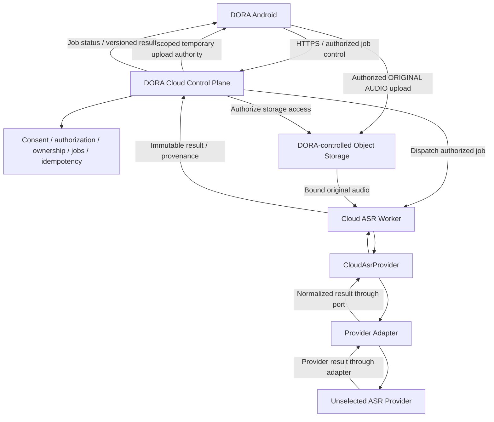

# ADR-0009: Alpha Cloud execution boundary

## Status

APPROVED FOR ALPHA ARCHITECTURE

Date: 27 September 2026

Authority: Project Owner's explicit Stage 6.1C Cloud Execution Boundary Decision.

Baseline: `chat/alpha-asr-runner-scope`, `00ce84bed18fe93101fe6a32c382b4ceed4a0e45`.

Decision: `6.1C = DORA_CONTROLLED_BACKEND_SELECTED`.

This decision does not select a Cloud ASR provider or model.
This decision does not assert that Cloud runtime/backend exists.
Cloud implementation remains NOT IMPLEMENTED.

The decision is owner-approved; closure evidence is subject to independent verification.
The proposed stage result is `6.1C = PASS / DORA_CONTROLLED_BACKEND_SELECTED` only after
this document is committed and pushed and the existing Alpha status Sheet is updated and
read back. Architecture approval is not runtime, security, legal or production admission.

## Context

The approved [user scenarios](../product/DORA_ASR_USER_SCENARIOS_V0_1.md),
[Gherkin scenarios](../product/DORA_ASR_USER_SCENARIOS_V0_1.feature) and
[data and versioning contract](../contracts/DORA_ASR_DATA_AND_VERSIONING_CONTRACT_V0_1.md)
at the baseline remain authoritative for product behavior, consent and data preservation.
Local ASR is optional. Cloud-only use without installing Local ASR remains valid.
Recording and safe storage must work while offline or when neither recognition route is ready.

The data contract deliberately left direct Android-to-provider versus DORA backend unresolved.
This prospective ADR resolves that specific `Execution boundary: DECISION REQUIRED` paragraph;
it does not rewrite or weaken the three approved contracts. Their immutable baseline is retained.
Provider wire formats must terminate at an adapter, and user corrections remain authoritative.

The [technical plan](../DORA_MVP1_TECHNICAL_PLAN.md) §§13, 22, 24 and 28 supplies existing
job, upload, retry and versioning concepts. Its earlier concrete stack, identity, storage and
retention recommendations are not selections or admissions made by 6.1C. Within this Alpha
Cloud/file-ASR decision, the owner's vendor-neutral boundary and deferred retention decision
apply; numeric retention recommendations must not be treated as an approved Cloud policy.
[Product Decisions](../DORA_MVP1_PRODUCT_DECISIONS.md) DEC-010/011/012 and the backend
readiness gates remain unresolved where they concern provider, region and Cloud retention.

## Decision

**DORA-controlled backend is the mandatory Cloud control plane for Alpha Cloud/file ASR.**

`DORA Android → DORA-controlled backend → CloudAsrProvider → future provider`.

Android communicates with a DORA-controlled Cloud boundary. Third-party ASR providers sit
behind a replaceable server-side `CloudAsrProvider` abstraction. Normal offline/file Cloud
transcription uses original audio and does not directly connect Android to a third-party ASR
provider. Backend control does not require the ordinary API application process to proxy every
large audio byte. Cloud remains optional for using the local core; the backend is mandatory
when using the Alpha Cloud/file-ASR route.

## Decision scope

6.1C selects authority, trust boundaries and the intended file-audio path only. It does not
admit any provider, model, region, object-storage product, SDK, identity provider, deployment
stack, endpoint, service or runtime. Existing technical-plan API concepts remain a compatibility
baseline; this ADR adds no HTTP schema and does not assert that any endpoint is deployed.

## Architecture diagram

The following is a conceptual future architecture, not an inventory of implemented services.
Solid arrows distinguish job control, authorized audio transfer and result delivery by label.

## Control plane

The DORA backend is the mandatory authority for the following future responsibilities:

| Responsibility | Required boundary |
|---|---|
| Authorization | Authenticate the request and enforce the permitted Cloud action. |
| Recording ownership | Bind the caller, logical recording, source audio and job; prevent cross-owner access. |
| Consent validation | Independently check recorded scope, policy basis and current revocation state. |
| Cloud job creation | Issue an authorized job/upload context only after validation. |
| Idempotency | Bind retries to one logical processing action and reconcile uncertain outcomes. |
| Job state | Maintain durable progress, cancellation, attempts and terminal-result association. |
| Quota control | Enforce usage/rate limits and abuse protection before costly processing. |
| Cost/usage accounting | Account for duration, bytes, requests, errors and estimated cost without retry amplification. |
| Retry policy | Centralize bounded timeouts, retry classification, backoff and uncertain-result reconciliation. |
| Provider routing | Route only to a separately admitted provider within the authorized scope. |
| Provider abstraction | Keep provider wire formats and privileged credentials behind adapters. |
| Observability | Correlate authorized jobs/attempts with redacted operational diagnostics. |
| Result provenance | Preserve source, action, attempt, provider/model identity and immutable version lineage. |

These are requirements for later implementation. No control-plane component is implemented here.

## Audio data plane

The intended Alpha direction is:

1. Android requests an authorized upload/job from the DORA backend.
2. The backend validates the action and issues scoped, temporary upload authority.
3. Android uploads original audio to **DORA-controlled object storage**.
4. An authorized Cloud worker reads the bound original audio and invokes `CloudAsrProvider`.

The ordinary API application server should not be required to proxy every large audio byte
through its application process. Storage access must be limited to the authorized caller,
recording/source, job and operation. Its concrete scope, expiry, renewal, byte limits and
revocation enforcement remain admission requirements, not a selected signed-URL or token design.
Temporary authority must not bypass current consent: an expired, revoked or otherwise invalid
grant cannot authorize new bytes, retries or new processing. Later design must demonstrate this
property for the selected storage mechanism before any upload is admitted.

No storage vendor/product or storage protocol is selected. Encryption, key custody, transport
payload and lifecycle details remain separately gated; server-side inference requires an honestly
disclosed, controlled ability to access audio. This ADR makes no end-to-end encryption claim.

## Provider abstraction

The conceptual port is `CloudAsrProvider`. Future implementations may be named
`ProviderAAdapter`, `ProviderBAdapter` or `DoraOwnAsrAdapter`; these are illustrative placeholders,
not selections. The rest of DORA must not depend directly on provider wire formats.

The port carries the existing data contract's action/job/idempotency identity, recording owner,
original source-audio reference or authorized stream, encoding/duration, language/configuration,
consent-scope reference and request trace. It returns normalized job/result status, immutable
transcript segments, timestamp availability, processing identity, usage and error/retry class.
Missing timestamps or provider/model version information remain explicitly unavailable/unknown.
Adapter-specific request IDs are provenance, not the authority for DORA's logical action identity.

Provider and model status are both **NOT SELECTED**. A later admission step evaluates RU and EN
recognition quality, latency, timestamps, diarization where relevant, cost, API limits, privacy,
retention, data location where relevant, reliability, provider/model versioning, availability
and replaceability. No candidate is recommended, benchmarked, approved or declared the winner here.

## Consent/authorization boundary

The approved policies and recording-level states are unchanged:

| Policy | Future Cloud behavior |
|---|---|
| `ALWAYS` | Automatic processing only within a valid informed grant. |
| `ASK_EACH_RECORDING` | At most one automatic prompt per logical recording; upload only after permission. |
| `MANUAL_ONLY` | No autonomous upload; an explicit Cloud action authorizes the selected recording. |

| Recording authorization | Upload eligibility |
|---|---|
| `PENDING` | No upload. |
| `INHERITED_ALWAYS` | Only while the inherited informed grant remains valid. |
| `EXPLICITLY_APPROVED` | Only within the recorded grant and until revoked. |
| `MANUAL_USER_ACTION` | Only within the selected recording's grant and until revoked. |
| `DEFERRED` | No upload; policy toggles/restarts/reconnect do not silently grant permission. |

Android-side consent state alone must not be the only future enforcement layer. The backend must
independently validate identity, recording ownership, consent evidence/scope and current validity
before issuing upload authority or dispatching work, and enforce revalidation for subsequent
upload chunks/retries and processing. A client-supplied policy label or stale queue flag is not
proof of authorization. **No unauthorized recording may be uploaded; zero audio bytes precede
valid authorization.** Credential possession and recording consent are separate requirements.

One recording remains one authorization unit across technical chunks. Batch grants cover exactly
the selected snapshot. Persist ASK prompt history and DEFERRED across restarts; automatic batches
must not re-prompt deferred items. Leaving ALWAYS invalidates unstarted work relying solely on
the old inherited grant. Explicit recording grants retain only their disclosed unrevoked scope.
Revocation stops further bytes, cancels pending work and requests in-flight cancellation where
possible; already-sent bytes cannot be unsent. Remote deletion/cancellation outcomes are reported
truthfully. Provider/region changes cannot silently expand an existing grant.

## Security boundary

**Privileged third-party ASR credentials MUST NOT be embedded in the Android application.**

Provider credentials belong to a controlled server-side environment. Neither the APK nor Android
configuration owns a permanent privileged provider secret. DORA-issued temporary upload authority
is scoped to the admitted storage/job operation and is not a privileged ASR provider key.
Future short-lived scoped client/provider credentials are allowed only where a later architecture
explicitly authorizes them. Secure transport, least privilege, ownership isolation, credential
lifecycle and content-free diagnostics require subsequent design and verification; no credentials
are provisioned or implemented by this decision.

## Identity principle

A full DORA user account is not mandatory for recording, offline operation or installed Local ASR.
These functions remain usable independently of a Cloud account, network and GMS.
Future Cloud operation may support an identity equivalent to **installation identity +
server-issued credential**, until/if a full account system is introduced. This is an architectural
capability, not a final authentication implementation or an identity-provider selection.
It does not waive server-side ownership, authorization, revocation or abuse controls.

## Offline/file Cloud flow

The identities below are synthetic examples, not a new wire protocol.

1. Android safely stores recording `R123` and original audio version `A1`.
2. Authorization becomes valid under `ALWAYS`, `ASK_EACH_RECORDING` or `MANUAL_ONLY`.
3. Android requests a Cloud processing job with stable logical action identity.
4. DORA validates request identity, recording ownership, consent/authorization, source audio
   identity and duplicate/idempotency state.
5. DORA returns an authorized upload/job context.
6. Android uploads **ORIGINAL AUDIO**, never a **LOCAL TRANSCRIPT**, to DORA-controlled storage.
7. A Cloud worker processes the authorized job after source and authorization checks.
8. The worker invokes `CloudAsrProvider`.
9. Its provider-specific adapter calls whichever provider is selected by a later admission decision.
10. The Cloud result returns as a new immutable transcript version with source and processing provenance.
11. Existing Local transcript versions, active text and user edits remain preserved.
12. Proposal, comparison and activation follow the approved versioning/edit contract.

Local processing is optional, not a prerequisite for this flow. Cloud re-transcription always
uses original audio. If audio was explicitly deleted or is unavailable, report source unavailable;
do not substitute transcript text. No job completion silently overwrites Local output or corrections.

`USER EDIT > CLOUD ASR > LOCAL ASR` remains the proposal priority, not overwrite permission.
The lineage `Original Audio → Local ASR version → Cloud ASR version → User Edits → proposed/active
merged version` preserves every existing version and edit; the Local stage may be absent and
edits may occur before, during or after Cloud processing. Preserve semantic/audio anchors;
ambiguous mappings require review. With edits present, activation waits for explicit acceptance
against the latest edit revision; stale proposals cannot defeat concurrent user corrections.

## Failure and idempotency principles

A logical Cloud action has stable identity/idempotency semantics across network loss, duplicate
requests, provider timeout/error, backend restart, Android restart, worker retry and late provider
responses. Attempts may have distinct identities; explicit reprocessing is a new logical action.
Provider idempotency cannot be assumed. Reconcile unknown outcomes before resubmitting work.

Duplicate or late results cannot create multiple competing active transcripts, regress the active
pointer, resurrect deleted content or bypass cancellation. Validate source identity, action/generation,
result association and current edit revision before activation. Failure at upload, processing,
proposal or activation preserves original audio, Local output, active text and user edits.
Durable state, bounded retries, normalized errors and atomic activation remain future work.

## Retention and deletion

No fixed Cloud audio retention period is selected. Retention, disclosure and deletion semantics
must be decided before production Cloud handling and, under the approved data contract, before
the first Cloud upload. Stage `11.1C` and the existing
[storage/retention/delete contract](../design/DORA_MVP1_STORAGE_RETENTION_DELETE_CONTRACT.md)
remain dependencies. Earlier recommendations are not approval of a Cloud retention period.

Retain separate local/remote outcomes, cancellation/job reconciliation, deletion receipts and
protection against stale-result resurrection. Local deletion is not proof of remote deletion;
consent revocation is not retroactive erasure. This ADR does not alter local retention or export
temporary-copy rules and supplies no privacy/legal approval.

## Future realtime exception

The DORA-controlled backend remains the authority/control plane. A later realtime architecture
may allow `Android → DORA Backend → short-lived/scoped authority`, followed by
`Android → Realtime provider`, only if all of the following hold:

- The provider supports safely scoped short-lived credentials.
- DORA retains authorization/control authority.
- No privileged permanent provider credential exists in the app.
- The flow is separately admitted and tested.

This is future scope, not Alpha file-ASR implementation or admission. The decision does not
prohibit every possible future direct client/provider network path.

## Alternatives considered

### Alternative A — rejected Alpha alternative: direct Android → provider

Direct third-party ASR is technically possible but **not selected for Alpha normal file/offline
ASR**. It provides weaker centralized control of privileged secrets, consent enforcement, quotas,
cost, provider replacement, retries, idempotency, observability, abuse protection and
audit/provenance. A safe future realtime exception must satisfy its separate conditions above.

### Alternative B — selected: DORA-controlled backend

The backend establishes a safe credential boundary, centralized control, provider independence,
consistent authorization, quota/cost control and auditability. This supports the intended
long-term architecture at the cost of more initial infrastructure, backend/storage/worker
responsibilities and more components to implement and operate.

## Consequences

Android integrates with DORA's boundary; provider-specific changes stay behind the server-side
port. DORA assumes ownership of admission, service operations and data handling. An unavailable
Cloud service may delay transcription, but must not block recording or installed Local operation.
Neither control-plane selection nor an ADR proves that any Cloud behavior works yet.

## Dependencies

| Stage/dependency | Effect of this decision; work still required |
|---|---|
| `6.1A`, `6.1B` | Approved baseline scenarios and version/edit contract remain unchanged. |
| `6.2C` | Immediate next architecture gate: define Cloud readiness/admission requirements using this selected backend boundary. Remains PLANNED. |
| `6.3` | Overall Alpha admission remains separate; 6.1C alone does not admit implementation. |
| `7.2C` | Define a replaceable server-side Cloud ASR port/adapter contract behind DORA. Remains NOT STARTED. |
| `7.2E` | Define DORA Cloud identity, credentials, ownership and authorization; preserve account-free local core. Remains NOT STARTED. |
| `9.2C` | Implement the authorized storage upload/job path only after readiness, consent and service dependencies. Remains NOT STARTED. |
| `18.1C` | Implement DORA backend/storage/worker and an independently admitted provider adapter after gates. Remains NOT STARTED. |
| `11.1C`, `CLOUD-02` | Privacy, disclosure, auth/consent, retention/deletion and relevant Legal/Security admission remain unresolved. |
| `12.1C`, `12.4C`, `CLOUD-03` | Deterministic acceptance and runtime evidence remain NOT_RUN; no runtime PASS follows. |
| Backend readiness IDs | `BE-LEGAL-001`, `BE-PROVIDER-001/002`, `BE-CONSENT-001`, `BE-AUTH-001`, `BE-API-001`, `BE-DELETE-001` remain separately gated. |

After commit/push and Sheet readback, close only the boundary-selection portion of `CLOUD-01`,
retain its historical `BLOCKED / DECISION_REQUIRED` fact and commit evidence, and route the next
dependency to `6.2C/6.3` admission and `11.1C/CLOUD-02`. Do not close runtime acceptance or claim
provider, privacy, identity or retention readiness.

## Out of scope

No Android or Cloud runtime, backend services, networking, storage implementation, workers,
authentication, APIs, provider SDKs/adapters/models, UI, database schema or tests are implemented.
No ASR campaign, device testing, ASR Cloud calls, provider benchmarking, Recovery changes,
PR #86 changes, historical evidence/dataset/threshold changes or Stage 5 evidence rewrites.
No merge. No provider/model or identity/storage vendor selection. No 6.2C work is started.

## Acceptance / decision criteria

These are documentation checks, not executed runtime tests:

1. Backend is selected as mandatory Alpha Cloud/file-ASR control plane.
2. Provider/model remain unselected; the replaceable port isolates wire formats.
3. Direct Android-to-provider is rejected only for normal Alpha file/offline ASR;
   the separately admitted future realtime exception remains possible.
4. Privileged provider credentials are prohibited in Android.
5. Object storage is DORA-controlled and vendor-neutral; API byte proxying is not required.
6. Cloud input remains original audio, never Local transcript text.
7. Local ASR remains optional, Cloud-only valid and local functions account-independent.
8. All three consent policies, recording states, prompt/batch and revocation invariants are preserved;
   the backend independently enforces authorization.
9. Immutable versions, user edits, safe activation and retry/late-result protections are preserved.
10. Retention and provider admission stay unresolved; `11.1C/CLOUD-02` remain dependencies.
11. Cloud implementation remains `NOT IMPLEMENTED`, runtime acceptance `NOT_RUN`.
12. The commit changes docs/planning only; approved ASR contracts, runtime, Recovery and
    historical evidence are unchanged.
13. The existing Sheet is updated only after successful commit/push, records exact commit/file
    evidence, preserves blocker history and keeps downstream implementation stages unpassed.
14. Closure is subject to independent verification; `6.2C` is the immediate next gate.

## Next gate

**6.2C — Cloud readiness / admission gates**

6.2C will define what must be true before implementation/admission of this architecture.
This task does not start that work or select a provider/model.
