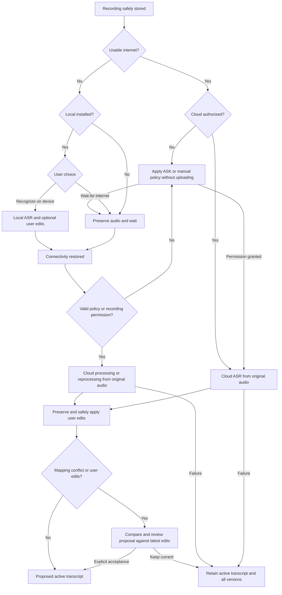

# DORA ASR user scenarios v0.1

Status: APPROVED FOR ALPHA ARCHITECTURE

Owner authority: explicit Cloud / Local ASR product-contract task, 27 September 2026.
This contract defines intended Alpha behavior.
It does not assert that Cloud functionality is already implemented.

## Authority and scope

This is the canonical human-readable authority for the approved Alpha ASR scenarios.
The [Gherkin contract](DORA_ASR_USER_SCENARIOS_V0_1.feature) specifies deterministic future
acceptance behavior; the [data contract](../contracts/DORA_ASR_DATA_AND_VERSIONING_CONTRACT_V0_1.md)
defines consent, versions, job identity and merge invariants. These three files are a
docs-only decision record, not runtime, dependency, production or legal admission.

This prospective Alpha decision makes Local ASR optional and Cloud preferred when online
and authorized. It refines the earlier local-first ASR planning in the
[technical plan](../DORA_MVP1_TECHNICAL_PLAN.md) and DEC-009/039 in
[Product Decisions](../DORA_MVP1_PRODUCT_DECISIONS.md) only for this ASR scope.
There is still no silent upload or default consent; no account, network or GMS is required
for recording or installed Local ASR. No particular initial policy enum is prescribed:
until an informed policy choice/recording authorization exists, Cloud upload is disabled.
Other artifact classes, training, region/provider and retention decisions are not approved here.
Existing storage/deletion and export contracts remain applicable.

### Verified starting state (7f7f0134d8031029a3fc77236124de9e1b0ccfee)

- [Stage 5 closeout](../stage0/DORA_ASR_SMALL_Q8_STAGE5_CLOSEOUT_STAGE0_V0_1.md):
  `PASS / BOUNDED_ALPHA_LOCAL_ASR_CANDIDATE_ADMITTED`; POC-ASR-001
  `PASS / BOUNDED_ALPHA_ONLY`, exact Small q8_0 on POCO M5 only. Timestamp quality
  remains `NOT_EVALUABLE`; actual 16 KiB device runtime remains `NOT_RUN`.
- [Latest expanded holdout](../stage0/DORA_ASR_EXPANDED_HOLDOUT_STAGE0_V0_1.md):
  `PASS / UNTOUCHED_EXPANDED_HOLDOUT_AVAILABLE`, RU24/EN24; all 48 consumed.
  Cross-corpus real-world participant equality is `UNKNOWN`.
- [Historical train audit](../stage0/DORA_ASR_TRAIN_HOLDOUT_AVAILABILITY_STAGE0_V0_1.md)
  remains `BLOCKED / INSUFFICIENT_UNTOUCHED_HOLDOUT_AFTER_TRAIN_AUDIT`.
  Historical BASE/SMALL/ARM82 results are unchanged.
- Stage 0 is technical feasibility. Recovery 0D.6 remains `ALPHA CLOSED / FULL OPEN`.
  PR #86 and Recovery are outside this task. No old campaign is reopened.
- Cloud runtime, backend/API, offline-to-Cloud processing and edit-preserving Cloud/local
  merge are `NOT IMPLEMENTED`. Local product integration is not proven by the bounded PoC.

## Modes and user language

Cloud recognition is preferred when internet is usable and audio upload is authorized.
Better recognition quality is a product expectation, not a measured provider comparison.
Recognition without internet is optional: the user may download, install, update or remove
the Local ASR package, with visible installation state, storage size and integrity/version checks.
Local recognition may produce slightly more transcription errors than Cloud recognition.
The user may use DORA Cloud-only and never install Local ASR. Recording and safe storage
must work even when neither recognition route is currently available.

Use “Cloud recognition”, “Recognition without internet”, “Improve recognition”,
“Recognize on device”, “Wait for internet” and “Recognize in cloud”. Core flows must not
require understanding Whisper, model, inference, runtime or provider terminology.
Before permission, explain that Cloud recognition sends audio outside the device, including
the applicable destination, purpose and retention disclosure.

## Cloud upload policies

One logical recording is one authorization unit, regardless of technical chunks.
The global preference and each recording's authorization are separate persisted concepts.

| Policy | Online | Offline and reconnect | Permission rule |
|---|---|---|---|
| `ALWAYS` | Automatically process eligible recordings in Cloud | Preserve audio, queue; automatically resume when usable connectivity returns | One informed grant remains effective within its valid consent scope; do not repeatedly prompt |
| `ASK_EACH_RECORDING` | Ask at most once automatically per logical recording; upload only after approval | Preserve audio; on reconnect request recording or batch permission before upload | Approval authorizes that recording, not every future recording |
| `MANUAL_ONLY` | Never autonomously initiate upload | No autonomous upload on reconnect | An explicit “Recognize in cloud” action authorizes the selected recording |

Under ASK, before approval **zero audio bytes** from that recording may be uploaded for ASR.
“Not now” persists `DEFERRED` and the fact that an automatic prompt was presented. App/device
restart, connectivity changes and policy toggles must not reset that prompt history.
Keep a non-blocking “Recognize in cloud” action; pressing it is sufficient recording permission.
Do not reopen the same recording's automatic modal, including inside a later automatic batch.

### Batch after an offline period

For multiple unprompted ASK recordings, present one batch prompt:

> Internet is available again. There are N recordings that can be processed in the cloud.
> Process all / Select recordings / Not now

“Process all” authorizes exactly the presented set. “Select recordings” authorizes exactly
the selected set; recordings created later are not included. Unselected presented recordings
and “Not now” remain `DEFERRED`. All presented recordings count as prompted once.
Previously deferred recordings remain available in a user-opened non-blocking list and can
be manually authorized together; reconnect never automatically re-prompts them.

### Preference changes and cancellation

Persist the consent version and timestamps. Recheck authorization before each outbound audio
operation and retry; cached queue eligibility is not permission. A policy change alone does
not authorize a previously deferred recording. Existing explicit recording grants remain
usable only within their disclosed scope and until revoked; changing the global preference
must explain the effect on already authorized work. Moving away from ALWAYS invalidates
unstarted operations relying solely on the old inherited grant. Unapproved future operations
follow the new policy. Explicit revocation stops further upload bytes, cancels pending work
and requests cancellation of in-flight work where possible. Bytes already sent cannot be unsent;
remote cancellation/deletion state must be reported truthfully. Cancellation never deletes audio
or transcripts. No repeated dialog is a substitute for valid consent.

## Primary scenarios

| ID | Trigger and outcome |
|---|---|
| S1 | Online + authorized: original recording audio → Cloud ASR → immutable Cloud transcript; make it active if no intervening edit/conflict prevents safe activation |
| S2 | Offline + Local installed: offer “Recognize on device” or “Wait for internet”; disclose possible additional errors; honor the choice |
| S3 | Offline + Local absent: record and preserve audio, show waiting status; Cloud recognition later follows policy; no forced Local download |
| S4 | Connectivity returns after Local success: make Cloud re-transcription available; ALWAYS can start automatically if still authorized, ASK needs permission, MANUAL_ONLY needs explicit action |
| S5 | Local → Cloud with user edits: preserve raw versions and edits, safely map corrections into a proposal; unresolved mapping requires review |
| S6 | Compare/replace: show proposed Cloud/merged text against active text; retain the current active text until explicit acceptance when user edits exist; rejection retains current active version; replacing a correction requires explicit conflict-level user choice and preserves history |
| S7 | Cloud failure: preserve original audio, Local version, active text and edits; show failure class and safe retry action; never switch active text to a failed/partial result |
| S8 | Multiple offline recordings: durable, deduplicated queue; ALWAYS uses valid grants, ASK uses one batch, MANUAL_ONLY waits; only the authorized selected set uploads |

Cloud re-transcription always recognizes **ORIGINAL AUDIO**, never the Local transcript as
ASR input. If the original audio was explicitly deleted, show source unavailable and do not
substitute text. Reprocessing is a new processing action; a retry is the same logical action.

## Transcript and edit invariant

`USER EDIT > CLOUD ASR > LOCAL ASR` applies to safe proposals, not permission to overwrite active
user text. Keep original audio, Local versions, Cloud versions, user edit history and an explicit
active/merged version. Historical ASR output is immutable. Use semantic/audio segment anchors
with timestamps where available; character offsets alone are insufficient. Cloud segmentation
may differ. If mapping is ambiguous, preserve the correction and mark a conflict for review.
If the user edits while processing or reviewing, rebuild/review against the latest edit revision;
a stale proposal cannot win a race with a newer correction.

## Flow

## Observable states and failure safety

The UI exposes pending, uploading/progress where useful, processing, ready, failed and retry
states without leaking implementation details. False-positive network availability is handled
as an operational failure. Queue/cancellation/authorization survive app and device restart.
Network loss, timeout, provider errors, duplicate retries or stale results cannot destroy any
original audio, successful Local transcript, active transcript or user edit.

## Alpha acceptance and sequencing

All following runtime exit criteria are **NOT STARTED / NOT IMPLEMENTED**, not PASS:

1. Cloud-only use without Local package installation.
2. Optional Local package download/install/removal/update with integrity/version checks.
3. Authorized online audio reaches Cloud recognition.
4. Offline recordings are never lost.
5. Installed Local recognition works offline without account/GMS.
6. Original audio can later be reprocessed in Cloud.
7. User edits survive Local → Cloud, including ambiguous mappings and concurrent edits.
8. ALWAYS / ASK_EACH_RECORDING / MANUAL_ONLY and batch flows obey permission rules.
9. Failed Cloud work leaves all successful data intact.
10. Pending jobs and DEFERRED state survive application and device restart.
11. Unauthorized audio upload never occurs, including retry and policy-change races.
12. Processing provenance and active-version history are recorded.
13. Duration/bytes/request count/error rate/estimated cost and quotas can be measured safely.
14. Deterministic online, offline, reconnect, consent, data-preservation and failure tests pass.

Stage 5 evidence remains closed in its bounded scope. In the existing Alpha roadmap,
Stage 6 must settle composition, Cloud boundary and admission; Stage 7 introduces ports,
identity, versioned data and test infrastructure; Stage 8 preserves original audio and logical
recording identity; Stage 9 implements recognition, queue, edits and proposals; Stage 10 consumes
active versions in history/search; Stage 11 implements privacy/offline/export guarantees;
Stage 12 verifies all exit criteria. Stage 18 remains the service ownership lane and supplies
dependencies before Stage 12, not an excuse to postpone required Alpha Cloud behavior.
Stages 13–17 retain future consumers of version/provenance changes; Stage 19 retains release gates.
No implementation starts in this documentation task.
