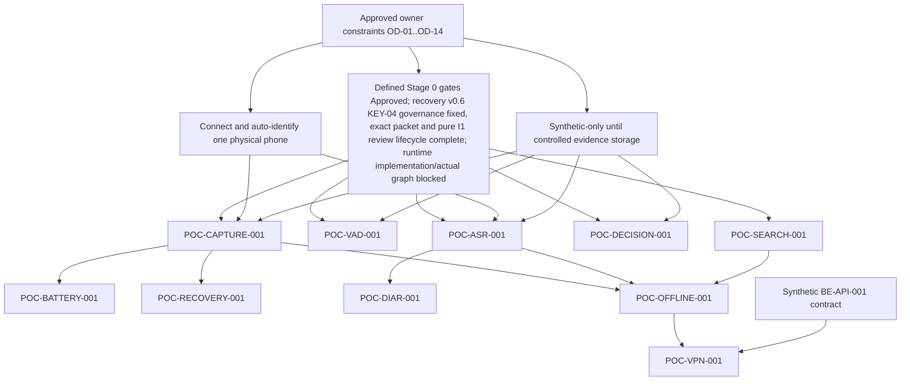

# Dora MVP 1 — Stage 0 PoC Execution Order

Version: 1.4
Date: 14 August 2026
Owner decisions effective: 4, 11 and 12 August 2026 (`OD-01`–`OD-14`)
Status: owner-approved ordering with reviewed/merged REC-I1 foundation; recovery runtime implementation/execution blocked
Scope: all ten Technical Plan PoCs mapped to the executable backlog

## 1. Decision summary

The recommended first real technical PoC is **`POC-CAPTURE-001` — one-hour microphone capture through a user-initiated foreground service**.

It is selected by `OD-01` because the higher-precedence Technical Plan puts capture first, capture reliability is the core product risk, and its output blocks battery/endurance work plus production Stage 2. The first campaign is only an exploratory one-phone run under `OD-06`; it must start after automatic device discovery and evidence handling are ready. It is an isolated PoC harness, not production capture and not an admitted dependency.

`POC-SEARCH-001` is the easiest safe parallel experiment because it uses generated data and no microphone/model/cloud. It is not selected as the first PoC because it does not reduce the leading data-loss/OEM feasibility risk and the Technical Plan explicitly prioritizes capture.

## 2. PoC mapping

| Technical Plan | Backlog ID | Short name |
|---:|---|---|
| PoC 1 | `POC-CAPTURE-001` | one-hour microphone FGS capture |
| PoC 2 | `POC-VAD-001` | 90-second silence/max-cap replay |
| PoC 3 | `POC-RECOVERY-001` | encrypted writer kill/recovery |
| PoC 4 | `POC-ASR-001` | local RU/EN/mixed ASR |
| PoC 5 | `POC-DIAR-001` | local/hybrid diarization and correction load |
| PoC 6 | `POC-BATTERY-001` | capture/VAD/ML energy and thermal matrix |
| PoC 7 | `POC-DECISION-001` | decision-revision graph benchmark |
| PoC 8 | `POC-SEARCH-001` | Room FTS4 10k/1M benchmark |
| PoC 9 | `POC-OFFLINE-001` | no-network/no-GMS dependency audit |
| PoC 10 | `POC-VPN-001` | route change and idempotent multipart |

## 3. Shared prerequisites

The diagram shows the recommended evidence order, not permission to implement downstream production modules.

Common blockers:

- `POC-GATES-001`: defined Stage 0 gates are approved, while an affected verdict remains `INCONCLUSIVE` if it depends on a section 7 `Proposed` threshold;
- `POC-DEVICE-001`: the first run waits for one connected/automatically identified phone, and every broader device claim needs confirmed D-profile evidence;
- `POC-DATA-001`: every corpus-backed quality claim needs governed data/splits;
- IP Asset Policy: every external model/runtime/weight requires exact evaluation approval;
- public-repository privacy: raw content/private traces never enter Git/Actions;
- one PoC per dedicated branch/PR and machine-readable result.

## 4. Dependency and execution matrix

| PoC | Direct dependencies | What it blocks | Safe parallel work | Physical phone | Audio/data requirement | Owner decisions |
|---|---|---|---|---|---|---|
| `POC-CAPTURE-001` | approved defined gates; one owner phone connected and automatically inventoried; synthetic fixture and evidence/deletion plan | `POC-BATTERY-001`; production Stage 2; informs recovery writer timing and offline capture harness | Search harness and synthetic decision corpus preparation | **First exploratory run:** exactly one physical owner phone. **Full gate later:** required D1/D2/D3/D5 and applicable D4–D7 slices; emulator only supplements API/fault checks | Reproducible synthetic acoustic speech/silence first; purpose-recorded only after consent and controlled-store gate | OD-01, OD-02, OD-03, OD-05, OD-06, OD-07, OD-08 |
| `POC-RECOVERY-001` | Proposed `DEC-044`; prospective Gate Set/protocol `stage0-v0.6`; completed distinct accountable recovery Engineering/Security governance review; completed pure REC-I1 task-scoped authorization, independent AI advisory implementation review and non-metric verification; separately authorized complete runtime implementation/non-metric verification; exact recovery-only zero-JSR305 graph/package/R8 evidence and scoped Product/IP disposition of that actual graph; fresh emulator/D2 preflight; separate owner execution authorization | production Stage 3 and later `ADR-AUDIO-001` final storage choice; contributes to offline/process-death evidence | governance/status reconciliation and synthetic-only planning; no runtime implementation or execution in the current scope | **Phase A:** 46 × (3 pinned emulator + 1 D2) = 184, only `FAIL`/`INCONCLUSIVE`. **Full physical:** 46 × (D1 + D2 + D5) = 138; D1/D5 deferred; exact-match-only D2 reuse leaves 92 injections. | Deterministic synthetic PCM16 byte oracle only; no microphone/real speech. 12 strata, 120 base hard kills/candidate as a separate denominator, ≥100 valid and ≥8/stratum; exactly 46 unique active rows with one KEY-04. KEY-04 is decrypt authentication/AAD failure only → `KEY_UNAVAILABLE_KEY_MISMATCH`; successful decrypt malformed/wrong plaintext remains KCF-07 → `CORRUPT_KEY_CONFIRMATION`. | OD-05, OD-08, OD-11, OD-14 |
| `POC-VAD-001` | gates, data governance; deterministic clock/frame contract | production Stage 3 segmentation profile; stable physical-segment inputs for later pipeline | Recovery and search; acoustic part can wait while deterministic part runs | Physical D1–D3 for real-time/acoustic evidence; emulator/JVM suitable for deterministic boundary cases | Synthetic 89.5/90/90.5, resume 89.9, noise and >10 min speech-like fixtures; governed real speech only later | OD-03, OD-04, OD-05, OD-06, OD-08, OD-09 if purpose-recorded |
| `POC-ASR-001` | gates, governed immutable corpus, D1–D4/D7, artifact license/digest/ABI/16-KiB approval | production Stage 4; timestamp contract and quality baseline for diarization/offline local ML | Search and decision benchmarks; runtime candidates may be compared independently after common normalization freezes | **Required:** D1–D4 for tier claims; D7 emulator/physical for native gate | Blind RU/EN/mixed clean/noisy/speakerphone corpus; participant-isolated evaluation | OD-03–OD-06, OD-08–OD-10 plus named IP/Legal artifact approval |
| `POC-DIAR-001` | gates, governed 1–6 speaker corpus, ASR/reference timestamp contract, exact weight license | production Stage 5 and correction UX scope | Battery repeats and decision/search work after shared corpus freezes | **Required:** D2/D3; D7 for native path; server reference may run separately | Clean/noisy/overlap/fast-turn/returning-speaker/speakerphone/negative corpus | OD-03–OD-06, OD-08–OD-10 plus weight terms approval |
| `POC-BATTERY-001` | stable capture harness/result; approved measurement protocol; physical D1–D5 | capture scheduling policy; whether VAD/ASR/diar may overlap capture; Stage 2 support claims | Diarization/decision/search scoring that does not use the same controlled device | **Required:** physical D1–D5; emulator is invalid for energy/thermal verdict | Calibrated one-hour synthetic signal, ≥3 repeats for idle/baseline/capture/VAD/ML modes | OD-05–OD-08 |
| `POC-DECISION-001` | gates, governed scripted/consented transcript corpus, source validator | production Stage 7 and task activation policy | Capture/recovery/ASR/search; local/server adapters can compare against one frozen corpus | D2/D3 only for local latency/memory; text-quality scoring can run host/server | ≥100 scripted/adjudicated transcript cases; audio not required when source ranges are synthetic | OD-03–OD-05, OD-08–OD-10 |
| `POC-SEARCH-001` | approved gates; generated DB and query manifest | production Stage 10 search/index choice; it does not block capture | Can run alongside every audio PoC without shared device if resources are isolated | Emulator/host for correctness; physical D1–D3 required for final device latency claim | Generated 10k conversations/1M transcript rows; no audio or personal data | OD-05 and OD-08; no consented corpus needed |
| `POC-OFFLINE-001` | selected local harnesses for capture/storage/history/search/tasks/export and installed/missing-model states | production local-mode claim and any Stage 11 network dependency admission | Later VPN/server contract work | **Required:** D4 no-GMS and at least D1/D2; emulator is supplemental | Synthetic RU/EN meeting-like fixture; installed model only after artifact approval | OD-03–OD-06, OD-08–OD-10 |
| `POC-VPN-001` | versioned synthetic `BE-API-001` server contract, consent/region model, upload fixture, offline/idempotency results | production Stage 11 transport/provider client | Backend and Android harness may proceed in parallel after contract freeze | Physical D2/D4/D5 for route changes; emulator/host for server fault injection | Non-sensitive multipart fixture/test audio; never real meeting content | OD-03–OD-05, OD-08–OD-10 plus provider/region consent decision |

## 5. Blocking relationships

### System-level blockers

- **Unresolved gates block affected verdicts.** Defined `stage0-v0.1` predicates are Approved for Stage 0; a result that depends on a section 7 `Proposed` value remains `INCONCLUSIVE`.
- **Device inventory blocks measured execution and support claims.** The owner phone must be connected and automatically identified before the first measured run. One phone cannot produce a D1–D7 support result.
- **Dataset governance blocks quality PoCs.** ASR, diarization and decision claims need protected splits; capture/recovery correctness can begin with synthetic signal.
- **Artifact rights block model execution.** A code license is not permission for exact model weights or a prebuilt native runtime.

### PoC-to-PoC blockers

- Capture blocks the authoritative battery matrix and supplies a realistic lifecycle/file contract to recovery/offline work.
- Recovery and VAD block production storage/segmentation, but they do not need ASR or diarization.
- ASR supplies the chosen timestamp/runtime contract used by the integrated diarization correction path. Diarization algorithm scoring may prototype against fixed reference timings in parallel, but final integration waits for ASR evidence.
- Capture, search and at least one local processing harness block an end-to-end offline claim.
- Offline/idempotency behavior and a frozen synthetic API contract precede VPN route testing.
- Decision and search PoCs do not block capture/recovery and can use independent generated data.

## 6. Recommended waves

### Wave 0 — owner/readiness gate (historical completion)

1. ~~Obtain explicit OD-01–OD-10 answers.~~ Completed 4 August 2026.
2. ~~Approve the fully specified Stage 0 gate set.~~ Completed; section 7 thresholds remain `Proposed` by decision.
3. ~~Connect the owner's one physical Android phone and automatically discover sanitized model, Android API, firmware/build, ABI and RAM.~~ Completed for Stage 0B; the sanitized phone inventory is recorded as D2 evidence.
4. ~~Freeze the synthetic fixture, sanitized evidence destination and cleanup plan.~~ Completed for the synthetic Stage 0B campaign. No controlled private evidence store was created, so real human data remains blocked.
5. ~~Open one dedicated PoC branch; do not reuse the Stage 0A documentation branch.~~ Completed for the isolated Stage 0B capture work.

### Wave 1 — first technical PoC (historical completion)

`POC-CAPTURE-001` was executed in isolated Stage 0B scope and closed `INCONCLUSIVE`. The following
were its execution-time constraints, not instructions to start a new or repeat campaign:

- one isolated Android PoC harness was used;
- microphone permission and the user-initiated microphone FGS remained inside the PoC scope;
- ASR, VAD, diarization, database, backend, account, production application ID/signing and real meeting audio were excluded;
- the exploratory campaign used only the automatically identified owner phone;
- schema-valid sanitized results were produced;
- no D1–D7 PASS or general device-support claim was made; the formal result remains `INCONCLUSIVE`;
- PoC code was not admitted to production.

The clean 60-minute screen-off baseline remains deferred. This document does not authorize a
repeat Capture/device campaign; any such campaign requires a separate owner scope and suitable
dedicated test device.

### Wave 2 — capture durability primitives

After capture evidence is understood:

- `POC-RECOVERY-001` proceeds through separately authorized scopes. Governance review and the
  distinct accountable formal human review are complete; `accountable formal review complete`
  remains the exact v0.6 governance marker. `REC-I1-AUTH-20260813-01` permits only the
  isolated pure contract foundation. Its exact PR #15 HEAD `ee7bb00…` received an independent
  OpenAI Codex / GPT-5 AI implementation advisory review with `formalReviewer=false`,
  `NO_FURTHER_CHANGES_REQUIRED`, no P0/P1/P2 findings and 62/62 Recovery JVM tests, then
  protected-squash-merged as `f2bc8c95…`. Validator-only PR #16 closed the resulting main-branch
  lifecycle defect and protected-squash-merged as `685e7592…`; exact-main post-merge CI passed.
  Runtime crypto/storage/harness implementation and execution each still require later scope.
  Global `implementationAllowed=false` and `executionAllowed=false`;
- v0.1/v0.2/v0.3/v0.4/v0.5 remain 15 unchanged SHA-256-pinned superseded audit artifacts and cannot govern
  implementation or execution;
- prospective `REC-JSR305-EXCLUDE-001` and exact governance packet authenticity/LICENSE/NOTICE
  evidence are closed. Novikova Katerina's distinct accountable formal review closed `REC-RDY-02`;
  the GPT-5.6 Sol/OpenAI records remain non-formal historical evidence, and the later REC-I1 and
  validator-remediation AI reviews likewise have `formalReviewer=false`. The I1 module adds no Tink
  or JSR-305 wiring. A later authorized runtime implementation must still produce exact
  recovery-only graph/package/R8 evidence and a scoped Product/IP disposition. Approval to use the
  excluded JSR-305 artifact is neither required nor granted;
- a later authorized recovery Phase A may use emulator+D2 but cannot PASS without D1/D5;
- `POC-VAD-001` remains a separate branch/harness and is not admitted by recovery work;
- `POC-BATTERY-001` may begin with capture-only modes once the capture harness is stable;
- no final crypto/container ADR is accepted before recovery evidence.

### Wave 3 — independent quality/performance tracks

After data/device/artifact gates:

- run `POC-ASR-001`;
- run `POC-SEARCH-001` in parallel because it uses generated data;
- run `POC-DECISION-001` in parallel after its scripted/adjudicated corpus freezes.

`POC-SEARCH-001` may be pulled earlier if capture is waiting for physical hardware, but it must be reported as an intentional schedule fallback, not as closure of the leading capture risk.

### Wave 4 — dependent quality and scheduling

- run `POC-DIAR-001` after exact weights and timestamp contract are available;
- complete `POC-BATTERY-001` with capture+VAD/concurrent/post-processing modes;
- use results to select scheduling and support fallbacks.

### Wave 5 — local/network boundary

- run `POC-OFFLINE-001` after selected local harnesses exist;
- freeze a synthetic versioned API/idempotency/consent contract;
- run `POC-VPN-001` last because it depends on the largest cross-boundary surface.

## 7. Parallelization rules

Allowed:

- documentation, owner/Legal/IP review and device procurement in parallel;
- search with generated data alongside capture/recovery;
- deterministic VAD replay alongside encrypted recovery fault injection;
- ASR runtime comparison, decision-corpus scoring and search when each uses separate immutable inputs and devices;
- server reference scoring alongside a local candidate after contract and consent freeze.

Not allowed:

- two PoCs modifying one shared production module or treating one PoC branch as a foundation dependency;
- changing a gate after seeing the same protected evaluation result;
- reusing evaluation speakers/scenarios in development;
- running heavy ML during capture before the battery protocol allows that exact comparison;
- sharing a physical device concurrently when battery/thermal state would invalidate either result;
- merging a candidate runtime/model because another PoC needs it.

## 8. Physical-device requirements

| PoC | Emulator/host sufficient for | Physical evidence required for |
|---|---|---|
| Capture | permission/FSM compilation and deterministic fault helpers | microphone, screen-off, OS/OEM lifecycle, sample integrity, battery/thermal |
| Recovery | large random kill matrix and file fault injection | flash/process/OEM/reboot confirmation on D1/D2/D5 |
| VAD | exact fake-clock 89.5/90/90.5 logic | real-time deadlines and acoustic performance on D1–D3 |
| ASR | reference scoring and schema | device RTF/PSS/thermal/ABI; D7 runtime |
| Diarization | server/reference scoring | local D2/D3 performance and D7 native runtime |
| Battery | none for verdict | all energy/thermal gates D1–D5 |
| Decision | text quality host/server | only local device latency/memory tier claim |
| Search | correctness/migration/generated scale | final D1–D3 latency/storage support claim |
| Offline | firewall/mock preparation | retail no-GMS D4 and physical local workflow |
| VPN | server fault injection | radio/VPN/Wi-Fi↔cell route behavior D2/D4/D5 |

No row claims a device is currently available. `device-matrix.yaml` records all availability as `unknown` until the owner's phone is connected and automatically inventoried. `OD-06` explicitly defers procurement of every additional device; this limits evidence and does not relax the final matrix.

## 9. Data requirements

| Data level | PoCs | Rule |
|---|---|---|
| Fully synthetic signal/text | Capture, Recovery, deterministic VAD, Search, most Decision cases, VPN transport | preferred starting point; generator/version/seed and digest recorded |
| Purpose-recorded scripted audio | acoustic VAD, ASR, Diarization, realistic Offline | separate adult consent, custodian, split, access, retention and deletion required |
| Public licensed corpus | ASR/Diarization comparison only if exact terms permit | IP Asset Policy and Dataset Governance both pass |
| Real meeting | none in current Stage 0 | prohibited until a new owner/Legal/research process |

## 10. Recorded source conflicts

### DEVICE-ID-MAPPING-001

Technical Plan section 34.2 maps D6 to audio routes and D7 to 16-KiB. Test Strategy section 5 maps D6 to 16-KiB and D7 to next API. Following source precedence, the preparatory matrix uses D6 for audio routes and D7 for combined 16-KiB/next-API coverage. This interpretation is explicit, not a silent baseline change. Final cross-document IDs must be reconciled before a release matrix claim; it does not block D1–D5 capture work.

### RECOVERY-ADR-ORDER-001

The backlog lists `ADR-AUDIO-001` as a dependency of `POC-RECOVERY-001`, while the Technical Plan expects the recovery PoC to choose Tink streaming versus sealed microfiles and then support a go/no-go ADR. Before recovery starts, create only a scoped **Proposed experiment decision** that freezes the compared formats and safety invariants. Accept the final audio/container ADR only after PoC evidence. This prevents a PoC from being forced to prove a choice already declared final.

`DEC-044` now supplies that Proposed record and freezes prospective governance protocol v0.6
without selecting a winner. It inherits the exact SHA-256-pinned v0.3 semantics except for the
explicit v0.6 effective `KEY-04` override and adds durable
run-key confirmation. Its exact Gate Set compares durable-one-segment-lookahead public Tink
Streaming AEAD with five-second `AES256_GCM_TINK_IV12_TAG16` microfiles and the exact authenticated
binary manifest; 15/30-second microfiles are not PASS-eligible. Design selection does not prove an
implementation. Prospective policy, exact governance packet evidence and the distinct accountable
Engineering/Security review are complete. The task-scoped I1 pure contract foundation is present,
independently AI-advisory-reviewed with `formalReviewer=false`, and protected-squash-merged; its
post-merge validator lifecycle defect is separately remediated with green exact-main CI. Future
actual runtime-graph Product/IP disposition, complete runtime implementation verification and
execution authorization remain absent. v0.1–v0.5 are retained only as 15
unchanged SHA-256-pinned superseded audit artifacts. v0.6 replaces only effective KEY-04 with its
exact decrypt-failure-only oracle and keeps KCF-07. A future final `ADR-AUDIO-001` remains evidence-dependent.

## 11. First PoC Definition of Ready (historical completion)

`POC-CAPTURE-001` passed this task-start readiness gate for the completed Stage 0B campaign. It is
not waiting for a new chat; its current result remains `DONE` / formal `INCONCLUSIVE` in the backlog
and Stage Status.

- OD-01, OD-02, OD-03, OD-05, OD-06, OD-07 and OD-08 have direct owner answers — **satisfied 4 August 2026**;
- fully specified `stage0-v0.1` gates are approved and every section 7 dependency is kept `Proposed`/`INCONCLUSIVE` — **satisfied**;
- the owner's one physical Android phone was connected and its sanitized model/API/firmware/ABI/RAM inventory was recorded as D2 — **satisfied for Stage 0B**;
- synthetic acoustic fixture/generator and digest plan were fixed — **satisfied for Stage 0B**;
- sanitized evidence handling, raw-artifact deletion and retention boundaries were fixed — **satisfied for synthetic Stage 0B evidence; no private store or real-data authority**;
- expected PoC files/module and dedicated branch were declared — **satisfied for Stage 0B**;
- microphone/FGS code was isolated from production and no unrelated feature was scaffolded — **satisfied for Stage 0B**;
- cleanup, failure fallback and machine-readable result paths were defined — **satisfied for Stage 0B**.

These historical readiness facts do not authorize a repeat Capture campaign. The deferred clean
60-minute screen-off baseline remains a separate future device-campaign scope.

## 12. Explicit non-action in Stage 0A

This document does not start `POC-CAPTURE-001` or any other PoC. No microphone permission, foreground service, audio writer, VAD, ASR, diarization, database, backend, account, model weight or production identity is added in this branch.
