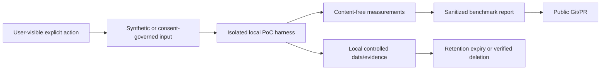
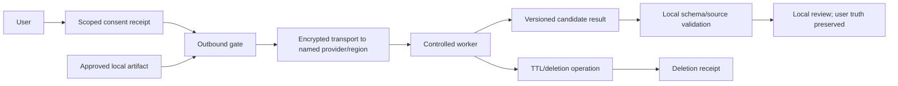

# Dora MVP 1 — Privacy Data Flow and Threat Model

Task: `GOV-PRIVACY-001`
Version: 1.1
Date: 5 August 2026
Owner decisions effective: 4 August 2026 (`OD-01`–`OD-04`, `OD-08`–`OD-10`)
Status: governance baseline; **not** a production security approval or legal opinion
Data rule for this stage: synthetic data only until controlled non-public storage is configured; no real meeting data

## 1. Purpose and scope

This document defines the minimum privacy and security boundary for Stage 0 experiments and the future local-first architecture. It does not authorize production recording, cloud processing, account creation, a production database or collection of real meetings.

The model protects confidentiality, integrity, availability, provenance and deletion of audio-derived data. It also protects people from an undisclosed recording or a model result being treated as user-confirmed truth.

Authoritative inputs are the Technical Plan, Design Spec, Product Decisions, Implementation Readiness Review, Test Strategy and accepted ADRs. If a future implementation changes a flow below, it requires an updated threat review before real data is used.

## 2. Privacy principles

1. **Explicit capture:** a microphone may start only after a visible user action. No passive, hidden or reboot-triggered recording.
2. **Local-first:** local mode works without account, network, GMS or cloud configuration.
3. **Purpose limitation:** data collected for one PoC cannot be reused for training, human review or another PoC without compatible consent and a new manifest entry.
4. **Data minimization:** store the least content and metadata needed to prove a named hypothesis.
5. **No silent outbound flow:** every artifact class, provider, region, purpose and retention rule is disclosed and consented before transfer.
6. **User truth wins:** model output is a candidate; it cannot silently overwrite a user edit or confirmation.
7. **Public-by-default repository assumption:** Git, PRs and Actions logs are treated as public.
8. **Verifiable deletion:** report local completion, remote pending state and remote receipt separately. Never claim physical flash overwrite.
9. **Honest limits:** root compromise, an unlocked device under hostile control and OS-level malware are not claimed as solved by Dora.

## 3. Data inventory

| Data class | Examples | Sensitivity | Created by | Default Stage 0 rule |
|---|---|---|---|---|
| Raw audio | PCM frames, encoded audio, recovered prefix | Critical content | microphone or synthetic generator | synthetic only by default; purpose-recorded audio requires governance; never Git |
| Audio-derived features | levels, VAD frames, timestamps, hashes, route markers | High when linkable to a session | capture/VAD harness | retain only metrics needed for the PoC; no reconstructable content in telemetry |
| Transcript | recognized text, word timing, correction | Critical content | ASR or test fixture | synthetic/scripted first; never logs or public evidence if derived from a person |
| Speaker data | cluster labels, intervals, embeddings, names | Critical; embeddings may be biometric | diarization/user edit | no voice identity templates in MVP; no real names in Stage 0 |
| Meeting knowledge | summaries, decisions, tasks, promises, deadlines, excerpts | Critical content | analysis/user | synthetic fixtures only in Stage 0; never telemetry or Git when personal |
| Source/provenance | session/segment IDs, source ranges, content hashes, model/prompt version | High | pipeline | pseudonymous IDs; publish only when fixture is synthetic and non-sensitive |
| Consent records | policy version, scope, purpose, provider, region, grant/revoke time | High compliance record | user/research process | append-only reference; no signature/contact detail in Git |
| Account/identity | OIDC subject, display name, workspace/tenant | High | optional future cloud | absent from local-only Stage 0; account is not required |
| Device/environment | profile D1–D7, API, ABI, RAM class, OEM, firmware, battery, thermal | Medium; can fingerprint | benchmark harness | sanitize serials, local paths and unique hardware IDs |
| Diagnostics | exit reason, error code, checkpoint age, job state, performance counters | Medium to High | app/OS/harness | categorical and content-free; preview before sharing |
| Cryptographic material | KEK/DEK/keyset, tokens, signing material, recovery secrets | Critical secret | future secure storage | never Git, logs, analytics, screenshots or benchmark result |
| Model/code artifacts | binary, `.so`, model weights, prompt templates | IP/supply-chain sensitive | approved supplier/build | metadata only until artifact admission; exact binaries remain out of this stage |
| Exports/cache | Markdown/JSON/CSV/audio/temp share files | same as source content | explicit user action | scoped, time-bounded, cleaned; plain export warns user |
| Research metadata | participant consent, annotation, split, reviewer notes | High | controlled research process | access-controlled and pseudonymous; no participant identity in public manifest |

## 4. Allowed storage locations

| Location | Allowed | Forbidden |
|---|---|---|
| App-private local storage | Future encrypted canonical data, pending explicit production admission | plaintext duplication beyond a bounded transaction; data before its feature is approved |
| Android Keystore | Future non-exportable wrapping keys | raw audio, transcript or application secrets encoded as aliases |
| Controlled local/private PoC store | Purpose-recorded test data, raw device traces, consent evidence, under named custodian and retention | unaudited shared folders, personal consumer sync without approval |
| Public Git/Git LFS | Schemas, policy, synthetic text fixtures, sanitized aggregate results and hashes that reveal no content | audio, real transcript, PII, secrets, private traces, unapproved binaries/weights |
| GitHub Actions logs/artifacts | Content-free build/test evidence; short-lived bootstrap APK already governed by Stage 00 | raw content, device identifiers, tokens, private paths, models, consent documents |
| Optional future cloud data plane | Only approved artifact under current scoped consent, named provider/region and retention | silent upload, VPN-selected region, training/human review without separate consent |
| Backup/transfer | Only explicitly classified recoverable data with a tested key lifecycle | encrypted DB/audio whose keys will not restore; secrets or temporary exports |

No new storage implementation is authorized by this table.

## 5. Data forbidden in logs and analytics

The following must never appear in application logs, CI output, crash reports, analytics, benchmark console output or notification text:

- raw audio, encoded audio or amplitude history sufficient to reconstruct speech;
- transcript, summary, task, decision, promise, deadline, search query or source excerpt;
- participant name, contact, email, telephone number, account subject or organization name;
- consent signature, consent document content or research recruitment data;
- access/refresh token, API key, cookie, password, private key, signing material, KEK, DEK or keyset;
- local absolute path, user profile name, device serial, advertising ID or stable hardware identifier;
- presigned URL, credential-bearing URL, private endpoint or object key containing content-derived data;
- model prompt/input/output that includes meeting content;
- database rows, SQLCipher passphrase or decrypted exception payload;
- clipboard/export content or screenshots of sensitive screens.

Allowed diagnostics are categorical codes and bounded aggregates such as `CAPTURE_START_FAILED`, API level, D-profile, duration bucket, sample-count delta, peak PSS, thermal state and a random run ID not reused as a content ID. Error messages must be redacted before persistence, not only before UI rendering.

## 6. Data forbidden in GitHub

The following are prohibited from Git objects, LFS, issues, PR bodies/comments, reviews, Actions caches/logs/artifacts and releases:

- any real meeting audio or purpose-recorded participant audio;
- any transcript or derived artifact that can identify or describe a real person or organization;
- consent forms, signatures, contact lists or participant mapping;
- credentials, tokens, signing keys, private endpoints or production configuration;
- raw Perfetto/Batterystats traces containing local paths, package history, identifiers or content;
- proprietary/restricted datasets, reference images without permission, model weights and native binaries without admission evidence;
- debug exports, local databases, crash dumps, backups, APKs containing an unapproved native/model artifact;
- generated sample content copied from a confidential source.

Public evidence may contain a schema version, PoC ID, commit, sanitized device profile, aggregate metrics, non-sensitive error code, exact digest of an approved synthetic fixture and an opaque controlled-store evidence reference. A digest does not make personal data safe to publish if it enables confirmation or linkage.

## 7. Local-first data flow

Required properties:

1. No account, DNS, remote config, analytics provider or GMS dependency is needed.
2. Capture and processing input stay local unless a later cloud PoC has a current, scoped consent receipt.
3. Canonical identifiers originate locally. External identifiers never replace local truth.
4. Raw content and raw traces stay outside public evidence.
5. A benchmark report is derived through a documented redaction step and contains only the fields allowed by `benchmark-result.schema.json`.
6. Deletion follows the dataset manifest and evidence retention class even if the PoC fails.

## 8. Optional cloud data flow

Cloud is an optional future boundary, disabled by default and not implemented in Stage 0A.

Before any outbound byte, the gate must verify:

- artifact class (`audio`, `transcript`, `structured candidates` or `diagnostics`);
- purpose and requested processing stage;
- provider and region selected independently of VPN route;
- consent/policy version and whether it has been revoked;
- retention and deletion behavior;
- content hash, size limit and destination allowlist;
- current network/user policy, without treating connectivity as consent.

The server may decrypt only if the approved inference design requires it and the UI states this plainly. The term E2EE is prohibited unless the threat model proves that the server/worker cannot access plaintext. Cloud results remain candidates and are rejected atomically when source IDs/ranges or schema are invalid.

## 9. Trust boundaries

| Boundary | Trusted inside | Untrusted or conditionally trusted outside | Required control |
|---|---|---|---|
| TB-1 Human → capture action | visible Dora UI state | accidental/hidden start, external coercion | explicit action, clear state, notification/system indicator, consent reminder |
| TB-2 Acoustic environment → microphone | declared synthetic/consented source | bystanders, TV, calls, unrelated speech | controlled room/fixture, stop rule, no call/system recording claim |
| TB-3 UI → capture engine | typed commands/state contract | navigation, duplicate Stop, stale notification command | idempotent command and state restoration; no capture side effect from Back |
| TB-4 App process → filesystem/database | app-private controlled path | other apps, backup/transfer, corrupted or swapped file | authenticated encryption, allowlisted directory, hashes, backup exclusions, recovery validation |
| TB-5 App → Android Keystore | non-exportable key operations | rooted/unlocked hostile environment, key invalidation | wrapped keys, explicit key-loss state, no impossible protection claim |
| TB-6 Local app → native/model artifact | admitted digest/runtime | tampered, gated or incompatible binary/weight | signed manifest, exact digest/license, ABI/16-KiB/runtime gate, replaceable port |
| TB-7 Local device → network/provider | explicit outbound gate | captive portal, VPN change, MITM, wrong region, replay | TLS, allowlist, scoped consent, checksum, idempotency, no automatic region switch |
| TB-8 API → worker/object/database | authenticated job/tenant | cross-tenant access, stale lease, excessive operator access | token-derived tenant, least privilege, isolated keys/prefixes, audit and TTL |
| TB-9 Private evidence → public repository | reviewed sanitized result | Git history, PR, Actions and forks are public | automated + manual secret/PII scan, explicit evidence classification |
| TB-10 Enterprise policy → end user | signed visible policy | silent admin mic enablement or hidden cloud route | policy cannot start microphone; user-visible enforced settings and local audit |

## 10. Main threats and mitigations

| ID | Threat | Impact | Required mitigation | Residual/fallback |
|---|---|---|---|---|
| T-01 | Microphone starts without informed visible action | unlawful/unexpected capture | manual Start, explicit state, Android indicator/notification, no boot/passive start | stop and discard according to incident procedure; block release |
| T-02 | Raw content leaks through log/crash/analytics | confidentiality breach | content-free typed logging, redaction at source, test scanners and fixture assertions | disable exporter; preserve only sanitized error code |
| T-03 | Public Git contains audio, PII, secret or private trace | irreversible public exposure | pre-commit/diff/history scan, artifact allowlist, no raw data paths | stop publication, revoke/rotate as applicable; owner incident review; do not rewrite history without explicit plan |
| T-04 | Lost/compromised device exposes local data | content disclosure | future SQLCipher/authenticated audio encryption, Keystore wrapping, app-private storage, optional lock/privacy cover | rooted/unlocked hostile device remains residual risk |
| T-05 | Backup/transfer restores ciphertext without usable key | permanent loss or misleading recovery | explicit backup exclusions and tested transfer/export path | name `KEY_UNAVAILABLE`; never call it corruption or successful restore |
| T-06 | Truncation/bit flip/swap corrupts a whole recording | data loss/false transcript | authenticated chunks, AAD binding, checkpoints, hashes, quarantine, kill-injection PoC | sealed microfiles fallback; no custom crypto without review |
| T-07 | Model/native artifact is malicious, incompatible or unlicensed | compromise, crash, legal breach | provenance manifest, license approval, exact digest, reproducible build, ABI/16-KiB and parser limits | reject artifact and use replaceable fallback |
| T-08 | Upload occurs without current scope consent | privacy/legal breach | deny-by-default outbound gate keyed by artifact/provider/region/purpose/policy version | local processing; queued operation remains blocked |
| T-09 | VPN or route change silently changes region/provider | unauthorized transfer | region bound to explicit configuration/receipt, not IP; resumable idempotent upload | pause and ask; local mode remains functional |
| T-10 | Duplicate/replayed request sends or bills twice | cost and duplicate data | content hash, idempotency key, part checksum and server unique constraint | reconcile by receipt; no second result application |
| T-11 | Cross-tenant or operator access | disclosure/deletion of other data | token-derived tenant, authorization tests, least privilege, separate prefixes/keys/audit | return non-enumerating error; incident response |
| T-12 | Model result overwrites user truth | integrity/trust failure | immutable machine revision, field ownership, diff/review, source validator | reject candidate; retain user version |
| T-13 | Export/clipboard/notification reveals content | shoulder-surfing or unintended share | generic notifications, scoped export preview, sharesheet warning, temp cleanup, privacy cover | user-controlled plain share remains disclosed residual risk |
| T-14 | Deletion omits derivative, index, cache, upload or backup | false deletion claim | deletion graph, tombstone, job cancel, key deletion, derivative/FTS/cache sweep, remote receipt and disclosed backup TTL | show pending/failed scope; never report complete early |
| T-15 | Research split or metadata re-identifies a participant | privacy leak and invalid evaluation | pseudonymous IDs, participant-level isolation, minimum reporting groups, restricted mapping | suppress small slices; delete on withdrawal |
| T-16 | Corporate admin silently enables capture/cloud | covert monitoring | admin policy may restrict but cannot initiate microphone; signed config and user-visible status | local-only deployment or block incompatible policy |
| T-17 | Resource exhaustion causes loss during capture | availability and data integrity loss | storage/battery/thermal preflight, graceful finalize, bounded buffers, separate UI/ML thread | narrow supported matrix; delay heavy processing |

## 11. Deletion requirements

### 11.1 Local data

A deletion workflow must eventually cover every scoped object:

1. create a durable tombstone/audit record without content;
2. stop or cancel local processing and prevent future upload;
3. delete or cryptographically erase per-artifact wrapped keys;
4. delete source audio, transcript, summaries, tasks/candidates and speaker data in scope;
5. remove FTS rows, cache, temporary export and recovery/quarantine files;
6. reconcile database/file manifest and report partial failures;
7. preserve only the minimum non-content deletion evidence required by policy.

Flash wear levelling prevents a guaranteed physical overwrite claim. The approved wording is logical deletion plus cryptographic erasure where a per-artifact key exists.

### 11.2 Cloud data

- revoke future sends immediately after consent revocation;
- queue an idempotent deletion operation if offline;
- delete source objects, derivatives, job payloads and searchable/indexed copies;
- expose `pending`, `failed` and `complete` separately;
- retain a content-free deletion receipt ID/status;
- disclose provider backup/replica expiry; do not call deletion complete before the defined scope is complete.

### 11.3 PoC/research data

- every collected item has `expiresAt`, custodian and deletion method before collection;
- withdrawal and purpose completion are deletion triggers;
- under `OD-09`, raw purpose-recorded audio is deleted no later than 90 days after PoC closure, annotations no later than 180 days, and consent-withdrawal deletion completes no later than 30 days;
- a shorter mandatory consent or Legal period always takes precedence;
- participant mapping and raw content are deleted from every controlled copy and backup according to the approved period;
- a public hash/reference is removed when it creates linkability, even though immutable Git history may make full retraction impossible; therefore such identifiers must not be published initially;
- deletion evidence contains opaque sample IDs and timestamps, not names or content.

## 12. Test-data requirements

- Synthetic signal, generated text and staged non-personal fixtures are the default.
- No real meeting is recorded or committed during Stage 0 preparation.
- Purpose-recorded adult volunteer speech is allowed in principle by `OD-03`, but requires informed consent for recording, named PoC evaluation, human access if any, approved retention/deletion, a named custodian and controlled non-public storage.
- Until controlled non-public storage is configured, only synthetic data may be used and no raw trace/audio may be retained.
- Consent for evaluation does not permit training, commercial redistribution or a public dataset.
- Corpus split is immutable and participant/meeting isolated as defined in Dataset Governance.
- RU, EN and mixed-language slices include clean/noisy, near/far, multiple speakers and overlap without using personal names or confidential topics.
- Test logs and reports use only sample IDs and aggregate metrics.
- Any cloud benchmark requires an additional provider/region/artifact consent; local consent does not imply cloud transfer.
- Fixtures from an external dataset require license and provenance review independent of participant consent.

## 13. Corporate local mode

A corporate/local deployment must remain useful with all outbound traffic denied. Minimum requirements:

- no account, GMS, DNS, cloud endpoint, remote config or online analytics prerequisite;
- capture remains an explicit end-user action; MDM/admin cannot start the microphone remotely or invisibly;
- a signed policy may disable cloud, restrict export, set shorter retention and require device controls, but every enforced setting is visible to the user;
- all audio, transcript, indexes and tasks remain on the managed device or an explicitly approved customer-controlled local environment;
- diagnostic export is content-free, previewed and compatible with offline transfer procedures;
- model/catalog update supports an approved offline package with digest/license evidence; no executable runtime code download;
- tenant/admin access, legal hold and deletion conflicts are documented before deployment; legal hold must not be represented as user deletion success;
- customer-controlled backup/KMS, key recovery and device-loss procedures require a separate threat-model extension;
- local audit records actions and policy versions without transcript/audio content;
- the product must not weaken encryption or logging rules merely because the deployment is on a corporate network.

## 14. Verification gates

Before any PoC with audio or sensitive evidence:

- dataset class, purpose, owner, access list, retention and deletion path are recorded;
- test input is synthetic or has valid consent reference;
- logging test proves forbidden strings/content never leave the harness;
- evidence files have classification, digest and storage location;
- repository diff/history scan finds no secret, PII, private audio or unapproved artifact;
- cleanup is executed after the run and recorded;
- if network is in scope, a packet/call ledger proves only approved destinations/artifacts were used.

Before any production or cloud path, this document must be extended with the actual schema, key custody, provider/region, consent ledger, retention owner, authZ model and incident/deletion runbooks.

## 15. Unresolved blockers

Owner decisions `OD-01`–`OD-10` are resolved. In particular, `OD-09` fixes the Stage 0 maximum retention periods; it does not replace the operational controls below.

| Blocker | Owner action | Until resolved |
|---|---|---|
| Markets, legal roles and final production consent wording | Product owner + Legal resolve DEC-001 and production lawful-basis/copy review | no production recording beta; real meeting collection remains prohibited by `OD-03` |
| PoC evidence store and custodian | owner names controlled non-public location/custodian and verifies access/deletion | synthetic data only; raw traces/audio and purpose-recorded speech are not retained |
| Cloud provider/region/key custody | Security/Legal/Product ADR | no outbound content path |
| Exact model/native artifacts | IP/Security/Engineering admission | no download, mirror, commit or runtime use |
| Production deletion topology | Data/Security/Backend design and tests | no production deletion claim |

## 16. Exit statement for GOV-PRIVACY-001

The owner-approved Stage 0 baseline now identifies data, locations, forbidden logging/publication, local and optional cloud flows, trust boundaries, threats, mitigations, deletion, test-data controls and corporate local-mode requirements. It does **not** authorize real meetings, cloud processing or production implementation; those remain blocked by the legal, storage, artifact and technical gates above.
