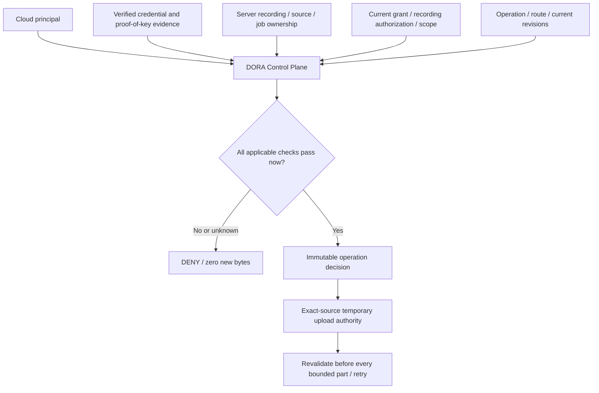

# 7.2E — Cloud identity, authorization and ownership v0.1

Status: CONTRACT_DEFINED_AWAITING_EXACT_SHA_CI. Logical contract only.

## Authority and scope

ADR-0009 remains the control-plane authority. ADR-0011 already requires invited
installation proof-of-key, finite audience/action-bound credentials, rotation,
replay resistance and independent ownership/consent/deletion epochs. These are
preserved security properties, not newly selected authentication technologies.
ADR-0012 retains consent/installation nonsecret history without extending grants;
ADR-0013 limits admission to the approved closed internal Alpha. DEC-015 and
BE-AUTH-001 preserve the account-free local core. The current admission, privacy
v0.4 and 6.3 records do not make auth runtime implemented or its runtime gate PASS.
The frozen ASR data/versioning contract and user/Gherkin scenarios remain binding.
Storage/retention/delete policy and 7.2C/7.2D identities remain unchanged.

Authentication establishes the caller. Ownership establishes the resource
relationship. Consent establishes user permission. Authorization establishes
whether this exact operation is allowed now. None substitutes for another.

## Principal and authentication evidence

CloudPrincipal is INSTALLATION, identified by a stable logical principal_id.
Its installation_ref is public identity, not a secret or authentication proof;
it is not an Android UID, hardware ID, Firebase identity or account. Invitation
and proof-of-key admission are server-verified evidence. Reinstall without
recoverable verified binding does not inherit old identity, ownership or consent.
Recovery/transfer mechanism is REQUIRED / IMPLEMENTATION_NOT_SELECTED; ambiguous
recovery fails closed. Key/credential rotation within the same verified principal
does not create a new grant or transfer ownership. No attestation vendor selected.

CredentialBinding contains an opaque reference, principal, DORA_CONTROL_PLANE
issuer, finite issued/expires times, generation, audience, purpose/operations,
ACTIVE/EXPIRED/REVOKED/SUPERSEDED state and optional replacement reference. It holds
no credential bytes. ADR-0011 renewal/rotation requirements remain; issuance and
refresh flows are not implemented. Unknown expiry cannot authorize Alpha Cloud.
Server verification includes the current request-bound proof/replay check; neither
a client assertion of VERIFIED nor schema-valid opaque IDs establishes evidence.
The offline fixture's trusted snapshot models facts a future server must resolve.

## Ownership and job binding

RecordingOwnershipBinding is a server-originated, immutable revision with binding
ID, principal, exact RecordingId + AudioAssetId/source version + digest, effective
time, state, version and provenance reference. A different source version requires
explicit new binding/revision. Ownership changes invalidate outstanding decisions;
no transfer workflow is selected. CloudJobOwnershipBinding binds the same owner
and source to DORA action/job IDs, configuration and immutable route/profile,
plus the prior CREATE_CLOUD_JOB ALLOW decision. Creation reserves DORA IDs before
authorization; a job binding is established only from that authorized context.
Provider operation IDs are provenance, never ownership keys. Transcript access
inherits verified action/job/source relationships; 7.2D entities are not modified.

## Consent and recording authorization

No grant exists merely because the application is installed. Credential possession
does not mean consent. GlobalCloudPolicy is a preference, separate from the
CloudConsentGrant and RecordingAuthorization. Grants bind principal, informed
disclosure version, purpose CLOUD_ASR, destination/provider/region, operation
classes, time, revision, validity and source/basis. Scope has its own reference.
EXACT_SNAPSHOT grants enumerate exact source references. ELIGIBLE_FUTURE grants
are only informed ALWAYS grants; every recording still needs its own current,
exact-source INHERITED_ALWAYS authorization. This never lifts existing deferral.

| Policy/state | Meaning |
|---|---|
| ALWAYS | Automatic eligibility requires an informed, unrevoked, matching grant. |
| ASK_EACH_RECORDING | At most one automatic presentation per logical recording. |
| MANUAL_ONLY | No autonomous initiation; explicit selected-recording action only. |
| PENDING | No upload or processing. |
| INHERITED_ALWAYS | Parent informed grant and current ALWAYS policy required. |
| EXPLICITLY_APPROVED | Only the independently approved exact scope. |
| MANUAL_USER_ACTION | Only the explicitly selected recording/source; no future grant. |
| DEFERRED | No upload; explicit pending-list action may establish a new authorization. |

Leaving ALWAYS invalidates unstarted work relying solely on inheritance. This
contract conservatively rechecks it for every new part/attempt. Independently
explicit valid grants survive policy changes; MANUAL_ONLY still forbids autonomous
initiation. Grant revision and recording authorization revision are independent.

## ASK and batch snapshot

Prompt history belongs to the logical recording, never technical chunks. Restart,
policy toggle, reconnect and chunks preserve its marker and DEFERRED state.
BatchAuthorizationSnapshot records principal, immutable presented exact sources,
selected recording IDs, presented/decision times, disclosure/scope/grant references.
Selected is a unique subset of presented. Presentation marks every presented item;
unselected items become DEFERRED. New arrivals and changed source versions are not
selected by an old batch. Automatic batches exclude previously presented/deferred
items; explicit pending-list selection does not reset automatic prompt history.
The batch records AUTOMATIC versus USER presentation. The complete before/after
snapshot checker covers every presented item, retaining an older automatic prompt
marker when a user later explicitly authorizes a deferred item.

## Operation authorization and fail closed

CREATE_CLOUD_JOB, ISSUE_UPLOAD_AUTHORITY, UPLOAD_AUDIO, RETRY_UPLOAD, DISPATCH_ASR
and RETRY_ASR move data or incur cost; each requires current authentication,
ownership, consent, exact scope, available original audio, current route/config,
source/job/action correlation and operation policy. READ_JOB_STATUS and READ_RESULT
also require authenticated ownership and applicable current grant in this Alpha
contract, but do not require original audio to still exist. CANCEL_JOB is a
protective owner control: it requires current authentication and job ownership,
not a live ASR grant or available audio. This preserves revocation/cancellation
without converting cancellation into a new processing permission. Deletion/DSR
authorization remains independently gated by ADR-0011 and is not an ASR operation.

AuthorizationRequest contains references, exact source, action/job, route/profile,
configuration, operation, request/attempt IDs, trigger and controlled current time.
The trusted fixture snapshot supplies independently resolved verified evidence,
current source, policy, generations and optional batch/job. Missing, ambiguous,
stale, unknown or contradictory required facts DENY. Quota/budget/admission remain
separate mandatory operation-policy facts, never inferred from valid consent.
No unknown outcome authorizes trying a provider.
Current route/configuration mean the authoritative context of this exact source,
action and job, not the global routing preference for future jobs. Changing a
default provider does not retarget existing job read/cancel operations. The
job-creation transition checker validates its original ALLOW and exact binding.

AuthorizationDecision is an immutable decision ID, request context, credential,
ownership, grant and recording-auth references, evaluated scope/version, current
generation vector, evaluated time, ALLOW/DENY and closed reason. Denial codes
distinguish authentication, expiry, revocation, ownership/source/job mismatch,
pending/deferred, consent/scope/provider mismatch, staleness and unavailability.
The offline checker verifies deterministic fixture expectations, not real users,
cryptographic proofs or service authorization. No runtime evaluator is implemented.

## Upload authority, retry and reconnect

ScopedUploadAuthority is an inert descriptor: authority ID, principal, exact
source, action/job, operation, maximum bytes, issued/expires times, grant reference,
ISSUE_UPLOAD_AUTHORITY decision and generation vector. Alpha requires a known
positive ceiling; unknown ceilings fail closed. It is not a signed URL or token.
It is non-transferable between recordings, source versions, jobs, owners or routes.
Its validity is bounded by both its own expiry and the credential lifetime.

**0 unauthorized audio bytes.** ALLOW(ISSUE_UPLOAD_AUTHORITY) must precede any
future data-plane transfer, and a fresh UPLOAD_AUDIO/RETRY_UPLOAD decision must
precede each bounded part. The future ingress must atomically fence revocation
against part acceptance; finite expiry alone is insufficient. Offline fixtures
model intended byte ceilings only; no test opens or simulates an audio upload.
The byte ceiling is cumulative, including earlier accepted bytes, never reset by
retry. Each retry retains logical action/job/source/config, uses a new attempt
and rechecks all current evidence. Reconnect is a scheduling signal only.
Trusted attempt history resolves the prior attempt and rejects a reused attempt ID
or changed source/action/job/configuration/route. Issuance is independently checked
against its historical server-resolved snapshot; current upload authorization is
then checked separately. Equal revisions must have equal immutable evidence, not
merely matching revision numbers. An asserted historical ALLOW is never sufficient.

## Revocation and staleness

Credential revocation, consent revocation, recording-authorization revocation and
deletion are separate events. Current credential generation, ownership revision,
grant revision, recording-auth revision, deletion epoch, source and route/profile
are captured in the decision. A changed vector invalidates its reuse. Rotation
requires a new decision even for the same principal; it never transfers consent.
Revoked consent permits no new bytes, retry or dispatch. Queued work becomes
unauthorized; request in-flight cancellation where supported and track its real
outcome. REQUESTED is not CONFIRMED. Already transmitted bytes cannot be unsent;
local deletion or consent revocation is not proof of remote erasure. Retention,
deletion receipts, tombstone restoration and late-callback fences follow ADR-0012
and the existing storage contract; retained consent history is not permission.

## Provider/region scope and 7.2C references

Provider/region/destination changes require explicit compatibility or re-consent;
v0.1 has no implicit compatibility mapping and denies a mismatch. Route/profile
and configuration changes also invalidate old decisions. A currently admitted
Amazon profile is one route, not a generic identity type.
7.2C authorization_ref resolves to the exact current DISPATCH_ASR/RETRY_ASR ALLOW
decision; consent_scope_ref resolves to its evaluated CloudConsentGrant scope;
ownership_binding_ref resolves to its exact RecordingOwnershipBinding revision.
The control plane must additionally resolve the correlated CloudJobOwnershipBinding.
These remain opaque IDs, never bearer capabilities. No provider schema change is
needed and no transcript text/edit/merge semantics change.

## Offline independence and privacy

Local capture, storage and admitted Local processing require no Cloud principal,
credential, account, network, GMS, Google account or Firebase. No login wall added.
Android must never hold privileged provider keys or backend signing secrets.
Future client authority is DORA-scoped, least privilege and independent of consent.
Logging permits opaque IDs and normalized reasons only: no credential bytes,
private disclosure/free text, audio, transcript, provider secret or signed URL.
No telemetry or identity/auth vendor, token format or key-storage implementation
is selected. Required future security mechanisms remain IMPLEMENTATION_NOT_SELECTED.

## Implementation plan and verification

Native execution under writing-plans / executing-plans / test-driven-development;
the explicit autonomous task and two-commit sequence override approval pauses and
separate plan commits. Existing isolated worktree is reused (using-git-worktrees).

- [x] Freeze the closed JSON catalogue and ADR-0019; test missing validator RED.
- [x] Implement tools-only validate_contract, check_case, validate_decision,
  validate_upload_authority and validate_prompt_transition; run deterministic
  positive/negative fixtures and all existing relevant offline contract checks.
- [x] Wire mandatory Android CI without weakening existing checks; fresh adversarial
  review of credential/consent substitution, forgery, revocation races, retries,
  batch/source transfer, route widening and local independence; fix P0/P1.
- [ ] Commit/push implementation, await exact-SHA android-bootstrap/search-smoke.
- [ ] Update status/backlog/evidence and Sheet with exact readback, publish only
  evidence changes, then verify final exact-SHA CI and final HEAD Sheet readback.

Review focus: malformed/missing evidence must deny; request-bound proof cannot
be replayed; CANCEL must remain available after consent revocation; valid authority
cannot cross source/route/generation; source deletion must not erase read/control
rights or pretend remote erasure. All fixtures are synthetic IDs and metadata.

## Non-execution

7.3, 7.3C, Stage 8 NOT_STARTED. Auth/backend/token issuance/login/ownership/consent/
authorization/upload/object-storage/AWS-adapter runtime NOT_IMPLEMENTED.
Transcript persistence, merge and recording NOT_IMPLEMENTED. Recovery integration
and audio upload NOT_RUN; real product audio NOT_USED; AWS NOT_CALLED, spend 0 BY
THIS TASK; FIRST_REAL_PRODUCT_AUDIO NOT_READY. main NOT_CHANGED; PR #86 UNTOUCHED;
PR #87 OPEN / DRAFT / UNMERGED. No automatic next-stage execution.
