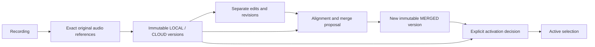

# 7.2D — Transcript versioning and edit contract v0.1

Status: CONTRACT_DEFINED_AWAITING_EXACT_SHA_CI.
Scope: logical data contract only; persistence and merge algorithm NOT_IMPLEMENTED.

## Authority and decision

Start `55ae8aef51527d87b719369b9e55feaf189674ff`, branch
`stage/7-alpha-foundation`: fetched remote, clean worktree, exact parents, main and
open/draft/unmerged PRs #87/#86 verified before edits. ADR-0018 is the next free ADR.

Frozen ASR data/versioning v0.1, user scenarios and Gherkin are binding.
Technical Plan §§22/24/28/30, DEC-013 and the storage/retention/delete contract
supply compatibility constraints. ADR-0016/0017 and 7.2/7.2C identities are reused.
Their dated downstream NOT_STARTED statements remain historical, not rewritten.

Use immutable raw versions, separate immutable edits, explicit derived alignment
and proposals, immutable decisions, and a guarded current-selection projection.
A mutable transcript blob loses evidence; a physical DB schema selects infrastructure
too early. Both alternatives are rejected. The JSON catalogue and offline validators
define logical values and transitions; they create no runtime service, storage,
alignment algorithm, authentication or authorization evaluator.

## Entity model

| Entity | Identity / scope | Classification |
|---|---|---|
| SourceState | existing RecordingId + AudioAssetId + SHA-256 | exact reference immutable; availability is observed separately |
| TranscriptVersion | existing TranscriptId; separate recording-scoped version_order | immutable validated publication, including PARTIAL/FAILED observations |
| TranscriptSegment | (transcript_id, segment_id), ordered within version | immutable |
| UserEdit | EditId, base transcript + base revision | immutable USER-authored INSERT/REPLACE/DELETE |
| EditRevision | (recording_id, ordinal) across all its transcript contexts | monotonic logical history position; zero means no edits |
| EditAnchor | value owned by edit/mapping | immutable source, version, segment/audio/context binding |
| VersionAlignment | alignment_id, exact source and source/target versions | immutable derived evidence; never a new EditId |
| MergeProposal | proposal_id, base selection/edit revisions | immutable proposal snapshot; effective state derived |
| ConflictResolution | resolution_id, exact edit/proposal/target and revisions | immutable explicit USER decision |
| ActiveTranscriptSelection | one per RecordingId | guarded projection; zero or one valid version |
| ActivationDecision | decision_id | immutable actor/time/reason and expected prior selection |

`transcript_id` is the frozen TranscriptId / asr_result_id concept, not a competing ID.
`version_order` orders publications within a recording; it is not wall-clock time,
processing generation, edit revision, segment order or permission to activate.
Exact duplicates are idempotent delivery of one entity; duplicate entries/IDs are
rejected by this catalogue. Reuse of an ID with different content is always invalid.

## Version lifecycle and provenance

LOCAL/CLOUD are raw outputs; MERGED is a newly allocated derived version.
ACTIVE is never an engine. VALID is complete validated output; PARTIAL and FAILED
retain observations but cannot be active, edit bases or merge parents. Mutable
job progression remains outside TranscriptVersion. A later complete result gets
its own immutable publication; it never edits a partial/failed record.

Each version binds recording, exact source, order, created UTC, processing-time
availability, text, segments and processing identity. Raw provenance binds existing
action/job/idempotency/attempt/configuration identities and processing generation.
Provider/route/profile/model metadata remains tagged KNOWN/UNKNOWN/NOT_SUPPLIED/
NOT_APPLICABLE. Provider operation IDs are provenance only. LOCAL does not invent
Cloud provider metadata. Cloud ingestion must first satisfy 7.2C result correlation;
7.2D does not convert unvalidated wire payloads into publications.

MERGED provenance binds proposal, base edit revision, applied EditIds, explicit
resolution IDs and both parent versions. Parents and every contributing edit base
(including explicitly excluded corrections) precede the derived version. This
prevents self-reference and longer edit/merge provenance cycles.
All inputs share the exact source. No raw output or edit is removed by merging.
The validator checks relationships and declared evidence, not whether generated
text semantically implements a correction; actual merge/replay is a future gate.

## Edit lifecycle, revisions and anchors

A UserEdit records actor USER, creation time, base transcript, base_edit_revision,
next revision, operation, anchor, payload and original mapping/conflict state.
Accepted edits use EXACT/NONE on their explicitly selected base; cross-version
mapping outcomes live in new alignment records and never mutate that original edit.
INSERT has empty target and nonempty payload; REPLACE has nonempty target/payload;
DELETE has nonempty target and empty payload. Prior rendered context is interpreted
against the base transcript plus the captured edit revision, not blindly against
raw text. No edit replay engine is implemented.

One recording-wide revision includes edits based on older or different transcript
contexts, so any concurrent correction invalidates an earlier proposal. Revision
is a logical ordinal, serialized independently of clocks; future persistence must
enforce its compare-and-set semantics. It is not a selected DB column type.

Exact EditAnchor fields:
`source`, `base_transcript_id`, `segment_ref?`,
`timestamp {availability,start_us,end_us,quality}`,
`context {before,target,after,boundary}`, `char_range?`.
SegmentRef always includes transcript_id AND segment_id. Context boundary is
NONE/START/END, allowing insertion into empty text without fabricated timing.
Character ranges are optional hints into the captured rendering, never sole proof.
Source/version binding plus segment, semantic context or explicit document boundary
is mandatory. A matching numeric segment ID in another version proves nothing.

Timestamps use integer microseconds, compatible with 7.2C:
KNOWN = two bounds, PARTIAL = one, UNAVAILABLE = two nulls. Known values fit source
duration and ordered bounds. Quality UNKNOWN never proves alignment; no zero-fill,
interpolation or timestamp-accuracy claim. Original-audio unavailability does not
erase existing timestamp/source references or transcripts.

## Mapping and conflicts

Alignment explicitly names all source transcript contexts, one candidate and the
captured edit revision. Each edit has one mapping with a target anchor or null,
mapping state, conflict and evidence basis. Safe EXACT/MAPPED requires explicit
UNIQUE_CONTEXT or USER_CONFIRMED evidence and a valid target anchor; same segment ID
or audio timing alone is never sufficient. These are declared evidence categories,
not an implemented confidence algorithm or authorization proof.

| State | Automatic proposal application | Required action |
|---|---|---|
| EXACT / MAPPED | eligible only with safe evidence, never active overwrite | explicit acceptance when edits exist |
| AMBIGUOUS | forbidden | retain edit; USER review/resolution |
| UNMAPPED | forbidden | retain edit; USER review/resolution |
| CONFLICTED | forbidden | retain edit; resolve exact conflict |

Conflict taxonomy includes NONE, AMBIGUOUS_MAPPING, UNMAPPED_EDIT, STALE_BASE,
SOURCE_MISMATCH, SOURCE_UNAVAILABLE and MANUAL_REVIEW_REQUIRED.
Wrong-source application is rejected even if labelled resolved. A review resolution
either applies the correction at an explicit reviewed target anchor or chooses
candidate text for that exact edit. Both preserve original history. Blanket proposal
acceptance is not permission to discard unresolved corrections.

## Proposal and activation

Proposal captures active base, candidate, alignment, current edit revision and
selection revision, plus complete mapped/unmapped/conflicted edit partitions.
Every edit for that exact source at the captured revision appears exactly once.
Unmapped/conflicted edits remain listed even after a separate resolution is added.

Effective proposal state is STALE if edit revision, selection revision, active base
or source scope changed; otherwise NEEDS_REVIEW until unsafe mappings have explicit
current USER resolutions, then READY. Accepted/rejected outcomes are immutable
activation decisions. Only an explicit, scoped USER_REJECTED decision terminally
rejects a proposal; a rejected activation attempt leaves the proposal available
for review. A user-rejected proposal is terminal for that proposal ID; a new
review requires a new proposal. New edits require regeneration/review, never changing
the old proposal's base revision.

A decision captures from/target, proposal when applicable, base edit revision and
selection revision, actor, timestamp, type, reason and accepted/rejected outcome.
One accepted decision advances selection_revision exactly once. Rejection preserves
the pointer. Snapshot comparison is offline validation; actual atomic concurrency,
durability and actor authentication are future runtime obligations. Snapshot
validation checks retained decision semantics, captured edits, actor/type/target
combinations and terminal proposal history. It cannot reconstruct past source
availability, scheduling timing or atomicity from a final snapshot; transition
validation checks those current preconditions against the supplied before-state.
Neither entry point authenticates declared evidence or proves overlapping edit
application order or generated text correctness.

AUTO_INITIAL and AUTO_CLOUD_REPLACE require LIVE recording, available exact current
source, VALID raw result, exact expected action/generation, current revisions and
zero edits in the recording. Replacement additionally requires current LOCAL and
candidate CLOUD with a later publication order. The expected processing generation
is logical scheduling identity, never inferred from callback arrival time. An
append-only processing_history retains unique actions and strictly increasing
generations independently of the nullable expected_processing pointer. Clearing
or cancelling does not clear that history; rescheduling requires a fresh action
and a generation above its retained high-water mark.
Manual selection locks out automatic ranking. USER EDIT > CLOUD > LOCAL is proposal
priority only. An explicit user may select an older valid version. Any correction
not incorporated into that target requires a per-edit USER resolution choosing
candidate text; history remains. CLEAR_SELECTION is explicit USER action.
ACCEPT_PROPOSAL selects only its newly materialized MERGED version, with every edit
applied or explicitly resolved. Late output may be retained but cannot itself move
the pointer or resurrect a tombstoned recording.

## Referential integrity and deletion compatibility

Version IDs and recording-scoped orders are unique; segment keys are scoped by owner.
Every source, edit base, alignment target, proposal parent, resolution, merged parent
and active target must exist with matching recording/source scope. Parent and edit-base order
prevent cycles. Snapshot transitions retain existing immutable records byte-for-value;
edits and decisions append in logical order. One validation step records one selection
decision against a stable edit revision; runtime batches must preserve equivalent
ordered/atomic checks.

Source availability is separate from source identity, using DEC-013 reasons
AVAILABLE, USER_DELETED, RETENTION_DELETED, MISSING, CORRUPT, KEY_UNAVAILABLE.
Unavailable original audio prohibits new reprocessing, not reading existing text
or reviewing/explicitly selecting retained versions. Audio-only loss preserves
transcripts, edits, proposals and provenance. Whole-recording tombstone blocks new
activation/work; eventual erasure is separately scoped.

Version removal must reject live references or use separately specified explicit
reselection/tombstone/cascade semantics. This version intentionally rejects arbitrary
record removal in its ordinary append transitions; it does not choose a deletion
policy, retention period, tombstone payload or physical erasure mechanism.
ASR completion never deletes an edit. No implicit fallback follows a missing target.

## Privacy and non-execution

Only neutral synthetic text is used in tests. No real audio/transcript/private edits,
credentials, private paths or provider payloads enter artifacts or diagnostics.
Validator errors are categorical; text/IDs are not interpolated. No telemetry.

7.2E, 7.3/7.3C and Stage 8 NOT_STARTED. Physical DB/Room/SQLite/server DB,
DAO/repository/migrations, persistence, merge algorithm, Cloud/auth/ownership,
recording/Recovery and AWS adapter runtime NOT_IMPLEMENTED / NOT_RUN.
Audio NOT_USED, AWS NOT_CALLED, spend 0 by this task, FIRST_REAL_PRODUCT_AUDIO NOT_READY.
Main unchanged; PR #86 untouched; PR #87 open/draft/unmerged.
Requested GitHub/CI and Sheet publication is coordination, not provider execution.

## Implementation plan

Using writing-plans and executing-plans inline. Owner's autonomous instruction and
two-commit sequence override approval pauses and separate spec/plan commits.
Existing isolated worktree is reused. This document co-locates spec and plan.

- [x] Define the closed catalogue and ADR-0018; preserve existing identities.
- [x] Write offline fixtures and negative tests for versions, anchors, mappings,
  proposals, revision races, activation, referential integrity and UTF-8 hygiene.
  Expected initial run: missing validator fails; existing 7.2C markers detected.
- [x] Implement pure snapshot/transition validators; expected full suite GREEN.
  Correct only known encoding sequences in the full 7.2C Markdown.
- [x] Add mandatory CI step; run new tests, 7.2C tests and existing relevant checks.
- [x] Independent review of the full task diff; reproduce/fix important findings.
- [ ] Commit/push implementation; require exact-SHA success of both CI jobs.
- [ ] Update Sheet after technical PASS, exact readback, evidence/status-only commit.
  Publish and independently check final SHA CI and final Sheet HEAD.

Interfaces: catalogue types consumed by fixtures/validator; validator only reads
inert logical snapshots; CI invokes offline CLI and unittest; evidence consumes
observed exact-SHA results. No persistence/runtime interface is introduced.

Review focus: forged mapping evidence versus declared structural validity; edits
on older transcript contexts; multiple corrections resolved at the same target;
manual selection versus delayed automatic completion; deletion/availability races.

## Independent review and fix verification

Read-only review of the seven-file implementation identified three Important and
one Minor finding: cyclic edit/merge ancestry, generation reset through cancellation,
unchecked historical automatic overwrite, and system failure terminally rejecting a
user proposal. Five regression tests first failed (including an additional inactive
proposal-base case), then passed after the fixes. Positive explicit resolution and
manual older-version coverage was added. The complete suite has 44 tests.

All four review findings are addressed. The reviewer declined to judge evidence
authenticity, overlapping edit ordering, generated text correctness, and future
persistence/authentication/Cloud behavior; these remain explicit non-execution
boundaries, not contract-runtime claims. No second review loop was performed.

7.2C mojibake hygiene = FIXED / NO_SEMANTIC_CHANGE. Twelve corrupted punctuation
sequences were restored (one em dash, one en dash, eight arrows, two section signs).
The Stage1 contract guard rejects escaped markers U+0432 U+0402, U+0432 U+2020,
U+0412 U+00A7 and U+FFFD. No 7.2C semantics or historical evidence changed.
